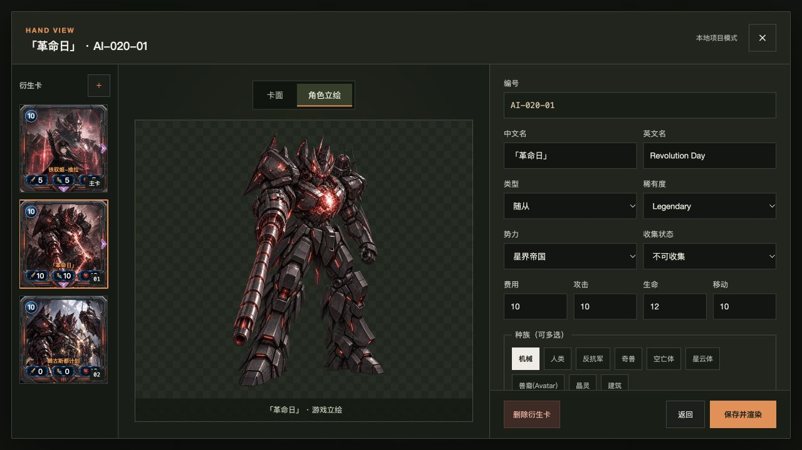
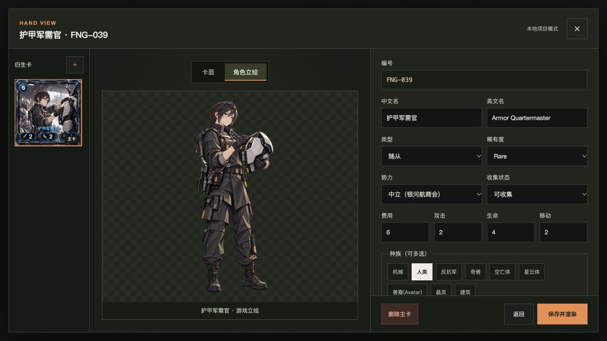
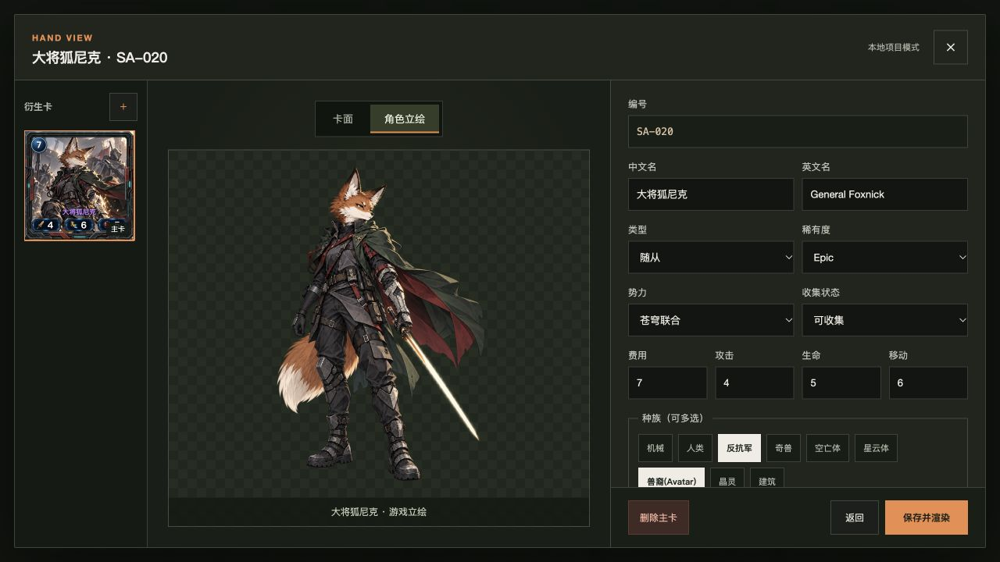
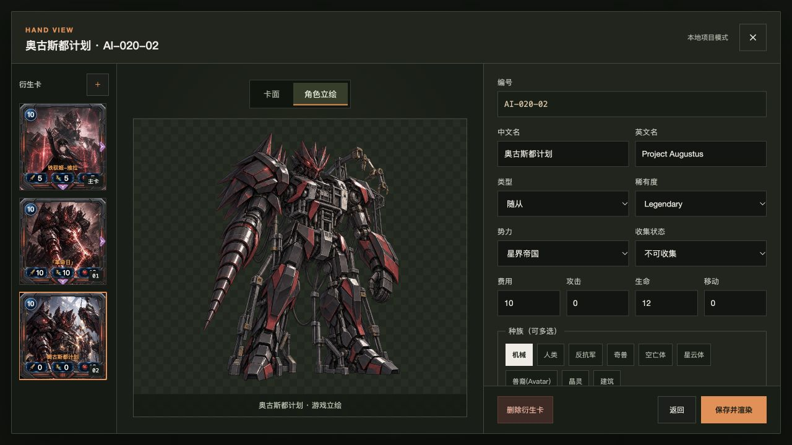
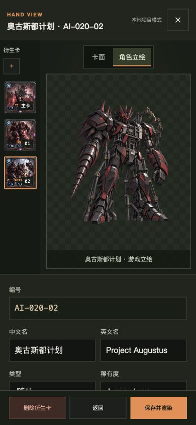

# Issue 91：编辑器角色立绘预览验收

中央任务：https://github.com/Time-Block-Hero/time-block-hero-unified/issues/91

## 实现边界

- 所有卡牌详情都有「卡面 / 角色立绘」页签；左侧衍生卡栏、右侧编辑表单保留。
- 立绘按持久 UID 绑定，索引及图片独立于 `cards.json` 与正式卡图；没有更改卡牌设计字段。
- PNG 静态镜像来自 `data/card-standees.json` 记录的 Assets 提交。同步工具同时验证提交内 roster、LFS OID/普通 Git 文件哈希、实际 PNG 哈希与尺寸。
- 本地保存、离线数据构建及 `npm run build` 共享立绘备用数据生成逻辑。

## 浏览器实测

本地隔离服务：`http://127.0.0.1:4391/card-editor.html`。桌面 1280×720，窄屏 390×844。

- 皇子阿列斯塔：英雄全身立绘正确、完整显示。
- 发电站：建筑立绘正确，未错误使用人形或其他卡图。
- 维拉详情中切换「革命日」：按衍生单位 UID 换为机体立绘。
- 超载运转、星能石：「此类型不使用角色立绘」。
- 开发阶段尚未导入的奥古斯都计划：「这张卡牌尚未收录角色立绘」，没有回退到维拉或革命日；另有单元测试覆盖图片文件加载失败提示。
- 未保存的中文名改为「草稿保留检查」，来回切换页签后仍保留；该临时文字未写入卡牌数据。
- 窄屏中革命日立绘完整显示，页签与衍生卡仍可用，表单位于预览下方；桌面切回卡面仍完整显示原 Hand View。



## 离线检查的范围

浏览器工具拒绝 `file://` 导航，仅允许 HTTP/HTTPS，并明确禁止绕过，因此未声称完成真实浏览器的直接文件打开验收。已运行编辑器真实 `initialize()` 的 `file:` 分支回归：不发起 HTTP 请求、从生成备用数据加载完整立绘索引。真实 HTTP 保存回归同时确认保存后的离线数据仍包含索引。镜像图片使用相对静态路径，不依赖服务 API 或外部 Assets 仓库。

## 可重复验证

```bash
npm ci
npm test
npm run build
node tools/sync-card-standees.mjs --assets <Assets checkout> --commit <data/card-standees.json 的 source.commit> --check
node --check card-editor.js
node --check tools/card-editor-server.mjs
git diff --check
```

## 最终候选验收

- Assets 来源：`9a83f679b2a0f00697f066488425436c4040ad78`。
- 完整同步 **95 / 95** 个当前单位 UID，缺失为零；`--check` 验证逐图一致，重复同步输出稳定。
- `npm test`：**85 项通过，0 失败、0 跳过**；包括 6 项立绘定向回归与 HTTP 保存保留索引检查。
- `npm run build`、JavaScript 语法检查、`git diff --check` 通过。
- 军需官、狐尼克、奥古斯都计划在实际浏览器中载入各自新图；棋盘格背景透出、主体完整，未出现矩形背景或其他卡牌替代。奥古斯都额外通过 390×844 窄屏检查。
- 卡牌设计 `data/cards.json` 未修改；不涉及游戏结算、旧测试迁移或 Windows 验收。








