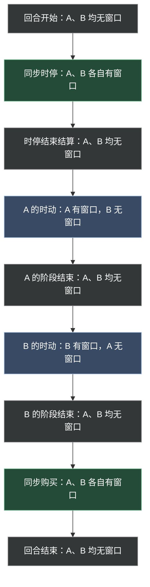
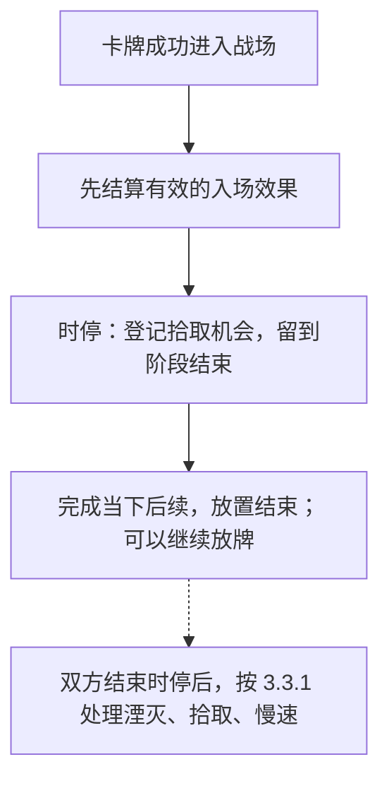
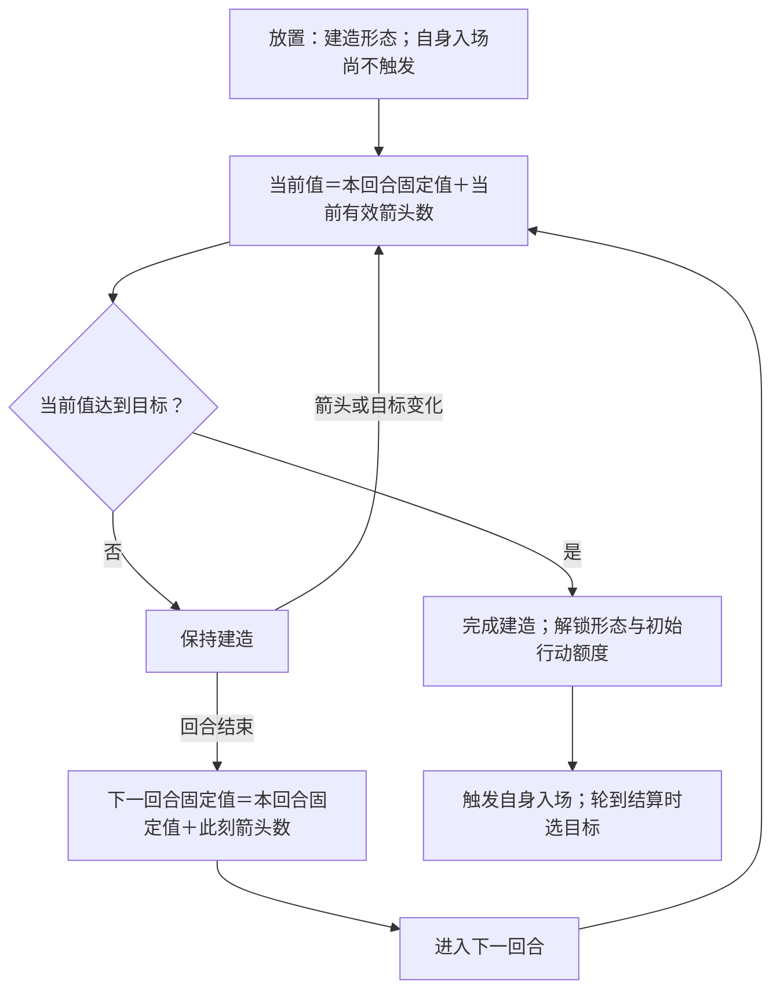

本章说明玩家行动与操作窗口。已确认条款作为裁定依据；本轮规则已固定为试玩基线，集中见[第四章审阅事项](../maintenance/pending.md#第四章审阅事项)。

## 4.1 行动的共同边界

**ACT-001 权限与完成。** 玩家只能在自己具有相应权限时发起行动，且必须满足来源、目标、位置、次数和成本限制。需要指定目标却没有合法目标，或无法完整支付必需成本时，不能发起该行动。

选取目标、位置或模式本身不表示行动已经发生。具体行动规定承诺点：承诺前取消不产生该行动的结果；已支付或消耗的成本能否退还，按以下各行动条款处理，不能一概用“效果没成功”要求返还。

行动产生后，处理本次应完成的触发、状态变化和其他后续事项，全部完成后才能开始本方下一次普通行动。触发排序与失败细节统一见[第八章](effects.md)；另一方是否可同时操作依本章[操作窗口](#操作窗口)判断。

效果指示“移动”“放置”或“发动攻击”时，按该效果明确给出的权限和例外执行；只改变指定限制，不能自行推断所有阶段、目标和成本要求全部失效。

### 4.1.1 操作窗口

**ACT-010 操作窗口。** 操作窗口是某位玩家可以执行当前阶段允许的行动、并亲自完成效果选择的一段时间。应分别判断每位玩家是否拥有窗口，不能只看整个对局是否处于某个阶段。

| 时点或阶段 | 玩家 A | 玩家 B |
| --- | --- | --- |
| 回合开始：刷新、生成、抽牌及抽牌效果 | 无窗口 | 无窗口 |
| 同步时停，包括时停阶段开始效果 | 有窗口，直到本人声明完成 | 有窗口，直到本人声明完成 |
| 时停结束结算，包括湮灭 | 无窗口 | 无窗口 |
| A 的时动阶段，包括 A 的阶段开始效果 | 有窗口，直到本人声明完成 | 无窗口 |
| B 的时动阶段，包括 B 的阶段开始效果 | 无窗口 | 有窗口，直到本人声明完成 |
| 同步购买 | 有窗口，直到本人声明完成 | 有窗口，直到本人声明完成 |
| 阶段结束效果、回合结束清理 | 对应窗口已关闭 | 对应窗口已关闭 |

表中假定 A 先行动；B 先行动时交换两个时动阶段。某玩家提前完成同步阶段后，即使对方仍在操作，该玩家自己的窗口也已经关闭。

图 4-A 按时间从上到下排列：绿色表示同步阶段中双方各有窗口，蓝色表示仅阶段所属玩家有窗口，灰色表示双方均无窗口。颜色只是辅助，节点文字给出完整权限。同步阶段内，每名玩家声明完成时，本人窗口立即关闭；共同结束位置只表示阶段最终汇合，不保证两人等时长。

**窗口内外的效果选择：** 应作出选择的玩家拥有操作窗口时，由该玩家选择；不拥有窗口时，由系统自动选择，不等待该玩家输入。具体效果没有规定自动选择方式时，默认从合法选项中随机选取。自动选择仍须遵守目标、数量和其他合法性要求，不因此增加候选范围，也不会替玩家发起一项原本不能发动的主动能力。

例如，回合开始抽牌触发的选择、阶段结束触发的选择，以及对方时动阶段中己方效果要求的选择，都采用自动选择。没有合法选项、多个选择互相约束及可选项如何转换，统一在[通用结算逻辑](effects.md#目标模式与数量选择)细化。

阶段开始时先开放该阶段应有的窗口，再结算阶段开始效果；开始效果尚未结算完时不能抢先执行下一项普通行动。阶段结束效果则在相应窗口关闭后处理。

### 4.1.2 新入场随从的行动

**ACT-012 新入场当回合可以行动（已确认）。** 普通随从本回合首次进入战场后，在自己的时动阶段即可按可用的初始额度移动、攻击，不必等到下一回合。仍须满足当前阶段、控制关系、行动额度及其他合法性要求；时停入场不因此开放时停移动或攻击，建造中的能力封锁也继续适用。

**离场再入场刷新本回合攻击与主动能力的使用额度（已确认）。** 同一张随从已经攻击或发动能力，回手再入场后可重新使用；按入场时有效的次数上限建立额度。刷新不抹去已经发生的攻击、发动或支付事实，也不恢复跨区保留的耐久等记录。入场不是原格变身，变身仍按[6.6.2](lifecycle.md#升级变形与复制)保留使用记录。

## 4.2 放置与箭头

**ACT-002 普通放置条件。** 在尚未声明完成的本方时停期间，可以从自己手牌选择卡牌，放入本方合法部署区域。目标格必须符合[占格规则](elements.md#棋盘与空间关系)：随从或法术可以进入资源格；资源牌自身只能放置到没有任何卡牌的空格。完整的单向共存规则见[2.2.3](elements.md#资源牌)。

普通卡牌默认要求至少一个己方有效箭头指向目标格；非可建造牌的箭头需求更高时，必须满足对应数量。可建造牌的普通放置只要求一个己方有效箭头，其卡文中的“箭头需求 N”作为建造目标值，见[4.2.3 建造](#建造)。同一个目标格可以受到多个来源的箭头支持，按有效箭头数量合计；同方向多层的计数见[2.5.2](elements.md#箭头层数与点亮)。待放置卡牌自身尚未在场，不能先用自己的箭头满足自己的入场条件。

### 4.2.1 放置步骤

1. 选择手牌与目标格，检查领地、占格、箭头及该牌专属放置限制。
2. 若卡牌明确要求独立的放置成本，完成相关选择并确认可以完整支付。星能购买标价不自动成为放置成本。
3. 在承诺前，可以取消选择，不移动卡牌、不支付成本。提交放置时再次检查卡牌、位置和必要条件。
4. **放置成本（已确认）：** 条件仍合法时支付明示的放置成本，随后执行入场；已支付的成本不因后续效果失败自动返还。没有明示放置成本的牌，不额外收取放置费。
5. 卡牌离开手牌进入战场。其位置与控制关系确定；箭头、持续效果及限制从满足相应生效条件时开始适用。建造中的随从遵守[4.2.3 建造](#建造)的封锁。
6. 记录本次普通手牌放置，按[3.4.1](rounds.md#时动行动顺序)计入实际次数及排序计数，先结算[入场](../reference/keywords.md#入场)效果；时停拾取登记后留到阶段结束处理，具体衔接见 [4.2.2](#放置与拾取)。
7. 本次当下应完成的后续处理结束，放置行动才完成。已安排在阶段结束的拾取／慢速不阻塞继续放置；其他当下结算未完时不能跳到下一张牌。

放置成功后又被移走或消灭，不撤销已经发生的放置，也不减少本次时停放置计数。由效果“召唤”或“生成”的牌可能满足入场条件，但不因此自动视为普通手牌放置。

**入场效果与放置条件分开（已确认）。** 卡牌已进入战场，轮到其入场效果结算时才选择该效果的目标。没有合法目标时，该效果对应部分不执行，不撤销已经完成的放置；只有卡文明确将目标要求写为放置条件时，才在放置前检查。该选择不重新开放放置的取消窗口。

**支付后的放置许可（已确认）。** 放置许可在支付前确定；支付移走唯一提供箭头的来源，不撤销已经合法提交的放置。实际入场时目标格仍须能容纳该牌；无法进入时，牌留在原区域，已付成本不返还。多项成本及其触发按[8.3](effects.md#成本支付)处理。

### 4.2.2 放置与拾取

**已确认：入场先于拾取，拾取默认是慢速动作。** 时停中的拾取等待湮灭结算完成，之后才处理普通慢速效果；完整时点和本体消失顺序引用[6.8](lifecycle.md#拾取)。例如，入场效果需要支付星能时，不能预先使用这次放置随后才会拾取到的星能。

图 4-B 展示时停放置；虚线表示之后的阶段结算，不表示本次放置要等待双方结束时停才能完成。明示延迟的效果仍在其指定时点执行，不因本图提前；拾取开始前的资格变化按[6.8.1](lifecycle.md#拾取完成流程)重检；多个入场与嵌套效果按[8.5.3](effects.md#放置入场与拾取的衔接)细化。

例如，先从手牌将资源放置到空格，再将随从或法术放置到同一格，形成按指定时点处理的拾取。两次放置各自满足放置条件；资源不能放在已有卡牌的格子，也不能与其他资源堆叠。拾取是放置引发的结算，不要求另外声明一次拾取行动。

### 4.2.3 建造

**已确认：建造是一种特殊的放置。** 可建造卡牌放置后以建造中的形态留在战场，完成建造后解锁完整形态。建造不豁免其他未被明示修改的放置条件。

**放置门槛与建造目标（已确认）。** 可建造牌标注的“箭头需求 N”表示建造目标值为 N；普通放置时只须至少一个己方有效箭头指向目标格，不要求先满足 N 个箭头。完成建造前，仍按本节保留建造形态与封锁。非可建造牌的箭头需求不采用这个放宽。

例如，一张“箭头需求 3、可建造”的牌可以放到只有一个己方有效箭头支持的合法格；初始已固定值为 0、未固定值为 1，因此当前建造值为 1，尚未完成。若入场时已获得三个有效箭头支持，初始当前值达到目标 3，立即完成建造。没有有效箭头时不能进行这项普通放置；效果召唤是否要求箭头仍按该效果和[8.5.3](effects.md#放置入场与拾取的衔接)处理。

**建造值与箭头。** 未固定值等于每个时刻指向建筑所在格的有效箭头数；当前建造值等于已固定值加未固定值。箭头移走或失效时，未固定值随之减少；反复移入移出同一箭头不会累计额外进度。每回合结束效果及其后续完成后、手牌与场上法术快照清理之前，将当时的未固定值加到本回合已固定值，记录为下一回合的已固定值；此时仍有效的场上法术箭头也贡献进度，本回合临时 buff 尚未到期；下一回合开始时再以该起点和当时箭头计算当前值。同一组箭头持续支持，可以逐回合继续贡献。

例如已固定值为 2，目前两个箭头指向建筑，当前值为 4；撤去一个箭头后为 3。若此时回合结束，固定值增加 1 成为 3；下一回合该箭头仍有效时，当前值为 4。回合末固定是本回合贡献转入固定记录，不在同一回合额外再计一次。

**完成检查。** 每次相关箭头或建造目标变化后，以及下一回合重新计算当前值时，检查是否达到目标；达到即完成。一旦完成，不因后来撤去箭头退回建造形态；建筑解锁的箭头支持其他建筑时，继续检查这些建筑的完成条件。

**身份与封锁。** 建造中仍保留名称、类型、职业、种族和归属，可以被对应筛选找到；仅生命值有效，攻击力与移动能力置 0，不提供有效箭头，卡牌效果全部关闭。建造值仍按本节更新。

**可建造卡牌的入场特例。** 其自身入场效果的触发时点是**完成建造时**，而不是放置时。放置时不先登记一份等待解锁的入场效果；完成后解除封锁，再按当时条件触发和选择目标。完成建造没有发生第二次跨区进入战场，因此不再次触发其他牌观察“有卡牌进入战场”的效果，也不补一次拾取。放置时真实发生的跨区事件仍照常记录。

**初始化与行动。** 初次建造或逆向转区后重新建造，已固定值从 0 开始，未固定值读取当时箭头。建造完成后取得完整形态的初始行动额度；若处于己方时动即可行动，已有伤害和仍有效的 buff 保留。建造值字段统一见[6.2.4](lifecycle.md#建造值)，它不采用普通进度效果的循环扣除规则。

图 4-C 展示建造完成与自身入场效果的特例；完成建造不构成第二次进入战场。

### 4.2.4 谕晶的发现与特殊放置

**本卡效果已确认。** 「谕晶」主动能力从自己的牌堆随机提供最多三张候选，由玩家选择其中一张，无视通常放置规则，将选中的那张牌放到谕晶的上方格子，并触发适用的入场效果。可建造牌自身入场仍依[4.2.3](#建造)在完成建造时触发；不能用本例撤销已经确认的建造特例。

这是选中牌从牌堆到战场的实际转区，不是复制新牌，也不是先抽到手牌再打出。方向依所属玩家的上方理解；效果召唤／放置的共同许可和占格限制见[4.2.5](#效果召唤与放置)。

**候选不足与占格（已确认）。** 牌堆不足三张时展示现有的牌，例如只有两张就展示两张。上方格被不能共存的随从／法术占用，或该格越界时，不能通过效果放置／召唤；资源共存仍按[2.2.3](elements.md#资源牌)处理，不能将资源牌自身放到非空格。

候选按不同实例取样，同名牌不去重；未选牌留在牌堆并保持相对顺序。发现不是抽牌，空牌堆不自动回洗弃牌堆。发动前没有可选牌或合法落点时不能发动、不消耗次数；已发动后落点或目标失效时不返还次数／成本，尚未移出的牌留在原区域，已被其他效果移动的牌不追回。不额外征收选中牌的购买标价。

### 4.2.5 效果召唤与放置

**领土与箭头（已确认）。** 效果明确指定落点或候选区域时，召唤／放置不要求普通放置的领土和箭头支持；仍须满足占格及卡牌明确的禁止条件，不能越界或与普通占格对象叠放。购买标价不额外支付；卡牌明示的独立成本仍遵守对应规则。

**建造例外保持不变。** 可建造随从仍以建造中形态入场，免除放置的箭头检查不等于完成建造；建造值及完成时自身入场效果按[4.2.3](#建造)处理。

**数量不足尽量执行（已确认）。** “召唤N张”默认按可用牌源和合法落点尽量执行，不要求必须凑齐N张。麦哲伦只有一张可用佣兵或一个合法指定格时召唤一张；没有可用牌或位置时不召唤。此规则不放宽明确“选择两个目标”的选择数量，也不允许少付成本。多张牌先全部完成本批入场，再结算后续，见[8.5.4批量结算通则](effects.md#批量结算通则)。牌与格的选择／分配方式依卡文；未指定随机时由效果所属玩家选择，窗口外由系统合法随机。生成数量不足同样尽量执行。

**麦哲伦落位（试玩暂定）。** 随机选出的佣兵再随机分配到可用的指定格，同一格不重复分配；只剩一个合法格时，只选一张可召唤的佣兵。

已确认的选择例外：麦哲伦随机选取弃牌堆中的佣兵；高等阳炎术随机选牌，并在合法箭头格中随机分配落点、不重复占格；危险入侵生物笼在对方领土内随机选择完全没有卡牌的空格，召唤归对方控制的螯兽，资源格也不符合其“空格”要求。随机均匀性引用[8.2.4](effects.md#随机选择与随机伤害)。

## 4.3 移动与特殊位移

游戏有三种移动方式：**普通按路线移动、瞬移、冲撞移动**。以移动行动执行时使用单位的剩余行动点作为移动额度；**效果造成的位移不消耗被移动者的行动点**，包括效果引发的冲撞，见[4.3.5](#效果位移与移动计数)。普通攻击次数与主动能力次数分别计算。

在自己的时动阶段，玩家可操作仍在战场、由自己控制、具有所需行动点且未被禁止移动的单位。普通移动适用通常移动规则；瞬移与冲撞还须具有提供对应移动方式的能力或效果。以下三节的行动点支付与额度限制针对移动行动；效果指示的位移按[4.3.5](#效果位移与移动计数)处理。

### 4.3.1 普通按路线移动

**ACT-003 普通移动（已确认选路方式）。** 玩家选择范围内的合法终点，系统选择一条合法路线，沿上下左右相邻格逐格移动，不直接斜走。

1. 玩家选择终点。系统须找到一条可通行、所需行动点不超过当前余额的路线；几何距离足够短，不保证被阻挡的目标可达。
2. 沿所选路线逐格前进，每走一格消耗 1 行动点；进入格子后处理该位置变化引发的效果，再继续下一步。
3. 每一步开始前重新检查该步是否合法。单位离场、被其他效果移离原定路线，或下一格不能进入时，停止剩余路线；已经完成的移动与消耗不撤回。
4. 路线及相关结算完成后，移动结束。有剩余行动点时可以另行移动，不必一次用完。

路线不能穿过友方或敌方普通占格对象，终点也须可进入。**系统选择最短合法路线；多条同长路线按棋盘固定方向“上→右→下→左”逐步比较确定。** 该方向不随玩家视角改变。中途受阻时停止，不自动改道；玩家可在行动完成后重新选择合法终点。

### 4.3.2 瞬移

**ACT-004 瞬移行动（已确认）。** 玩家选择符合瞬移效果要求的合法目标格，消耗 **1 行动点**，直接从起点移动到目标位置。

「星航恶兆-巨鳐」的特殊移动方式取代其普通按路线移动，仍消耗 1 行动点；完成整次移动后产生一次卡文规定的移动后伤害，不按途中格数触发。

瞬移无视沿途碰撞，不经过中间格，不拾取途中资源，也不触发途中格的进入效果。终点仍须满足占格及具体效果规定的条件，例如只允许瞬移到具有某种特征的格子；无视途中碰撞不取消终点合法性检查。到达终点后处理该格的进入效果与拾取。

### 4.3.3 冲撞移动

**ACT-011 冲撞移动行动（已确认）。** 玩家选择上、下、左、右中的一个方向，单位沿该方向直线冲 N 格；N 由对应效果规定。

1. 沿选定方向逐格前进，每实际移动一格消耗 1 行动点，并处理该格的位置变化效果。
2. 达到 N 格、下一格有不能通过的障碍物、没有下一格可进入，或行动点耗尽时，停止冲撞。单位离场等使移动无法继续的情况同样停止。
3. 只按实际移动格数付费；被障碍物挡住而没有走出的那一步不消耗行动点。例如计划冲 4 格，走 2 格后遇阻，则停在已到达的格子，只消耗 2 点。

资源的合法共存不会阻挡冲撞。冲撞本身不附带撞击伤害、击退或摧毁障碍的效果；这些收益须由对应效果明示。

### 4.3.4 移动中的拾取

进入资源格时，按[6.8 拾取流程](lifecycle.md#拾取)判断和处理。

普通移动与冲撞逐格判断进入效果，瞬移只判断终点。拾取无需另行声明或额外支付一次移动成本，时动中的移动到达资源格后当场结算拾取，再继续后续移动；时停中的效果移动仍按时停结束拾取处理，完整时点见 6.8。资源不能堆叠；其他多个进入效果按第八章处理。

### 4.3.5 效果位移与移动计数

**效果位移不消耗行动点（已确认）。** 效果直接使随从移动、瞬移或冲撞时，不扣该随从的行动点，也不要求它有足够行动点；卡文的明示成本与发动次数另行支付。洛岚可以移动没有行动点的反抗军，薇可以瞬移0速度建筑，贾格的主动瞬移不额外支付1行动点。巨鳐自己执行的瞬移移动行动仍按[4.3.2](#瞬移)支付1行动点。

**冲锋的效果冲撞同样免费。** 「冲锋！！」使目标向前冲撞8格，不逐格扣行动点，也不因目标原本行动点为0而停止；仍在到达规定格数、遇障碍、越界或移动无法继续时停止。普通按路线的效果位移同样只移动效果规定的距离，保留路线与终点合法性要求。免费位移不免除占格、路径和终点条件。

**移动格数（已确认）。** 普通按路线移动与冲撞按实际移动格数计数；一次成功改变位置的瞬移只计1格，不读取起终点格距，也不计途中格。移动行动和效果位移采用同一计数口径；没有改变位置不增加移动格数。机械天国的移动进度引用此计数，不因免费位移就排除，也不把瞬移跨越全场计成多格。

## 4.4 攻击与反击

**ACT-005 普通攻击条件。** 在自己的时动阶段，选择仍在场、由自己控制、尚有攻击次数且允许攻击的随从。攻击可选择自身**当前攻击范围内任一格**中的非友方随从，即不由当前攻击玩家控制的战场随从。常规随从默认攻击范围为 **1**，因此按[2.5 的距离规则](elements.md#棋盘与空间关系)，通常只能攻击上下左右相邻格；范围提高后，目标格也相应扩大，不能仍限制为相邻格。范围形状有明示例外时按其说明处理。

通常每回合恢复 1 次普通攻击机会；修改攻击次数的效果另行适用。攻击与移动分别使用次数和行动点，普通攻击不自动耗尽剩余行动点。

若合法范围内存在具有[嘲讽](../reference/keywords.md#嘲讽)的目标，按该词条限制目标选择。**法术牌与资源牌不能成为攻击目标。**

### 4.4.1 攻击步骤

1. 选择攻击者及合法目标，确认当前攻击权限、范围和次数。提交前可以取消，不消耗次数。
2. 提交合法攻击，消耗 1 次攻击次数，再处理攻击前响应。
3. 攻击前响应完成后，重新检查双方仍在场、目标仍为非友方随从，以及双方各自的攻击范围。攻击自身不再合法或被取消时，不进行战斗伤害，已消耗次数不返还；仅反击条件不满足时，只取消反击。
4. 攻击能够继续时，确定攻击伤害及符合反击条件的反击伤害，作为同一战斗伤害批次处理。
5. 本批伤害全部处理后，锁定死亡快照并清理本体，再处理受伤、死亡及攻击后事项；具体顺序见[6.3.1](lifecycle.md#确认死亡离场与死亡效果)与[8.5](effects.md#多个效果与连续结算)。
6. 本次后续处理全部完成后，攻击结束。

同一批战斗伤害不表示全部触发在同一瞬间无顺序发生，也不能先让一方死亡、再单凭该死亡取消已经确定的反击伤害。护甲、[圣盾](../reference/keywords.md#圣盾)和其他伤害修正规则仍须分别应用。详细伤害与死亡顺序由第六、八章统一规定。

**攻击前反制与削甲（已确认）。** 天元防壁与震荡晶核在攻击伤害前，按[8.5.2](effects.md#同时满足条件的效果)排序。已发生的削甲不因攻击随后取消而撤销，护甲最低减至 0；攻击先取消后，不再新触发尚未触发的攻击前效果。前一防壁成功取消攻击后，其他防壁不为已取消的攻击继续消耗次数。已经触发的事项仍按[8.7.2](effects.md#来源离场封锁与控制权变化)与自身适用条件处理。

### 4.4.2 反击条件

**ACT-006 反击。** **已确认：攻击者必须位于受击者自身的当前攻击范围内，受击者才可能反击。** 双方分别使用自己的攻击范围，不因攻击者能够命中就默认受击者也能还击。例如，攻击者范围为 2、受击者范围为 1，双方相距 2 格时，这次攻击可以命中，但受击者不能反击。

防守方须仍在场，且未被有效规则禁止反击。反击不属于防守方主动发起的一次普通攻击，不消耗其普通攻击次数，也不要求它是当前行动玩家。**“无法攻击”默认只禁止主动攻击；同时禁止反击须明写。** 建造中攻击力为 0，不会产生有效反击伤害；伤害前的范围重检见[4.4.1](#攻击步骤)。

## 4.5 主动能力

**ACT-008 发动条件。** 主动能力由玩家主动选择发动，区别于满足条件时自动触发的效果和持续生效的规则。在自己的时动阶段使用；时停不提供主动能力操作，入场及其他触发效果按各自条件处理。

来源须位于能力要求的区域、由有权玩家控制，且未被相应限制封锁。目标、模式、成本和使用次数都必须满足。**每项主动能力默认每回合可发动 1 次，随从牌与法术牌采用同一规则。** 明示“每回合可发动／触发两次”等次数说明时，使用该能力写明的上限。这个默认限次针对主动能力，不给所有触发效果统一增加每回合一次限制。

**存活期间限一次。** 该次数在本次连续留场期间仅可使用一次，回合开始不刷新；离场后重新进入战场才刷新。控制权变化不刷新，明确每回合限次另按回合规则。

### 4.5.1 发动步骤

1. 选择来源与具体能力，检查阶段、控制关系、状态、次数及必需成本。
2. 完成本次发动要求的目标、模式和数值选择。此时取消，不支付成本，也不算发动。
3. 支付前再次检查来源、选择和成本；条件不满足则不发动、不支付。
4. 完整支付发动成本，并消耗本次使用额度，再处理针对本次发动的反制。
5. **被反制仍消耗次数（已确认）。** 不执行被反制的效果，已支付成本及已消耗次数均不返还；每回合一次的能力本回合不能因此重试。
6. 未被反制时，按文本执行效果，不再重复扣除使用次数。后续目标失效或效果部分失败，同样不返还已支付成本和使用额度。
7. 应在本次完成的后续处理结束，能力行动完成。

多项成本整体支付、普通触发等待主体完成，见[8.3](effects.md#成本支付)。使用额度已消耗不等于效果成功发动或主体成功执行，其他读取“成功发动”的条件须按自己的事件定义判断。

非回合限次不因回合开始自动恢复；刷新规则见[3.2](rounds.md#回合开始)。具体能力若采用不同次数口径或退款例外，须明确说明。

### 4.5.2 时停效果与延迟结算

**ACT-009 明示延迟。** 时停中的入场或其他触发效果可以明确安排延迟结算，例如当前卡牌“刺客-J”“预判投弹”的入场效果带有“慢速”。这不构成玩家在时停主动发动能力的许可。只有文本明确延迟的效果才延迟；时停内产生的慢速按[慢速词条](../reference/keywords.md#慢速)引用的时停结束流程处理，不能将所有入场效果或时停效果一概推迟。

延迟效果须说明锁定的对象是什么。例如，“结算时该格上的单位”与“此前指定的那次入场单位”可能得到不同结果。指定区域中的目标离开该区域后失效、重新进入也不恢复，统一见[8.2.3](effects.md#无合法选项与目标失效)；改变控制者或位置后的其他资格仍按该效果的目标条件检查，尚未裁定的交互不能由玩家自行选择有利解释。

## 4.6 关联章节

- [回合流程与行动权限](rounds.md)
- [状态变化与卡牌生命周期](lifecycle.md)
- [通用结算逻辑](effects.md)
- [关键词库与术语索引](../reference/keywords.md)
- [第四章审阅事项](../maintenance/pending.md#第四章审阅事项)
