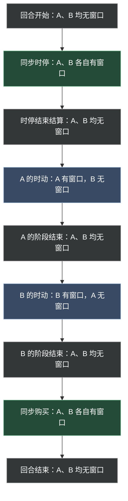
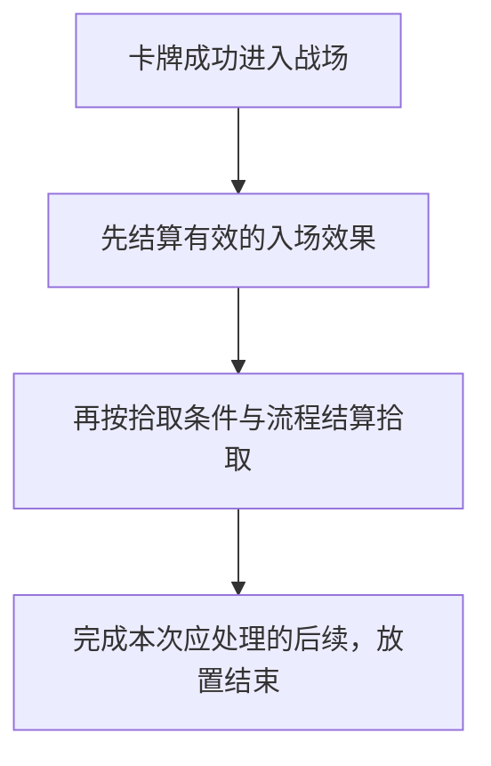

**第四章修订稿。** 操作窗口、明示放置成本、三种移动方式、拾取资格、攻击目标及主动能力默认次数已按本轮讨论更新。反击、入场目标选择等剩余问题见[第四章审阅事项](../maintenance/pending.md#第四章审阅事项)。

## 4.1 行动的共同边界

**ACT-001 权限与完成。** 玩家只能在自己具有相应权限时发起行动，且必须满足来源、目标、位置、次数和成本限制。需要指定目标却没有合法目标，或无法完整支付必需成本时，不能发起该行动。

选取目标、位置或模式本身不表示行动已经发生。具体行动规定承诺点：承诺前取消不产生该行动的结果；已支付或消耗的成本能否退还，按以下各行动条款处理，不能一概用“效果没成功”要求返还。

行动产生后，处理本次应完成的触发、状态变化和其他后续事项，全部完成后才能开始本方下一次普通行动。触发排序与失败细节统一见[第八章](effects.md)；另一方是否可同时操作依本章[操作窗口](#操作窗口)判断。

效果指示“移动”“放置”或“发动攻击”时，按该效果明确给出的权限和例外执行；只改变指定限制，不能自行推断所有阶段、目标和成本要求全部失效。

### 4.1.1 操作窗口

**ACT-010 操作窗口。** 操作窗口是某位玩家可以执行当前阶段允许的行动、并亲自完成效果选择的一段时间。应分别判断每位玩家是否拥有窗口，不能只看整个对局是否处于某个阶段。

| 时点或阶段 | 玩家 A | 玩家 B |
| --- | --- | --- |
| 回合开始：刷新、生成、抽牌及抽牌效果 | 无窗口 | 无窗口 |
| 同步时停，包括时停阶段开始效果 | 有窗口，直到本人声明完成 | 有窗口，直到本人声明完成 |
| 时停结束结算，包括湮灭 | 无窗口 | 无窗口 |
| A 的时动阶段，包括 A 的阶段开始效果 | 有窗口，直到本人声明完成 | 无窗口 |
| B 的时动阶段，包括 B 的阶段开始效果 | 无窗口 | 有窗口，直到本人声明完成 |
| 同步购买 | 有窗口，直到本人声明完成 | 有窗口，直到本人声明完成 |
| 阶段结束效果、回合结束清理 | 对应窗口已关闭 | 对应窗口已关闭 |

表中假定 A 先行动；B 先行动时交换两个时动阶段。某玩家提前完成同步阶段后，即使对方仍在操作，该玩家自己的窗口也已经关闭。

图 4-A 按时间从上到下排列：绿色表示同步阶段中双方各有窗口，蓝色表示仅阶段所属玩家有窗口，灰色表示双方均无窗口。颜色只是辅助，节点文字给出完整权限。同步阶段内，每名玩家声明完成时，本人窗口立即关闭；共同结束位置只表示阶段最终汇合，不保证两人等时长。

**窗口内外的效果选择：** 应作出选择的玩家拥有操作窗口时，由该玩家选择；不拥有窗口时，由系统自动选择，不等待该玩家输入。具体效果没有规定自动选择方式时，默认从合法选项中随机选取。自动选择仍须遵守目标、数量和其他合法性要求，不因此增加候选范围，也不会替玩家发起一项原本不能发动的主动能力。

例如，回合开始抽牌触发的选择、阶段结束触发的选择，以及对方时动阶段中己方效果要求的选择，都采用自动选择。没有合法选项、多个选择互相约束及可选项如何转换，统一在[通用结算逻辑](effects.md#目标模式与数量选择)细化。

阶段开始时先开放该阶段应有的窗口，再结算阶段开始效果；开始效果尚未结算完时不能抢先执行下一项普通行动。阶段结束效果则在相应窗口关闭后处理。

## 4.2 放置与箭头

**ACT-002 普通放置条件。** 在尚未声明完成的本方时停期间，可以从自己手牌选择卡牌，放入本方合法部署区域。目标格必须符合[占格规则](elements.md#棋盘与空间关系)。[资源牌](elements.md#资源牌)可与其他卡牌重叠，不阻挡普通放置；放置资源牌时也适用这一占格例外，其余放置条件仍须满足。

普通卡牌默认要求至少一个己方有效箭头指向目标格；箭头需求更高时，必须满足对应数量。同一个目标格可以受到多个来源的箭头支持，按有效箭头数量合计。待放置卡牌自身尚未在场，不能先用自己的箭头满足自己的入场条件。

### 4.2.1 放置步骤

1. 选择手牌与目标格，检查领地、占格、箭头及该牌专属放置限制。
2. 若卡牌明确要求独立的放置成本，完成相关选择并确认可以完整支付。星能购买标价不自动成为放置成本。
3. 在承诺前，可以取消选择，不移动卡牌、不支付成本。提交放置时再次检查卡牌、位置和必要条件。
4. **放置成本（已确认）：** 条件仍合法时支付明示的放置成本，随后执行入场；已支付的成本不因后续效果失败自动返还。没有明示放置成本的牌，不额外收取放置费。
5. 卡牌离开手牌进入战场。其位置与控制关系确定；箭头、持续效果及限制从满足相应生效条件时开始适用。建造中的随从遵守[4.2.3 建造](#建造)的封锁。
6. 记录一次本次时停成功放置，先结算[入场](../reference/keywords.md#入场)效果，再结算拾取，具体衔接见 [4.2.2](#放置与拾取)。
7. 本次应完成的后续处理结束，放置行动才完成。期间引发的新效果按结算规则处理，不能直接跳到下一张牌。

放置成功后又被移走或消灭，不撤销已经发生的放置，也不减少本次时停放置计数。由效果“召唤”或“生成”的牌可能满足入场条件，但不因此自动视为普通手牌放置。

**尚需决定的入场时序：** 放置自身的选择与成本顺序已经确认；以下两项会改变实际结果，需另行讨论；入场先于拾取的顺序已经确认：

- **入场效果的目标何时选？** 是放置提交前选定，还是卡牌已经进入战场、开始处理该入场效果时选择？
- **支付成本改变了位置条件怎么办？** 例如支付成本移走唯一提供箭头的随从，是仍完成已经合法提交的放置，还是重新检查？后者还须规定支付后无法入场的处理。

这些问题记录为 [A-02](../maintenance/pending.md#第四章审阅事项)；第八章统一定义效果链的插入与返回方式。

### 4.2.2 放置与拾取

**已确认：同一次放置引发入场效果与拾取时，先结算入场效果，再结算拾取。** 拾取自身的收益与本体消失顺序引用[6.8](lifecycle.md#拾取)。例如，入场效果需要支付星能时，不能预先使用这次放置随后才会拾取到的星能。

图 4-B 只规定入场效果与拾取的相对顺序。明示延迟的效果仍在其指定时点执行，不因本图提前；入场中途离场、移位或资源消失后的处理，以及多个入场效果、嵌套效果的排序，仍须按[8.5.3](effects.md#放置入场与拾取的衔接)细化。

例如，先从手牌放置资源，再将另一张牌放置到同一格，会触发资源拾取。两次放置各自满足放置条件；资源进入手牌后仍适用共存规则。拾取是放置引发的结算，不要求另外声明一次拾取行动。

### 4.2.3 建造

**已确认：建造是一种特殊的放置。** 可建造卡牌放置后以建造中的形态留在战场，完成建造后解锁完整形态。卡牌具有建造进度，每有一个箭头指向它，进度增加 1；每回合结束时固定进度，下回合从固定的进度值起继续计算。

建造中的随从仅生命值有效，攻击力与移动能力置 0，不提供任何有效箭头，卡牌效果全部关闭；建造进度满时才解锁完整形态。建造进度依本节继续结算，不因卡牌效果关闭而停止。

**待细化：** 箭头移走是否回退当回合未固定的进度、同一箭头持续指向或重复出现如何计数、何时检查进度已满，以及名称、职业、种族等身份信息是否属于被封锁的属性。不能从“白板”自行补出这些答案。

建造不自行豁免未被明确修改的放置条件。进度达到多少算完成由对应卡牌规定；实例转区后的记录处理见[6.2.4](lifecycle.md#建造值)。

## 4.3 移动与特殊位移

游戏有三种移动方式：**普通按路线移动、瞬移、冲撞移动**。三者使用单位的剩余行动点作为移动额度；普通攻击次数与主动能力次数分别计算。

在自己的时动阶段，玩家可操作仍在战场、由自己控制、具有所需行动点且未被禁止移动的单位。普通移动适用通常移动规则；瞬移与冲撞还须具有提供对应移动方式的能力或效果。效果指示的位移按其明确权限执行。

### 4.3.1 普通按路线移动

**ACT-003 普通移动（已确认选路方式）。** 玩家选择范围内的合法终点，系统选择一条合法路线，沿上下左右相邻格逐格移动，不直接斜走。

1. 玩家选择终点。系统须找到一条可通行、所需行动点不超过当前余额的路线；几何距离足够短，不保证被阻挡的目标可达。
2. 沿所选路线逐格前进，每走一格消耗 1 行动点；进入格子后处理该位置变化引发的效果，再继续下一步。
3. 每一步开始前重新检查该步是否合法。单位离场、被其他效果移离原定路线，或下一格不能进入时，停止剩余路线；已经完成的移动与消耗不撤回。
4. 路线及相关结算完成后，移动结束。有剩余行动点时可以另行移动，不必一次用完。

路线不能穿过普通占格对象，终点也须可进入。**多条合法路线之间的选择由系统负责**；系统如何在这些路线之间确定唯一结果仍须细化，不再让玩家选择路线。

### 4.3.2 瞬移

**ACT-004 瞬移（已确认）。** 玩家选择符合瞬移效果要求的合法目标格，消耗 **1 行动点**，直接从起点移动到目标位置。

瞬移无视沿途碰撞，不经过中间格，不拾取途中资源，也不触发途中格的进入效果。终点仍须满足占格及具体效果规定的条件，例如只允许瞬移到具有某种特征的格子；无视途中碰撞不取消终点合法性检查。到达终点后处理该格的进入效果与拾取。

### 4.3.3 冲撞移动

**ACT-011 冲撞移动（已确认）。** 玩家选择上、下、左、右中的一个方向，单位沿该方向直线冲 N 格；N 由对应效果规定。

1. 沿选定方向逐格前进，每实际移动一格消耗 1 行动点，并处理该格的位置变化效果。
2. 达到 N 格、下一格有不能通过的障碍物、没有下一格可进入，或行动点耗尽时，停止冲撞。单位离场等使移动无法继续的情况同样停止。
3. 只按实际移动格数付费；被障碍物挡住而没有走出的那一步不消耗行动点。例如计划冲 4 格，走 2 格后遇阻，则停在已到达的格子，只消耗 2 点。

资源的合法共存不会阻挡冲撞。冲撞本身不附带撞击伤害、击退或摧毁障碍的效果；这些收益须由对应效果明示。

### 4.3.4 移动中的拾取

进入资源格时，按[6.8 拾取流程](lifecycle.md#拾取)判断和处理。

普通移动与冲撞逐格判断进入效果，瞬移只判断终点。拾取随移动结算，无须另行声明或额外支付一次移动成本。同格多资源或多个进入效果的先后由第八章统一规定。

## 4.4 攻击与反击

**ACT-005 普通攻击条件。** 在自己的时动阶段，选择仍在场、由自己控制、尚有攻击次数且允许攻击的随从。攻击可选择自身**当前攻击范围内任一格**中的非己方随从，即不由当前攻击玩家控制的战场随从。常规随从默认攻击范围为 **1**，因此按[2.5 的距离规则](elements.md#棋盘与空间关系)，通常只能攻击上下左右相邻格；范围提高后，目标格也相应扩大，不能仍限制为相邻格。范围形状有明示例外时按其说明处理。

通常每回合恢复 1 次普通攻击机会；修改攻击次数的效果另行适用。攻击与移动分别使用次数和行动点，普通攻击不自动耗尽剩余行动点。

若合法范围内存在具有[嘲讽](../reference/keywords.md#嘲讽)的目标，按该词条限制目标选择。**法术牌与资源牌不能成为攻击目标。**

### 4.4.1 攻击步骤

1. 选择攻击者及合法目标，确认当前攻击权限、范围和次数。提交前可以取消，不消耗次数。
2. 提交合法攻击，消耗 1 次攻击次数，再处理攻击前响应。
3. 若攻击被取消，不进行战斗伤害，已消耗次数不返还。双方离场等情况使战斗不能继续时，同样不自动退回次数。
4. 攻击能够继续时，确定攻击伤害及符合反击条件的反击伤害，作为同一战斗伤害批次处理。
5. 本批伤害全部处理后，受伤效果与死亡检查依[6.3.1](lifecycle.md#确认死亡离场与死亡效果)的先后处理；随后处理攻击后事项。
6. 本次后续处理全部完成后，攻击结束。

同一批战斗伤害不表示全部触发在同一瞬间无顺序发生，也不能先让一方死亡、再单凭该死亡取消已经确定的反击伤害。护甲、[圣盾](../reference/keywords.md#圣盾)和其他伤害修正规则仍须分别应用。详细伤害与死亡顺序由第六、八章统一规定。

### 4.4.2 反击条件

**ACT-006 反击。** **已确认：攻击者必须位于受击者自身的当前攻击范围内，受击者才可能反击。** 双方分别使用自己的攻击范围，不因攻击者能够命中就默认受击者也能还击。例如，攻击者范围为 2、受击者范围为 1，双方相距 2 格时，这次攻击可以命中，但受击者不能反击。

其余条件沿用本章草案：防守方仍在场、能够进行战斗反击，且未被有效规则禁止反击。反击不属于防守方主动发起的一次普通攻击，不消耗其普通攻击次数，也不要求它是当前行动玩家。

是否允许无法主动攻击的单位反击，以及攻击前位移后在哪一步重新检查双方范围，仍需具体裁定。范围内才可能反击的条件已经确认，不再作为未决问题。

## 4.5 主动能力

**ACT-008 发动条件。** 主动能力由玩家主动选择发动，区别于满足条件时自动触发的效果和持续生效的规则。在自己的时动阶段使用；时停不提供主动能力操作，入场及其他触发效果按各自条件处理。

来源须位于能力要求的区域、由有权玩家控制，且未被相应限制封锁。目标、模式、成本和使用次数都必须满足。**每项主动能力默认每回合可发动 1 次，随从牌与法术牌采用同一规则。** 明示“每回合可发动／触发两次”等次数说明时，使用该能力写明的上限。这个默认限次针对主动能力，不给所有触发效果统一增加每回合一次限制。

### 4.5.1 发动步骤

1. 选择来源与具体能力，检查阶段、控制关系、状态、次数及必需成本。
2. 完成本次发动要求的目标、模式和数值选择。此时取消，不支付成本，也不算发动。
3. 支付前再次检查来源、选择和成本；条件不满足则不发动、不支付。
4. 完整支付发动成本，再处理针对本次发动的反制。
5. 被反制时不执行效果，已支付成本不返还；本稿以成功发动计次数，因此此次不增加成功发动次数。
6. 未被反制而成功发动时，记录一次使用，再按文本执行效果。后续目标失效或效果部分失败，不返还已支付成本，也不抹去已记录的成功发动。
7. 应在本次完成的后续处理结束，能力行动完成。

上述“先选择、再支付、再反制”采用较新的成本文档与当前实现，替代旧长版“先反制后付主体成本”的草案来源，仍待本轮审阅。

非回合限次不因回合开始自动恢复；刷新规则见[3.2](rounds.md#回合开始)。若具体能力改用“尝试发动次数”等其他口径，须明确说明。

### 4.5.2 时停效果与延迟结算

**ACT-009 明示延迟。** 时停中的入场或其他触发效果可以明确安排延迟结算，例如当前卡牌“刺客-J”“预判投弹”的入场效果带有“慢速”。这不构成玩家在时停主动发动能力的许可。只有文本明确延迟的效果才延迟；慢速的准确时点统一由其词条裁定，不能将所有入场效果或时停效果一概推迟。

延迟效果须说明锁定的对象是什么。例如，“结算时该格上的单位”与“此前指定的那次入场单位”可能得到不同结果。指定区域中的目标离开该区域后失效、重新进入也不恢复，统一见[8.2.3](effects.md#无合法选项与目标失效)；改变控制者或位置后的其他资格仍按该效果的目标条件检查，尚未裁定的交互不能由玩家自行选择有利解释。

## 4.6 关联章节

- [回合流程与行动权限](rounds.md)
- [状态变化与卡牌生命周期](lifecycle.md)
- [通用结算逻辑](effects.md)
- [关键词库与术语索引](../reference/keywords.md)
- [第四章审阅事项](../maintenance/pending.md#第四章审阅事项)
