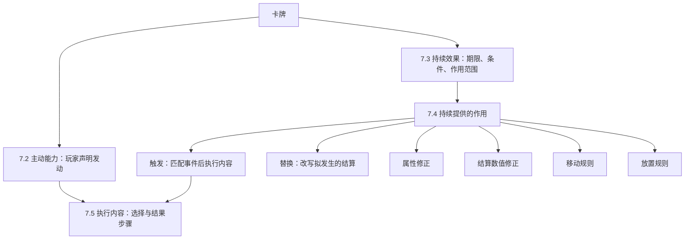

**本章按已确认的组织方向修订，具体规则以本轮固定的试玩基线为准。** 卡牌可以拥有主动能力，也可以在一定期限与条件下持续提供作用。触发、结算替换、属性修正、数值修正、移动规则和放置规则，是持续效果可以提供的六类作用。

## 7.1 设计方法与阅读入口

**DES-001 先确定效果怎样存在，再填写它提供什么。** 效果、关键词与状态的区别见[2.4.1](elements.md#效果关键词与状态)。同一张卡可以拥有多个主动能力和持续效果；一个持续效果也可以同时提供多项作用。

图 7-A 表示设计的组成关系，不是对局结算顺序。触发和替换由持续效果提供；替换直接改写匹配的结算，不先发动一次主动或触发效果。

### 7.1.1 从想法到完整设计

- **玩家主动发动：** 从 [7.2](effect-design/activated.md) 开始，写清阶段、使用要求、选择、成本、次数与执行内容。
- **符合条件时提供作用：** 先填 [7.3](effect-design/continuous.md) 的存在期限、生效条件和受影响对象，再选择 [7.4](effect-design/contributions.md) 中的一种或多种作用。
- **需要选择并改变局面：** 主动能力和触发作用通过 [7.5](effect-design/execution.md) 写清执行步骤。持续加成及替换本身不因此变成一次能力发动。
- **查具体选项：** 到 [7.6](effect-design/dictionary.md) 比较事件、范围、条件等条目；没有规则可唯一解释的组合列入待裁定问题。

### 7.1.2 如何填写要素表

**DES-002 只填写当前层负责的信息。** 持续效果已经规定期限、条件和作用范围，内部触发或替换就引用这些约束，不再各填一套重复的外层条件。内部需要更窄的事件筛选或不同的结果目标时，再单独写明。

例如，持续效果作用于“自己”，可以为自己提供“敌方随从攻击前”的触发；该触发再影响攻击者。**拥有触发的对象、事件中的对象、执行内容的目标是三件事。** 它们不必相同，不能用一个“目标范围”字段混在一起。

已有默认可以直接引用，例如主动能力每回合一次、窗口外选择转为合法随机；有例外时写明改了哪项。没有决定的时点、期限或失败处理不能靠模板留白代答，也不要求设计者为每张牌重新发明通则。

### 7.1.3 与结算规则及卡面文案的边界

本章描述效果的组成和设计参数；[第四章](actions.md)规定行动，[第六章](lifecycle.md)规定状态变化，[第八章](effects.md)规定选择、支付、检查和后续的时序。特别是触发可以观察明确的发生前或发生后节点，不能把所有发生前触发都改叫替换，也不能用单卡自填优先级代替通用结算规则。

正文使用游戏语言。当前运行内容帮助核对组织关系，但不覆盖本对话确认的规则；与旧数据不同的阶段、资源、卡牌分类和死亡处理，仍以对应主章节为准。[来源及差异记录](../maintenance/sources.md#第七章按实际内容结构重写)保存数据版本和编辑修正。

卡面文案是这份完整设计的简写，两者应表达同一行为；完整设计能被引用，并不要求把全部参数印在卡面上。

## 7.2 主动能力

[进入主动能力设计](effect-design/activated.md)：玩家怎样声明发动，以及准备选择、成本、次数和执行内容如何组合。

## 7.3 持续效果

[进入持续效果设计](effect-design/continuous.md)：分别定义存在期限、生效条件、受影响对象和持续提供的作用。

## 7.4 持续效果提供的作用

[查看六类作用](effect-design/contributions.md)：触发、结算替换、属性修正、结算数值修正、移动规则、放置规则。触发与替换的详细说明在该组下展开。

## 7.5 执行内容

[进入执行内容设计](effect-design/execution.md)：描述主动能力或触发作用执行时的选择与结果步骤，区分一次性改变和留下的持续作用。

## 7.6 共享设计字典

[打开字典索引](effect-design/dictionary.md)。按类别查阅紧凑列表，一行比较一个词条的用途、参数与例子。词条可以搜索、精确引用；复杂边界按需展开，本页目录只列类别。

本轮排除测试的卡牌及后续工作见[第七章审阅事项](../maintenance/pending.md#第七章审阅事项)。
