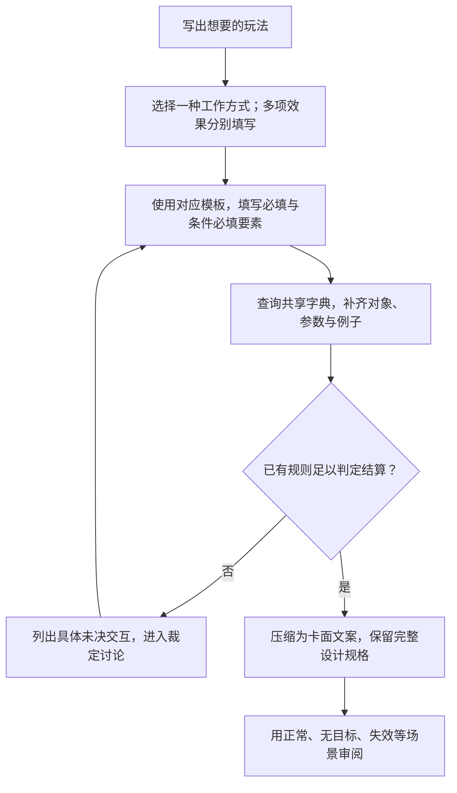

**本章的手册结构已确认，具体正文与示例待审阅。** 从下面选择一种效果模板，按表填写，再查共享字典。四类模板各自说明必填项、默认、完整示例和检查方法；卡面可以简写，设计规格必须能展开为无歧义的含义。

## 7.1 设计方法与阅读入口

**DES-001 先确定工作方式，再填写对应规格。** 效果、关键词与状态的区别引用[2.4.1](elements.md#效果关键词与状态)。一张卡可以同时拥有多项不同工作方式的效果，每项独立填写；触发效果留下加成，不因此变成另一种触发事件。

| 你想设计的行为 | 选用模板 | 核心问题 |
| --- | --- | --- |
| 玩家主动声明发动 | [7.2 主动效果设计](effect-design/activated.md) | 何时能发动、付什么、选择什么、执行什么、可以用几次？ |
| 某个事件发生后引出效果 | [7.3 触发效果设计](effect-design/triggered.md) | 观察哪个事件、事件中的谁、满足什么条件、产生什么结果？ |
| 在条件成立期间不断提供作用 | [7.4 持续效果设计](effect-design/continuous.md) | 存在多久、何时生效、影响谁、持续提供哪种贡献？ |
| 在变化发生前改写或阻止它 | [7.5 替换与阻止效果设计](effect-design/replacement.md) | 原来准备发生什么、何时适用、具体改掉哪一部分？ |

### 7.1.1 从想法到完整设计

图 7-A 是设计工作流程，不是对局中的效果结算顺序。

### 7.1.2 如何填写要素表

**DES-002 设计规格不依赖读者猜测。**

| 标记 | 如何填写 |
| --- | --- |
| 必填 | 必须给出具体值或精确规则引用。写“无成本”“无额外条件”也是明确答案。 |
| 条件必填 | 满足该行条件时必须填；例如即时伤害不填持续期限，留下攻击修正则须填期限。 |
| 可引用默认 | 写明引用哪个条款，不必把默认全文抄到每张卡；有例外单独说明。 |
| 待裁定 | 目前没有唯一答案，记录缺失问题和会出现不同结果的案例；不能以空白、代码现状或教学示例代答。 |

模板的“省略规则”说明缺失信息会造成什么问题。未列默认的项目没有暗含默认。每个设计还应注明来源卡牌、效果名称；一张牌有多项效果时，用不同名称区分，供关联效果和次数引用。

**教学示例只示范填写方法。** 示例的数值、名称、局部设计方案不是新卡表，也不批准新的通用机制。示例保留的审阅依赖须解决后，才能作为唯一可结算的正式卡牌规则。

### 7.1.3 与结算规则及卡面文案的边界

第七章描述效果的组成及参数；[第八章](effects.md)规定选择、支付、检查和后续何时处理；[第四章](actions.md)规定实际发动动作；[第六章](lifecycle.md)定义伤害、死亡、转区等变化。模板通过链接调用它们，不复制另一套结算顺序。

设计者可以明确提出例外，但不能给单卡随意填写“触发优先级”来替代通用排序。缺少目标、来源离场、窗口外选择等场景先引用通则，通则未定就记录依赖。四种模板使用游戏语言，不要求填写程序接口或内部编号。

短卡面只需呈现玩家应理解的行为；默认规则、完整筛选和边界仍保存在设计规格及其引用中。若短句与规格不同义，应修改短句，不能让两者成为两套规则。

## 7.2 主动效果设计

[进入主动效果模板](effect-design/activated.md)：独立要素表、发动要求、填写模板、完整教学实例和含糊写法修正。

## 7.3 触发效果设计

[进入触发效果模板](effect-design/triggered.md)：区分事件、观察角色、过滤条件、另外选择的目标、触发次数与结果。

## 7.4 持续效果设计

[进入持续效果模板](effect-design/continuous.md)：区分来源与承载者、存在期限、生效条件、影响范围及贡献内容。

## 7.5 替换与阻止效果设计

[进入替换与阻止模板](effect-design/replacement.md)：明确拟发生事件、适用条件、被改写部分、替代结果与使用限制。

## 7.6 共享设计字典

[打开字典总索引](effect-design/dictionary.md)。每一类是独立 Markdown 页面，条目以分级标题提供稳定锚点；侧边栏展开第七章即可进入。必填要求直接展示，不藏在折叠说明内。

- [7.6.1 事件](effect-design/dictionary/events.md)
- [7.6.2 对象与范围](effect-design/dictionary/targets.md)
- [7.6.3 选择方式](effect-design/dictionary/selection.md)
- [7.6.4 条件](effect-design/dictionary/conditions.md)
- [7.6.5 成本](effect-design/dictionary/costs.md)
- [7.6.6 结果与持续贡献](effect-design/dictionary/results.md)
- [7.6.7 执行时间与期限](effect-design/dictionary/duration.md)
- [7.6.8 次数限制](effect-design/dictionary/usage.md)

本章未决项集中见[第七章审阅事项](../maintenance/pending.md#第七章审阅事项)。新增条目应给出精确定义、参数和规则依据，不从实现枚举直接推导已批准选项。
