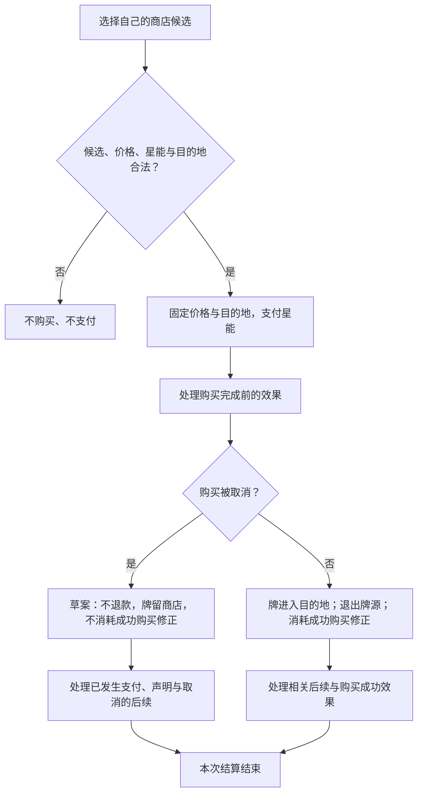

**第五章完整草案，待集中审阅。** 星能运营、商店购买和卡组成长属于所有模式共用的核心。本章承接已确认的操作窗口、放置成本和区域转移规则；默认商店数量、刷新及购买细则从旧文与当前行为整理，仍随本章审阅。问题集中于[第五章审阅事项](../maintenance/pending.md#第五章审阅事项)。

## 5.1 星能

**ECO-001 星能属于玩家。** 获得星能增加该玩家的余额，支付星能减少余额。星能主要用于购买商店卡牌，也可用于明确要求星能的其他成本；它不是单位的护甲、生命或行动点。

星能跨回合保留，不在回合结束时清空。不能支付超过当前余额的成本，也不能以预期在后续效果中获得的星能提前付款。若一个效果先获得星能、后要求支付，先完成的获得可以用于后续支付。

星能来源由卡牌效果或模式规则规定，例如[资源拾取](lifecycle.md#拾取)。普通回合流程不自行附加固定收入、利息或自动补满。模式可规定开局余额与资源生成方案；本章不把标准模式地图上的某种资源数量当成所有模式的收入。

### 5.1.1 购买标价与其他成本

卡牌的星能标价是购买价格的计算基础，不代表放置时再次收取该金额。放置只支付明确写出的独立成本，见[4.2.1](actions.md#放置步骤)。主动能力支付自身明确要求的成本。

“下一次购买减费”只修正符合其条件的购买，不降低任意星能支付。

## 5.2 额外卡组与商店候选

**ECO-002 默认商店牌源。** 每位玩家的普通商店以自己的额外卡组为牌源。**购买阶段开始时自动上货**，为各自商店自动产生最多 **5 张候选牌**；剩余牌源不足 5 张时，展示全部可用牌。明确增加格子或改变牌源的效果按其文本处理。

“剩余商店牌源”包括仍可供后续购买的未展示牌和当前未购候选。**展示不是购买，未购候选没有被消耗。** 成功购买的那一张退出普通商店牌源，之后不能在同一个牌源里再次被抽成候选，除非明确效果把它送回或新增另一份牌。

### 5.2.1 候选生成与拷贝

普通候选按随机结果从可用牌源选择；同一张具体卡牌不能在一批候选中重复出现。同名的两张牌是不同对象，可以同时出现。普通随机选取按[8.2.4](effects.md#随机选择与随机伤害)对合法候选等概率、不重复实例。

购买成功后留下的空位不自动补牌；需要刷新或等到下一次正常上货。剩余牌源为空时，没有普通候选；不凭空生成新牌，也不把主牌堆或弃牌堆作为替代牌源。

### 5.2.2 陈列、归属与区域

玩家只能按权限购买自己商店里的候选。展示不等于已取得一张手牌，也不把商店中的牌当作场上卡牌。自己的商店信息是否向对手公开，依[2.7](elements.md#公开与隐藏信息)。

额外卡组与商店是两个独立区域，定义见[2.6.3](elements.md#额外卡组与商店的区域划分)。额外卡组数量只计算未陈列部分；“剩余商店牌源”计算两个区域的合计。刷新流程见[5.3.1](#主动刷新步骤)，转区时的修正继承见[6.5](lifecycle.md#区域转移与状态保留)。

## 5.3 商店刷新

**ECO-003 刷新草案。** 购买阶段开始的自动上货，与玩家主动刷新是两种不同操作。本稿采用：**每名玩家每回合可成功主动刷新一次，默认不收星能**；阶段开始自动上货不占用这个次数。次数与费用的明确例外仍可生效。

### 5.3.1 主动刷新步骤

1. 玩家仍在自己的购买窗口内，尚未声明完成，且有本次可用刷新次数。
2. 检查是否存在可重新展示的候选。若全部剩余牌源都已展示，本稿不提供不会带来新候选的普通刷新；此限制列入审阅。
3. 将商店中的全部未购牌退回额外卡组，按[6.5](lifecycle.md#区域转移与状态保留)保留修正；洗牌后，按当前商店格数取牌进入商店，默认最多 5 张、不足则全部取出。
4. 成功完成后，消耗一次刷新次数。之前已经成功购买的牌不会因此被退回商店，星能支付也不撤回。
5. 完成刷新相关效果后，继续本人的购买窗口。

新候选可能再次包含刚才未购买的牌；刷新不保证出现不同牌。已经成功购买的牌不因刷新重新加入牌源。

阶段结束后未购牌仍留在剩余牌源中，下次自动上货可以再次展示。玩家提前声明完成后不能再购买或刷新；另一方仍可在自己的窗口中继续。

## 5.4 购买卡牌

**ECO-004 一次购买取得一张具体候选。** 购买默认把牌送入购买者的弃牌堆。改变目的地的有效例外在支付前确定；购买完成后的效果可以再移动它，但不能追溯改写这次购买原本进入的区域。

### 5.4.1 确定价格与目的地

以该牌的购买标价为基础，应用当前有效且符合条件的费用修正。本稿将最终价格下限设为 0；零费购买仍占用该候选，仍能满足“购买成功”的条件，不会因价格为 0 自动变成生成。

本次价格和目的地在最终检查后固定，再支付星能。只有条件适用于这次购买的修正参与；“下一次成功购买”的修正在购买成功时消耗。

设定值、加减、倍数及取整采用[8.4.1](effects.md#数值运算与读值)；购买价格的小数向上取整。多个目的地例外依其有效性及[替换顺序](effects.md#结算前改写与结算后触发)处理，不按稀有度或界面排列决定。

### 5.4.2 购买步骤

以下采用旧长版及当前购买行为形成的草案，支付后取消的规则需要重点审阅：

1. 选择自己商店中的一张候选，检查本人购买窗口和购买权限。
2. 确定当前价格及适用的目的地例外，检查候选仍存在、星能够付、目的地合法。支付前可以取消，牌和星能均不改变。
3. 提交购买，固定这次价格和目的地，支付星能并声明本次购买。由支付／声明引发的后续暂记，按本流程的专门顺序处理。
4. 处理明确发生在购买完成前的效果。若购买被取消，转入 5.4.3；否则继续。
5. 将该牌移入最终目的地，默认是购买者弃牌堆；这张牌退出普通商店牌源，同时消耗用于本次成功购买的一次性修正。
6. 先处理暂记的支付／声明后续，再处理区域转移及购买成功所引发的后续。若已取消，也须处理已发生支付／声明及取消引发的有效后续，只是不产生购买成功效果。成功后的效果不追溯重算已经支付的价格，也不把已发生的购买撤回。
7. 相关结算完成后，玩家才能继续本人的下一项购买或刷新。

**购买的专门时序草案：** 本流程将支付／声明的后续延至购买成功或取消后，先完成明确的购买前反应；其结算点按[8.5 待结算效果](effects.md#多个效果与连续结算)独立说明，需随本章审阅，不能暗中推广到放置或主动能力成本。

图 5-A 表示一次购买。它不规定双方购买轮流进行；双方操作窗口仍同步开放。图中的取消分支是本章草案，不表示玩家支付后拥有自由撤销购买的权利。

### 5.4.3 取消与失败

支付前的检查失败：不扣星能，不消费候选或一次性成功购买修正。

**支付后被效果取消的草案：** 已付星能不返还，牌仍留在商店，没有购买成功事实，也不消耗“下一次成功购买”的修正。该结算结束后，若牌仍合法且玩家仍有权限和足够星能，可以另发起一次购买，重新检查和报价。

**待审阅的失败去向方案：** 购买被取消或目的地不能接受、且商品尚未离开商店时，牌留在商店；若另一项已完成的效果把它移走，牌留在该效果实际送达的区域，不追回，也不凭空消失。尚未成功的购买不会自动把牌送进弃牌堆。支付后候选被移走或目的地变非法的完整失败方案仍待确认，不能把用户追问去向当作整项批准。

## 5.5 卡组成长与循环

**ECO-005 买入不等于立即抽到。** 默认买到弃牌堆的牌等待后续回洗，再经抽牌进入手牌。购买阶段不因取得新牌而开放普通放置窗口。

牌组循环见[图 2-B：区域迁移](elements.md#区域迁移示意)；各次转区是否保留修正，统一按[6.5](lifecycle.md#区域转移与状态保留)裁定。

额外卡组不会因为主牌堆耗尽而自动洗入主牌堆，已经买到的牌也不会因使用完毕自动补回额外卡组。生成、移除、回收或特殊商店补货须有相应效果。

能否直接构筑某张牌由[四类收集属性](elements.md#收集属性)与模式决定；进入循环后的持续与离场依随从、法术、资源三种基础类型处理，不能从“衍生”或“买来的”身份额外推导消失规则。

## 5.6 关联章节

- [回合流程与同步购买](rounds.md#购买)
- [抽牌弃牌与洗牌](lifecycle.md#抽牌弃牌与洗牌)
- [通用结算逻辑](effects.md)
- [标准对战的构筑与开局配置](../standard/setup.md)
- [第五章审阅事项](../maintenance/pending.md#第五章审阅事项)
