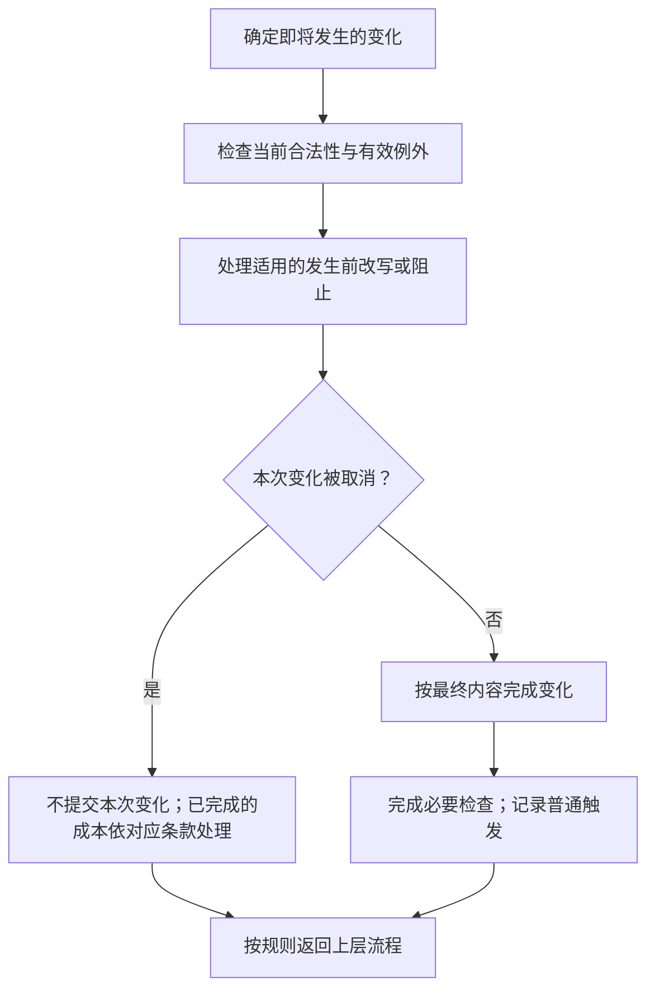
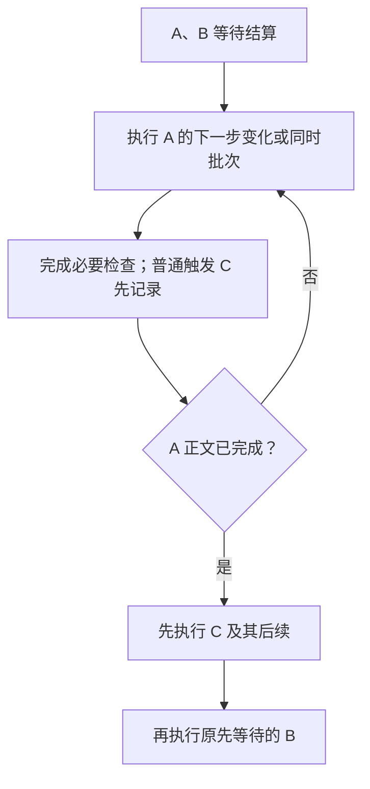

本章说明行动、效果和系统流程共用的结算时序。已确认条款作为裁定依据；本轮规则已固定为试玩基线，集中见[第八章审阅事项](../maintenance/pending.md#第八章审阅事项)。

## 8.1 通用结算边界与行动时序

**SET-001 共用结算概念，各行动定义自己的先后。** “玩家选择了一个目标”“行动已声明”“实际发生了变化”“因此触发的效果已经处理”是不同节点。放置不等于发动卡牌效果，购买也不因为可能触发能力就先变成一次能力发动。

### 8.1.1 必须区分的节点

- **准备与检查：** 确定意图、选择、合法条件及成本；尚未发生的结果不能当成已经发生。
- **承诺与支付：** 到对应行动规定的时点才消耗资源或次数；并非所有行动都有相同成本。
- **发生前处理：** 只让明确适用于此节点的替换、阻止或反制参与。
- **完成变化：** 明确哪些内容必须一起完成，形成已发生事实；不能让后续效果读取同一整体变化只完成一半的状态。
- **记录触发与必要检查：** 记录这次事实引出的效果，再按对应时序处理属性、死亡、区域及胜负检查。
- **处理待结算事项：** 到规定结算点才执行等待的效果，最后返回尚未完成的原流程或交还行动权限。

这是一组需要逐项定义的节点，不要求每种行为全部经过，也不规定它们对所有行为只有一种排列。替换与反制不自动开放一个新的玩家操作窗口。

### 8.1.2 各类行动的时序入口

| 行为 | 主定义与承诺边界 | 本章衔接 |
| --- | --- | --- |
| 放置 | [4.2.1](actions.md#放置步骤)：选择检查 → 明示成本 → 入场。 | 成本整体支付；入场先于拾取，拾取开始时的资格重检见[6.8.1](lifecycle.md#拾取完成流程)。 |
| 移动 | [4.3](actions.md#移动与特殊位移)：普通与冲撞逐格，瞬移只处理终点。 | 逐格完成进入效果再走下一步；效果位移不消耗目标行动点，见4.3.5。 |
| 攻击 | [4.4.1](actions.md#攻击步骤)：声明时扣次数；双方分别检查攻击范围。 | 攻击前反制后重检；战斗伤害同批，死亡清理先于普通后续触发。 |
| 购买 | [5.4.2](economy.md#购买步骤)：报价、支付、购买前处理、转区及成功／取消。 | 支付后续与购买成功后续的释放顺序，不能套用能力成本的实现分支。 |
| 主动能力 | [4.5.1](actions.md#发动步骤)：准备选择、支付并消费次数、反制和正文执行。 | 已付成本和次数不因反制返还；普通成本触发待主体完成，来源变化按8.7.2处理。 |
| 阶段与系统流程 | [第三章](rounds.md)：窗口、阶段起止、刷新、抽牌及结束清理。 | 结束清理使用统一快照；没有费用的系统步骤不添加支付节点。 |

各行为采用其对应主定义，共用时点模型不改变其专门顺序。

## 8.2 目标模式与数量选择

**SET-002 选择应满足完整条件。** 目标可以是卡牌实例、玩家、格子或区域中的牌；模式、方向、数量和点数分配也是选择。一次选择必须同时满足类型、区域、控制关系、距离、数量和其他限制。

### 8.2.1 选择时点与操作窗口

选择权限引用[4.1.1 操作窗口](actions.md#操作窗口)：有本人窗口时亲自选择；窗口外由系统自动选择。没有专门的自动方式时，从合法选项中随机选择，不暂停等待一个不存在的操作窗口。

放置行动先选择手牌和目标格，主动能力按第四章先准备其发动要求的选择。效果执行到中途才产生的新选择，在那一步处理，不要求玩家提前知道尚未发生的结果。

**入场目标选择已确认：** 轮到该入场效果结算时选择目标，不以其目标条件代替放置条件；完整规定见[4.2.1](actions.md#放置步骤)。可建造卡牌自身入场触发在建造完成时发生，见[4.2.3](actions.md#建造)。

未指定随机的选牌、选格由效果所属玩家选择；卡文明确最近者时按通常格距比较，并列最近者随机选择。来源或目标缺失时采用既有失败与部分完成规则，不补造对象。

### 8.2.2 多目标与点数分配

效果要求“恰好 N 个”时，必须有 N 个合法选项；要求“至多 N 个”时，不超过上限并满足文本规定的最低数量。选择多个不同目标时不能重复选择同一实例。选择时已经满足数量要求后，执行时只跳过已失效的目标，不再以剩余数量不足为由阻止其余合法目标，详见[8.7.1](#不同失败阶段)。分配总点数时，每一项及总和都必须符合该效果的条件。

选择一张牌和选择它所在的格子不是同一件事：“对该随从造成伤害”跟随指定对象的合法性检查；“对该格上的随从造成伤害”在规定时点读取该格的对象。效果必须说明自己使用哪一种。

**放弃须由文本允许（已确认）。** 默认强制执行；“可以”“至多”等文本才允许放弃或少选。窗口外自动选择也须遵守相同选项范围。窗口外的可选放弃与随机权重按[8.2.4](#随机选择与随机伤害)处理，不默认最大收益、最多目标或总是放弃。

**点数分配。** 未另定限制时，分配总量必须用尽，每个实际接受者至少分得1点整数，可以全部分给一个合法目标。没有合法目标时该部分不执行。随机分配护甲逐点等概率抽取合法目标、允许重复，先确定本批各目标总量，再批量赋予护甲，不逐点插入后续。随机伤害仍按8.2.4的逐点完整结算例外。

### 8.2.3 无合法选项与目标失效

发动前就无法满足必需选择或完整成本时，不能发起该主动行动，不支付成本。结算途中因局面变化而缺少必需目标时，不提出无法完成的选择；转入[失败与部分完成](#取消失败与部分完成)处理。

目标仍存在但不再符合要求，与目标已离场是不同原因，都要核对当前这一步的条件。未明确允许重新选择时，不能擅自换一个有利目标。

**SET-012 指定区域的目标离区后失效（已确认）。** 一项效果以指定区域中的某张具体卡牌为目标时，该牌一旦离开该区域，就不再是这次效果的有效目标。即使同一张牌在效果结算前重新进入该区域，也不会恢复这次目标关系；效果明确允许跨区域追踪时，按其例外处理。该规则适用于战场、手牌、牌堆、弃牌堆、商店、额外卡组、虚空等可由效果合法指定的区域。

“指定目标”说明**某一次效果作用于谁**，是这次效果记录的对象关系，不向目标卡牌赋予新的“被锁定”状态或 buff。因此，本条不是逆向转区清除 modifier 的一种表现，也不删除这张牌的实例、耐久或整局历史。多项效果各自指定目标，分别按各自要求判断。

例如刺客-J 指定随从 A 后，A 返回手牌并再次放置到战场，原来的慢速消灭不再对 A 生效，也不能自动改选另一只随从。仅在战场内移动不是离场，不因本条使目标关系失效；其他目标条件仍照常检查。按格子选择的效果则继续按[8.2.2](#多目标与点数分配)读取该格，不套用本条对指定卡牌的规则。

同样，效果指定了敌方手牌中的某张牌，该牌被打出或弃置后，即使又回到敌方手牌，也不再是这次效果的有效目标；效果指定牌堆中的某张牌，该牌抽出后再洗回也不恢复；效果指定商店中的某张牌，该牌刷新退回额外卡组后，即使再次上货也不恢复。商店刷新保留 modifier 的例外，不改变这项目标规则。

失效的是这次效果对该目标的指定，不能因此把整项效果的其他步骤一并判为取消；其余步骤是否继续，仍按[8.7.1](#不同失败阶段)的依赖与部分完成规则裁定。本条也不增加查看隐藏区域或选择其中具体卡牌的权限，选择本身须先合法。

### 8.2.4 随机选择与随机伤害

**SET-014 随机口径（已确认）。** 未明示权重时，每个合法候选等概率。选择多个不同目标时不重复取同一实例；同名的不同实例仍是不同候选。

**随机分配 N 点伤害逐点结算。** 每次从当前合法目标中等概率选择一个，造成 1 点伤害，完成这一点的必要检查及后续效果，再选择下一点；仍有效的对象可以再次被选中，已死亡等失效对象不再参与。这是逐点结算的明确机制，不与“一次同时伤害”混用，也不把其他效果正文改成逐步插入普通触发。没有合法候选时，余下点数无法造成伤害。

**窗口外的可选效果。** 文本允许执行或放弃时，先以相同概率选择执行／放弃；选择执行后，再从合法选项随机选取。目标数量不会改变放弃概率。强制效果没有放弃选项，多目标仍须满足原文数量条件；“至多 N”先等概率决定放弃／执行，执行时在1至实际可选上限之间等概率选择数量，再合法随机选择目标。

## 8.3 成本支付

**SET-003 成本与效果结果分开。** 成本是为了完成某项行动必须先付出的内容，例如星能、行动点、使用次数，或明确要求弃置／移除的牌。花费星能不会自行成为伤害；弃牌、移除和死亡也不能因都失去一张牌而混称。

### 8.3.1 检查、承诺与返还

先完成行动要求的选择并检查能否完整支付，再到该行动的承诺点支付。承诺前取消不支付；承诺后不能单凭效果失败要求撤销已经发生的支付。

放置采用已确认的[4.2.1](actions.md#放置步骤)：只付明示放置成本，卡牌购买标价不自动成为放置费。攻击、移动、主动能力与购买各自的支付点，分别见第四、第五章，不把一种行动的次数处理直接套到另一种。

**多项成本整体支付（已确认）。** 先检查全部成本可支付，再整体支付，普通触发不插入成本之间；不能明知第二项付不起仍先收取第一项。支付引发的普通触发等支付与行动主体完成后处理；明示的发动反制仍在主体执行前处理。已发生支付不因后续失败回滚。

**成本替换也须满足支付要求（已确认）。** 在实际支付之前，判断所有成本经适用替换后的结果能否满足要求，再整体支付。要求献祭一只随从，但替换后它不会实际被献祭，就不算付清；明确允许替代支付的效果除外。支付检查失败不执行主体，也不先扣其他部分成本。

### 8.3.2 成本本身改变局面

**生命成本允许支付至死亡（已确认）。** 当前生命足以完整支付时，可以支付到0；不能以不足的生命支付完整成本。借时蜉蝣有2点生命时可以支付2点而死亡，只有1点时不能发动。生命支付不是伤害，不由圣盾或护甲抵挡，也不触发受伤。支付后满足死亡条件时按[死亡流程](lifecycle.md#确认死亡离场与死亡效果)锁定并清理本体，已经发动的效果不因来源死亡而取消，仍须遵守目标和其他结算条件。

作为成本移除一张牌，仍是[移除](../reference/keywords.md#移除)，须应用区域转移和 modifier 规则；成本不因服务于另一个效果就失去自身含义。哪些后续效果会因此触发，由实际事件条件判断。

放置许可在支付前确定；支付移走箭头来源不取消已合法提交的许可，入场时仍检查目标格能否容纳该牌，见[4.2.1](actions.md#放置步骤)。上述等待只延后普通触发，不免除支付造成的必要状态检查，也不新增自由响应窗口。

## 8.4 结算前改写与结算后触发

**SET-004 发生前可以改写，发生后只能引发新变化。** 一次变化尚未成为事实时，适用的效果可以改写其数值、目标、目的地或取消该变化；变化已经完成后，后续效果不能追溯声称它没有发生。

例如，购买前改为进入手牌，会改变这次购买的目的地；购买完成后再把牌送回牌堆，是另一次区域转移，分别判断 modifier。受到伤害后治疗，也不能抹去已经受到伤害这个事实。

图 8-A 描述一项变化的前后边界，不表示每项行动都自动开放一个让对手自由出牌的响应窗口。普通触发何时处理见[8.5](#多个效果与连续结算)，不因图中记录触发而立刻打断正文。只有满足条件的规则参与；涉及选择仍依 4.1.1。

**多个替换逐个应用（已确认）。** 采用[8.5.2](#同时满足条件的效果)的固定排序；每应用一个，重新判断其余替换是否仍适用。同一项替换对同一次变化最多应用一次。变化被取消后，依赖该变化继续发生的替换不再执行。该顺序不构成卡牌、模式或关键词之间的来源优先级。

### 8.4.1 数值运算与读值

**SET-015 运算顺序（已确认）。** 同一数值按 **设定值 → 加减 → 倍数 → 最终取整** 计算。同类修正按生效顺序处理，多次设定采用最后一次；中途不反复取整。不能为负的费用、护甲等最终最低取 0，不能据此将允许负值的当前生命／行动点强行归零。

购买费用的小数向上取整，进度目标向上取整；其他整数属性的小数向下取整，卡文明示覆盖。例如原价 6、减 1、再半价，得到 2.5，最终支付 3。[超越进制](lifecycle.md#进度)的目标降低后立即检查仍适用。

**SET-016 读值时点（已确认）。** 默认在对应步骤实际执行时读取当前值；支付材料、死亡对象等事件所引用的数值，读取该次事件发生前的记录。卡文明确“原始值”才读取原始定义，明确提前记录则使用该记录。

例如「黑市护甲贩」弃置原价 6、当时减费到 4 的手牌，获得 4 护甲；弃牌逆向清除 modifier 不将这次成本记录改成 6。购买报价依[5.4.1](economy.md#确定价格与目的地)在支付前固定，不因后续变化重新收费。

## 8.5 多个效果与连续结算

**SET-005 一份效果正文先完成（已确认）。** 执行期间每次变化仍完成必要的属性更新、死亡锁定与本体清理，同类批量变化依[8.5.4](#批量结算通则)整体完成；因此产生的普通触发先记录，等这份效果正文完成后再处理。明示的攻击前／发动前反制，仍在自己的发生前节点处理。[8.2.4](#随机选择与随机伤害)的逐点随机伤害是明确的逐点结算机制，每点后完成后续再进入下一点。

例如“造成伤害，然后抽牌”：先完成伤害、必要死亡清理，在伤害步骤成功时抽牌，随后处理受伤和死亡等普通触发。不允许用受伤后治疗抢在死亡锁定之前自救。

### 8.5.1 嵌套与返回

**子效果优先于原先等待的下一份效果。** A、B 已在等待，A 引发 C，则先完成 A 的正文和必要检查，再处理 C 及其后续，最后处理 B；不把 C 追加到 B 后面。若 C 又引发 D，则在 C 正文完成后处理 D，再返回 B。同一份正文引发的多项效果先按[8.5.2](#同时满足条件的效果)排序。

图 8-B 说明子效果先于等待中的其他效果；不允许普通触发打断尚未完成的一份效果正文或同一同时批次。来源离场不取消已触发效果，目标合法性仍逐项检查。

### 8.5.2 同时满足条件的效果

**固定排序（已确认）。** 先遵守具体规则明示的先后；没有专门顺序时，依次比较：

1. 事件发生的先后。
2. 相关玩家本回合的时动顺序；尚未确定时采用开局席位顺序。无控制者来源排在玩家来源之后。
3. 同一玩家的来源进入所在区域的先后；战场卡牌即按入场顺序。
4. 同一张牌的卡面效果书写顺序。

同一事件使多个效果符合条件，不表示它们在同一局面上完成；先结算者可以改变后一个的目标或可执行内容。玩家不能自由重排这一组效果。同步时停仍分别处理各自冻结局面，不因本排序变成轮流操作；跨双方场面合并按第三章另定规则处理。

**同批入场顺序（已确认）。** 同一批进入战场的来源，在上述玩家顺序内按入场格的棋盘固定顺序“从上到下、从左到右”区分，不随玩家视角翻转。这只确定来源及后续效果先后，不将本批入场拆成逐张完整结算。

**最终同序兜底（试玩暂定）。** 以上条件全部相同时，按来源卡牌在本局的创建先后处理。同一批创建的新牌，按生成效果列出的顺序；未列明时，为该批确定并记录创建次序，后续不再改变。此兜底只区分仍然同序的事项，不改变批量结算边界。

**批量变化与后续排序分开。** 批次按[8.5.4](#批量结算通则)整体完成，之后才为产生的后续效果排序；不能为了排序把同批变化拆成逐个完整结算。

### 8.5.3 放置、入场与拾取的衔接

已确认的放置步骤见[4.2.1](actions.md#放置步骤)，拾取过程见[6.8](lifecycle.md#拾取)。本节只讨论二者与入场效果如何衔接。

相对顺序以[4.2.2](actions.md#放置与拾取)为唯一主定义；入场目标在轮到效果结算时选择，多个效果按本章排序。建造中卡牌自身入场触发发生在完成建造时，主定义见[4.2.3](actions.md#建造)，不是放置时先触发后等待解锁。

拾取者或资源在执行前变化的处理，统一按[6.8.1](lifecycle.md#拾取完成流程)重检，不以收益是否能生效决定拾取资格。

### 8.5.4 批量结算通则

**同批变化先完成，后续效果再结算（已确认）。** 一项效果的同一步影响多张牌，或一次规则结算处理多张牌，默认构成一个批次；伤害、消灭／死亡、召唤／放置、抽牌、弃牌、湮灭等采用同一原则，不必逐种动作另作裁定。卡文或专门规则明确分步、逐次或逐点结算时，才按明示边界拆开。

1. **确定本批对象。** 完成必要选择与合法性处理，确定本次处理的对象、位置及所需记录。快照的建立时点沿用对应行动规则，例如回合结束先结算结束效果与固定建造值，再记录清理名单。
2. **完成本批变化与必要清理。** 先让本批各项实际变化完成，再完成对应的状态检查、死亡锁定及本体清理；发生前替换或取消仍在其必要时点应用。普通后续效果先记录，不在处理第一张牌后插入，以改变本批尚未处理的其他牌。
3. **处理本批后续。** 若这只是当前效果正文的一步，先依[8.5](#多个效果与连续结算)完成该正文的其他步骤，再处理已记录的后续；否则在批次完成后处理。后续按[8.5.2](#同时满足条件的效果)排序，并采用子效果优先。后续新生成、抽取或移入的牌不追加入已经确定的批次。

| 批量情形 | 本批先完成什么 | 随后处理什么 |
| --- | --- | --- |
| 对多张牌造成伤害／消灭 | 全部目标的本次变化、死亡锁定与死者本体清理。 | 受伤、死亡等后续。 |
| 召唤或放置多张牌 | 本批可成功入场的牌全部进入确定的合法位置。 | 入场等后续；第一张的入场效果结算时，其他成功入场的牌已经在场。 |
| 一次抽取多张牌 | 按牌堆与回洗规则完成本批抽取。 | 抽牌后续；按张计数仍按实际抽到的张数累计，不因同批而只计一次。 |
| 一次弃置／清理多张牌 | 对确定名单完成对应转区和必要检查。 | 弃牌、离场等后续；后续新增牌不追加清理。 |
| 多个格子湮灭 | 依据合并时的场面确定全部冲突、锁定本批应湮灭牌，统一清理。 | 湮灭后续；某格的后续不能改写另一格已锁定的本批结果。 |

**通则的边界。** “召唤A，然后召唤B”有明确先后及成功依赖，不自动合并成同批；[逐点随机伤害](#随机选择与随机伤害)明确每点完成后续再处理下一点，继续保留这一例外。数份独立效果同一时点触发，也不因此合并成一份批量正文。通则决定结算边界，不授予额外目标、占格许可或不同的费用规则。

## 8.6 持续时间与失效

**SET-006 到期与结算分开判断。** 可设计的时间维度见[7.6.7](effect-design/dictionary/duration.md)；本节处理到达时点或条件变化后的局面。

条件变化或期限到达后，按[6.2.3](lifecycle.md#持续加成与一次性修正)更新持续贡献；涉及转区时另按[6.5](lifecycle.md#区域转移与状态保留)处理修正。由这些变化引发的检查与后续纳入当前结算，不能都推迟到回合末。

**SET-011 已建立的延迟事项不依赖来源继续存活（已确认）。** 一项效果已经完成安排、建立了未来执行的事项后，不因来源随后死亡或离场而自动取消；文本明确要求“若来源届时仍在场”等条件时，才按该条件检查。执行时仍检查目标是否合法，不因安排保留就保证操作成功。

「刺客-J」的当前卡文为“入场：选定一个非英雄单位，[慢速]将其消灭。”入场效果选定目标并建立延迟消灭后，即使刺客-J 在慢速结算前死亡，该事项仍保留；到期时对仍合法的目标执行消灭。卡文不增加“刺客-J 仍在场”的条件。

这与尚未触发的阶段效果不同：例如一项明确只在来源位于战场期间有效的阶段开始触发，时点到来时来源已离场，就不再提供该触发。是否已经建立延迟事项与是否仍在等待触发条件，应由效果内容与存在期限判断，不以“注册”一词混称。

延迟事项到达指定时点后，纳入该时点的待结算事项。指定区域目标的离区与重入按[8.2.3](#无合法选项与目标失效)处理；数值读取采用[8.4.1](#数值运算与读值)默认，卡文明示提前记录则用该记录；同点普通效果使用[8.5.2](#同时满足条件的效果)的排序。时停中产生的慢速按[3.3.1](rounds.md#时停结束与湮灭)，在湮灭与拾取结算后、任何玩家时动前处理；其他阶段或慢速结算期间新产生的慢速按[慢速词条](../reference/keywords.md#慢速)当场处理，不另等下一阶段。

## 8.7 取消失败与部分完成

**SET-007 不撤销已经发生的事实。** 结算失败不等于整次行动从未发生；已经支付、移动、抽取或造成的伤害，只能由后续明确效果再改变。

### 8.7.1 不同失败阶段

- **提交前不合法：** 不执行行动，也不付成本；可以重新作合法选择。
- **某项即将发生的变化被取消：** 不产生该项完成事实；已经完成的前置成本及其事实仍按规则保留。
- **效果中途目标失效：** 该步骤不能对失效目标执行，其他部分是否继续取决于依赖关系。
- **部分目标仍合法（已确认）：** 选择目标时必须满足规定数量；合法选完后，结算时跳过失效者，仍对剩余合法目标执行，不重新要求凑足原数量，也不自动改选补足。

**SET-013 “然后”表示成功依赖（已确认）。** 卡文写“A，然后 B”，表示 A 必须结算成功，才执行 B；A 因目标失效、被取消等原因未成功时，B 不执行。若拿掉“然后”，且没有其他明确依赖条件，则两项效果并行、互不依赖，其中一项失效不阻止另一项执行。

例如“对指定随从造成 3 点伤害，然后抽一张牌”，目标在结算前离开原区域，伤害无法执行，因此不抽牌；若写“对指定随从造成 3 点伤害。抽一张牌。”，伤害失效仍抽牌。“若以此消灭目标，则抽牌”进一步明确要求成功消灭，不能仅以完成伤害步骤代替。

这里的“并行”确认两项效果没有成功依赖，不自行把它们规定为同一伤害批次；独立效果的结果先后和触发排序仍按对应时序裁定。**伤害被圣盾抵挡仍算成功执行（已确认）。** “造成 3 点伤害，然后抽一张牌”对合法目标执行伤害，伤害被圣盾全部抵挡，伤害事件已经发生，伤害步骤算成功，因此仍抽牌；供伤害量统计读取的数值则是 0。这不同于目标失效或伤害步骤被取消而根本没有执行。执行成功与实际造成多少伤害分别判断，不能由计数为 0 自动推断执行失败；但“受到伤害”触发要求实际扣除生命，见[6.1.2](lifecycle.md#伤害事实与多段伤害)。

例如已合法选择两名目标，一名在结算前离开原区域，仍对另一名执行；选取时必须选两名，不代表执行时必须仍有两名。本条不授予重新选择权。**至少对一个合法目标成功执行，就满足后续“然后”；要求全部成功时须明写“若全部……”。** 所有目标均失效则不满足。

**零收益不等于未执行（已确认）。** 合法治疗满血目标仍算治疗步骤成功，但没有实际治疗事件；合法执行抽牌时，牌堆和可回洗的弃牌堆都无牌可取，仍算执行过抽牌步骤，但没有抽到牌的事件。这两种情况均可继续“然后”，不能凭收益为 0 判为失败。

### 8.7.2 来源离场、封锁与控制权变化

**SET-010 已触发的效果不因来源离场而取消（已确认）。** 效果已经触发、正在等待结算时，来源随后死亡或离场，不自动取消这项效果。尚未触发的效果则仍须在触发条件到来时满足自身的存在与生效条件。

例如，随从具有“受到伤害后，抽一张牌”，受到致死伤害时记录了这项触发；随后按死亡快照先清理本体，已触发的抽牌仍会结算。来源离场与执行目标失效是两回事：保留这项效果不保证每个步骤都能成功，目标与条件仍按[8.2](#目标模式与数量选择)及[8.7.1](#不同失败阶段)处理，也不撤销已经锁定的死亡。

**已触发效果的归属（已确认）。** 触发时确定这次效果的所属玩家；来源随后转交控制权，不改变这次效果的受益玩家或选择玩家。例如甲的随从已触发“你获得1星能”，结算前被乙取得控制权，仍由甲获得星能。需要选择时由该效果所属玩家依[操作窗口](actions.md#操作窗口)处理；转交之后新触发的效果才属于新控制者。明确指定其他受益对象的卡文照常适用。

事件数值记录和执行时读值采用[8.4.1](#数值运算与读值)，固定效果所属玩家不等于冻结所有数值与目标合法性。已经触发后来源被沉默也不取消该次效果；沉默阻止的是之后尚未触发的原有效果。未来时点尚未到来的安排不自动视为已经触发，见[8.6](#持续时间与失效)。

这项边界不推翻建造中效果关闭、窗口外自动选择或已经发生事实不可撤回的原则。需要记录的是：何时锁定触发资格、效果归属及数值，何时重新检查。

## 8.8 检查与行动完成时点

**SET-008 完成当前结算才继续本方行动。** 一次行动除了本身的位移、支付或伤害，还须完成规定属于本次的状态检查与后续效果；完成之前不能开始本方下一项普通行动或通过声明完成跳过它。已经安排在未来时点的事项不属于当下未完成项，例如时停拾取登记后不会阻塞继续放牌，仍留到阶段结束处理。

完成单项变化或明确的同时批次后，须按适用顺序完成持续属性重算、死亡处理、后续触发及胜负检查。检查引发新的必要变化时继续处理，直到本次没有未完成事项，再返回上层步骤或交还行动权限。

死亡确认后的内部顺序已按[6.3](lifecycle.md#死亡与消灭)定为先清理本体、再结算死亡效果。满足死亡条件时按快照锁定并先清理本体，后续受伤效果不能通过回复撤销死亡。**必要清理完成后检查胜负；模式一旦判定结束，不再执行等待中的效果或正文剩余步骤。** 同时批次的必要清理必须先完整完成，不能在其一半时提前判胜负。

同步时停与购买中，一方等待选择并不自动关闭另一方的窗口。跨双方的冲突、冻结场面的合并，依第三章和对应模式处理；本章的待结算事项不把同步阶段改成轮流操作。

**循环边界（已确认）：** 确定无法自然结束的强制循环判平局；若存在玩家可选的退出方式，须结束重复，不能主动无限延续。不用任意执行次数截断，也不能只因某个计数持续增长就断言已经能够自然结束。

## 8.9 自动机制与其他结算的衔接

**SET-009 系统也按规则结算。** 模式可以在玩家行动之外安排资源生成、天气、野怪刷新等机制，须明确触发时点、对象、数量、位置、持续时间、随机方式以及无法执行时的处理。

到达规定时点，执行该自动机制，并处理它引发的相关效果；完成后回到原来的阶段流程。系统生成不自动获得绕过占格、目标或来源有效性的权限。例如当前资源生成必须选择无任何卡牌的空格，数量和时点则由[标准对战自动逻辑](../standard/automatic.md#资源生成)规定。

在无玩家窗口的自动阶段，效果要求的玩家选择按 4.1.1 转为系统合法随机。自动机制与另一效果同一时点发生时，同样需要明确排序；不能仅因由系统发起就获得更高规则优先级。

## 8.10 关联章节

- [卡牌效果设计](card-effects.md)

- [行动规则与操作窗口](actions.md)
- [星能商店与卡组成长](economy.md)
- [状态变化与卡牌生命周期](lifecycle.md)
- [标准对战的对局自动逻辑](../standard/automatic.md)
- [第八章审阅事项](../maintenance/pending.md#第八章审阅事项)
