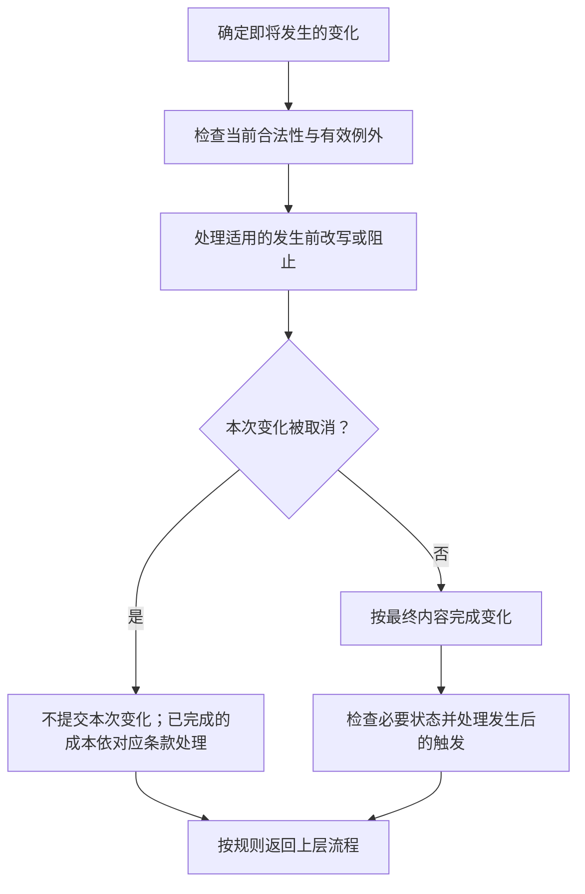
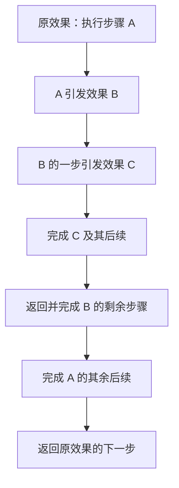

**第七章完整草案，待集中审阅。** 已确认的有效性原则、操作窗口、放置成本、主动能力次数及资源拾取顺序直接沿用。其他结算细则从旧规则中提炼；新增的具体建议会标明“时序提案”，不视为已确认。具体问题见[第七章审阅事项](../maintenance/pending.md#第七章审阅事项)。

本章解释一个效果如何一步步改变对局，以及它引发的其他效果在何时处理。给定同一局面、合法选择与随机结果，规则应能导出同一个结果；未定的分支不能由动画、操作速度或程序内部编号决定。

## 7.1 效果分类

**EFF-001 效果按发生方式区分。** 关键词是效果的简写，状态是对局中的记录；二者都不是独立的优先等级。

- **主动能力：** 由玩家在有权操作时主动发动，具体步骤见[4.5](actions.md#主动能力)。随从与法术的每项主动能力默认每回合一次，明示次数覆盖默认。
- **触发效果：** 在所写条件发生时进入处理，例如[入场](../reference/keywords.md#入场)、受到伤害或某个阶段开始。它不要求玩家另行发起一次主动能力；需要选择时仍检查操作窗口。
- **持续效果：** 在条件成立期间持续影响属性或规则，例如附近友方随从获得攻击加成。条件变化时重新判断，不每次重复叠加同一份加成。
- **发生前的改写或阻止：** 改变尚未完成的伤害、区域转移、购买等，例如无视护甲、改变购买目的地或取消攻击。只能改变明确授权的事项。
- **延迟结算：** 一个效果明确安排到未来时点处理。它描述的是时间安排，可以由主动或触发效果产生，不表示现在先执行一次、未来再执行一次。

同一张牌可以带多种效果，分别按各自条件判断。效果被封锁时，先依[第一章](principles.md#gen-003-有效性与规则优先关系)确定是否有效；不能先利用一个已被关闭的效果去覆盖封锁它的规则。

## 7.2 目标模式与数量选择

**EFF-002 选择应满足完整条件。** 目标可以是卡牌实例、玩家、格子或区域中的牌；模式、方向、数量和点数分配也是选择。一次选择必须同时满足类型、区域、控制关系、距离、数量和其他限制。

### 7.2.1 选择时点与操作窗口

选择权限引用[4.1.1 操作窗口](actions.md#操作窗口)：有本人窗口时亲自选择；窗口外由系统自动选择。没有专门的自动方式时，从合法选项中随机选择，不暂停等待一个不存在的操作窗口。

放置行动先选择手牌和目标格，主动能力按第四章先准备其发动要求的选择。效果执行到中途才产生的新选择，在那一步处理，不要求玩家提前知道尚未发生的结果。

**入场时序提案（待确认）：** 卡牌成功进入战场后，轮到某项入场效果处理时再为它选择目标。入场选择不属于放置承诺前的取消窗口；不能在看到抽牌、拾取或其他入场结果后，把已经完成的放置撤回。是否采用此方案，以及与拾取的先后，见 7.5.3。

### 7.2.2 多目标与点数分配

效果要求“恰好 N 个”时，必须有 N 个合法选项；要求“至多 N 个”时，不超过上限并满足文本规定的最低数量。选择多个不同目标时不能重复选择同一实例。分配总点数时，每一项及总和都必须符合该效果的条件。

选择一张牌和选择它所在的格子不是同一件事：“对该随从造成伤害”跟随指定对象的合法性检查；“对该格上的随从造成伤害”在规定时点读取该格的对象。效果必须说明自己使用哪一种。

**自动选择的剩余边界：** 默认合法随机已确认；可选的“可以不执行”是否也作为随机选项、多目标组合和点数分配怎样确定随机分布，仍待裁定。本稿不默认为系统总选最大收益、最多目标或总是放弃。

### 7.2.3 无合法选项与目标失效

发动前就无法满足必需选择或完整成本时，不能发起该主动行动，不支付成本。结算途中因局面变化而缺少必需目标时，不提出无法完成的选择；转入[失败与部分完成](#取消失败与部分完成)处理。

目标仍存在但不再符合要求，与目标已离场是不同原因，都要核对当前这一步的条件。未明确允许重新选择时，不能擅自换一个有利目标。离场又重入的同一张卡，是否仍算先前锁定的战场对象，列为审阅项，不以同名牌或卡牌编号替代判断。

## 7.3 成本支付

**EFF-003 成本与效果结果分开。** 成本是为了完成某项行动必须先付出的内容，例如星能、行动点、使用次数，或明确要求弃置／移除的牌。花费星能不会自行成为伤害；弃牌、移除和死亡也不能因都失去一张牌而混称。

### 7.3.1 检查、承诺与返还

先完成行动要求的选择并检查能否完整支付，再到该行动的承诺点支付。承诺前取消不支付；承诺后不能单凭效果失败要求撤销已经发生的支付。

放置采用已确认的[4.2.1](actions.md#放置步骤)：只付明示放置成本，卡牌购买标价不自动成为放置费。攻击、移动、主动能力与购买各自的支付点，分别见第四、第五章，不把一种行动的次数处理直接套到另一种。

本稿沿用旧文的基本处理：需要支付多项成本时，先检查整个组合可支付；不能明知第二项付不起，仍先收取第一项。支付已经引发事实变化后，后续无法完成不自动回滚。

### 7.3.2 成本本身改变局面

作为成本移除一张牌，仍是[移除](../reference/keywords.md#移除)，须应用区域转移和 modifier 规则；成本不因服务于另一个效果就失去自身含义。哪些后续效果会因此触发，由实际事件条件判断。

**待裁定：** 支付移走了唯一箭头来源后，已经提交的放置是否继续；多项成本之间是否允许插入成本引发的触发；这些触发是否早于主体能力。它们影响下一步的合法性，不能用“先付成本”四字替代完整顺序。

## 7.4 结算前改写与结算后触发

**EFF-004 发生前可以改写，发生后只能引发新变化。** 一次变化尚未成为事实时，适用的效果可以改写其数值、目标、目的地或取消该变化；变化已经完成后，后续效果不能追溯声称它没有发生。

例如，购买前改为进入手牌，会改变这次购买的目的地；购买完成后再把牌送回牌堆，是另一次区域转移，分别判断 modifier。受到伤害后治疗，也不能抹去已经受到伤害这个事实。

图 7-A 描述一项变化的前后边界，不表示每项行动都自动开放一个让对手自由出牌的响应窗口。只有满足条件的规则参与；涉及选择仍依 4.1.1。

多个改写相互冲突时须有明确处理顺序。这里不采用“卡牌永远优先于模式”或“后显示的效果优先”；尚无对应裁定时，记录具体冲突交审阅。

## 7.5 多个效果与连续结算

**EFF-005 先完成当前步骤引发的后续，再继续原效果。** 本稿沿用旧长版的嵌套顺序：一个效果按文字指定的步骤执行；某一步引发新的结算时，先完成该步应处理的后续，之后返回原效果下一步。后续若又引发效果，继续以同样方式处理。[购买步骤草案](economy.md#购买步骤)另列支付／声明后续的延后处理，属于需要审阅的专门时序，不由此更改其他行动。

### 7.5.1 嵌套与返回

例如，一个效果先使随从受到伤害、再抽一张牌；伤害这一步产生的必要死亡处理及后续须先完成，才回到抽牌。若文字明确将若干变化组成一个同时处理的批次，则先按批次规定完成，不在同批中途把它拆成多个普通行动。

本图只规定已经确定的子效果如何返回，不决定多项同时触发谁先谁后。也不让玩家在处理 B 时插入一项无关的主动行动。

### 7.5.2 同时满足条件的效果

同一事件可以使多个效果符合条件。“同时符合条件”不等于每个效果都在同一局面上完成；先结算的效果可能改变后一个效果的目标或可执行内容。

有明确先后条款时，先按该条款处理。没有专门规定时，需要一个所有模式可引用的稳定排序。本稿暂不把实现中的内部编号写成游戏规则；以下情况列为 **T-01**：双方来源同时触发、同一玩家多张牌同时触发、同一张牌多个效果，以及无控制者来源插入哪一处。

**供审阅的方向：** 可以采用席位顺序、来源进入相应区域的先后、卡面效果顺序作为可追溯的排序依据；也可以在明确窗口内允许玩家排自己的一组效果。两者会影响玩法，尚未决定，正文不授予自由排队权限。

### 7.5.3 放置、入场与拾取的衔接

已确认部分是：放置自身先选择、检查和支付，再进入战场；建造封锁与效果有效性原则仍适用；符合拾取资格时为进入者的控制者结算资源收益，拾取完毕后资源本体消失。

**供审阅的完整顺序提案：** 完成入场与适用的持续变化 → 完整处理该格资源拾取及其后续 → 选择并处理卡牌的入场效果及其后续 → 返回放置流程。此方案使入场效果能够读到刚拾取的收益，但它尚未获确认；4.2.1 不据此提前固定顺序。

若一张可建造牌尚未完成建造，其卡牌效果已关闭，不能仅因发生入场就执行被封锁的入场效果。建造完成后是否补触发一次，须在建造规则中特别决定，不能从上述顺序自动推出。

## 7.6 持续时间与失效

**EFF-006 按明示时限和条件判断。** “本回合”覆盖当前回合到其结束清理；“你的时动阶段”属于对应玩家自己的阶段，不是所有玩家时动阶段的合称。“下次”“直到某时点”须指出具体事件或阶段。

持续效果的来源或条件不再满足时停止提供对应修正，依[6.2 属性变化](lifecycle.md#属性变化)重新计算。已由一次性效果赋予的修正，按自身期限和区域转移规则处理，不因施加者后来离场就必然消失。

回合开始刷新按回合计算的行动及效果额度；跨回合保留的修正不因此全部清零。逆向转区清除 modifier 与临时修正到期是两种独立原因，见[6.5](lifecycle.md#区域转移与状态保留)。

延迟效果到达指定时点才处理；到时再按目标、来源与有效性要求检查。其究竟锁定格子还是具体对象、原来源离场后是否仍执行，必须由对应效果或统一裁定说明。当前旧卡“慢速”的准确落点仍待整理，不把延迟一律改成对方阶段或整轮第一次时动。

## 7.7 取消失败与部分完成

**EFF-007 不撤销已经发生的事实。** 结算失败不等于整次行动从未发生；已经支付、移动、抽取或造成的伤害，只能由后续明确效果再改变。

### 7.7.1 不同失败阶段

- **提交前不合法：** 不执行行动，也不付成本；可以重新作合法选择。
- **某项即将发生的变化被取消：** 不产生该项完成事实；已经完成的前置成本及其事实仍按规则保留。
- **效果中途目标失效：** 该步骤不能对失效目标执行，其他部分是否继续取决于依赖关系。
- **部分目标仍合法：** 不自行补足替代目标，也不从“部分失败”推断整批全部作废。

**部分执行提案（待确认）：** 独立步骤继续处理；明确要求前一步成功的步骤，在条件未满足时跳过。例如“造成伤害，然后抽牌”与“若以此消灭目标，抽牌”具有不同依赖。多目标不足最低数量时，是整步失败还是只处理剩余目标，也须明确，不靠玩家临场解释。

### 7.7.2 来源离场、封锁与控制权变化

尚未触发的效果在检查时必须有效。已经满足条件并等待处理的效果，如果来源随后死亡、转区、效果被关闭或控制权改变，是否继续及由谁选择，不能仅由“来源不在了”推断；此为 **T-02** 的统一裁定事项。

这项边界不推翻建造中效果关闭、窗口外自动选择或已经发生事实不可撤回的原则。需要记录的是：何时锁定触发资格、效果归属及数值，何时重新检查。

## 7.8 检查与行动完成时点

**EFF-008 完成当前结算才继续本方行动。** 一次行动除了本身的位移、支付或伤害，还须完成规定属于本次的状态检查与后续效果；完成之前不能开始本方下一项普通行动或通过声明完成跳过它。

完成单项变化或明确的同时批次后，须按适用顺序完成持续属性重算、死亡处理、后续触发及胜负检查。检查引发新的必要变化时继续处理，直到本次没有未完成事项，再返回上层步骤或交还行动权限。

这些事项的统一先后尚未确认，尤其不能据此提前判定受伤触发一定无法救回致死目标。死亡确认、离场、死亡效果及胜负检查的精确先后仍须统一见[6.3](lifecycle.md#死亡与消灭)；不能因为流程图还画有下一步，在模式已经判定对局结束后强行继续。

同步时停与购买中，一方等待选择并不自动关闭另一方的窗口。跨双方的冲突、冻结场面的合并，依第三章和对应模式处理；本章的嵌套顺序不把同步阶段改成轮流操作。

**循环边界：** 若多个强制效果相互触发且无法自然结束，需要统一的循环终止裁定。本稿不擅自设定“执行若干次便停止”或平局次数门槛；出现具体循环时列入裁定库。

## 7.9 自动机制与其他结算的衔接

**EFF-009 系统也按规则结算。** 模式可以在玩家行动之外安排资源生成、天气、野怪刷新等机制，须明确触发时点、对象、数量、位置、持续时间、随机方式以及无法执行时的处理。

到达规定时点，执行该自动机制，并处理它引发的相关效果；完成后回到原来的阶段流程。系统生成不自动获得绕过占格、目标或来源有效性的权限。例如当前资源生成必须选择无任何卡牌的空格，数量和时点则由[标准对战自动逻辑](../standard/automatic.md#资源生成)规定。

在无玩家窗口的自动阶段，效果要求的玩家选择按 4.1.1 转为系统合法随机。自动机制与另一效果同一时点发生时，同样需要明确排序；不能仅因由系统发起就获得更高规则优先级。

## 7.10 关联章节

- [行动规则与操作窗口](actions.md)
- [星能商店与卡组成长](economy.md)
- [状态变化与卡牌生命周期](lifecycle.md)
- [标准对战的对局自动逻辑](../standard/automatic.md)
- [第七章审阅事项](../maintenance/pending.md#第七章审阅事项)
