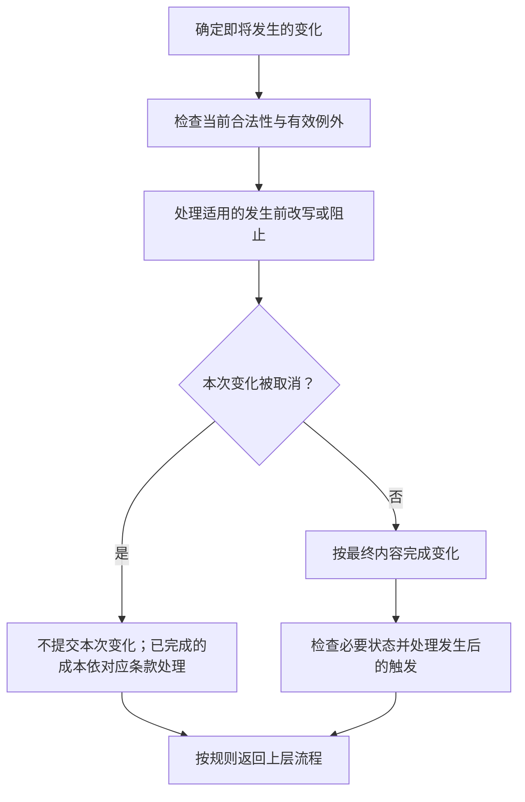
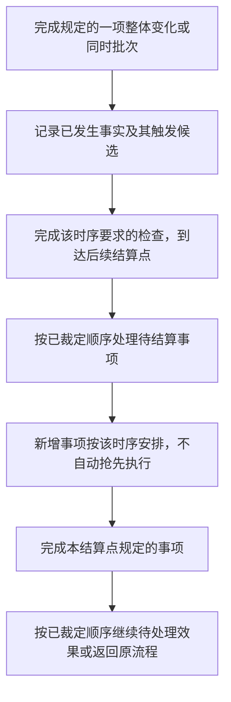

**通用时点模型草案，待重点讨论。** 本章适用于放置、移动、攻击、购买、主动能力、自动机制及它们引出的效果。卡牌效果的类别和设计选项已独立为[第七章](card-effects.md)。本章依队友时点模型重新组织；模型中的未决事项仍须裁定，不能把工程实现现状直接变成正式玩法。具体见[第八章审阅事项](../maintenance/pending.md#第八章审阅事项)。

## 8.1 通用结算边界与行动时序

**SET-001 共用结算概念，各行动定义自己的先后。** “玩家选择了一个目标”“行动已声明”“实际发生了变化”“因此触发的效果已经处理”是不同节点。放置不等于发动卡牌效果，购买也不因为可能触发能力就先变成一次能力发动。

### 8.1.1 必须区分的节点

- **准备与检查：** 确定意图、选择、合法条件及成本；尚未发生的结果不能当成已经发生。
- **承诺与支付：** 到对应行动规定的时点才消耗资源或次数；并非所有行动都有相同成本。
- **发生前处理：** 只让明确适用于此节点的替换、阻止或反制参与。
- **完成变化：** 明确哪些内容必须一起完成，形成已发生事实；不能让后续效果读取同一整体变化只完成一半的状态。
- **记录触发与必要检查：** 记录这次事实引出的效果，再按对应时序处理属性、死亡、区域及胜负检查。
- **处理待结算事项：** 到规定结算点才执行等待的效果，最后返回尚未完成的原流程或交还行动权限。

这是一组需要逐项定义的节点，不要求每种行为全部经过，也不规定它们对所有行为只有一种排列。替换与反制不自动开放一个新的玩家操作窗口。

### 8.1.2 各类行动的时序入口

| 行为 | 已有条款与承诺边界 | 还须明确的结算点 |
| --- | --- | --- |
| 放置 | [4.2.1](actions.md#放置步骤)：选择检查 → 明示成本 → 入场。 | 成本引发的变化、持续效果与嵌套事项的插入点；入场先于拾取已确认。 |
| 移动 | [4.3](actions.md#移动与特殊位移)：普通与冲撞逐格，瞬移只处理终点。 | 每次位置变化后处理哪些事项，再继续下一步。 |
| 攻击 | [4.4.1](actions.md#攻击步骤)：声明时扣次数；双方分别检查攻击范围。 | 攻击前反制、战斗伤害批次、受伤触发和死亡检查。 |
| 购买 | [5.4.2](economy.md#购买步骤)：报价、支付、购买前处理、转区及成功／取消。 | 支付后续与购买成功后续的释放顺序，不能套用能力成本的实现分支。 |
| 主动能力 | [4.5.1](actions.md#发动步骤)：准备选择、支付、反制、成功发动和正文执行。 | 成本触发何时执行、来源变化后能否继续、何时消费次数。 |
| 阶段与系统流程 | [第三章](rounds.md)：窗口、阶段起止、刷新、抽牌及结束清理。 | 同时批次及后续触发的位置；没有费用的系统步骤不添加支付节点。 |

各行沿用已确认部分；表中未决问题不因采用同一时点模型而自动获得答案。

## 8.2 目标模式与数量选择

**SET-002 选择应满足完整条件。** 目标可以是卡牌实例、玩家、格子或区域中的牌；模式、方向、数量和点数分配也是选择。一次选择必须同时满足类型、区域、控制关系、距离、数量和其他限制。

### 8.2.1 选择时点与操作窗口

选择权限引用[4.1.1 操作窗口](actions.md#操作窗口)：有本人窗口时亲自选择；窗口外由系统自动选择。没有专门的自动方式时，从合法选项中随机选择，不暂停等待一个不存在的操作窗口。

放置行动先选择手牌和目标格，主动能力按第四章先准备其发动要求的选择。效果执行到中途才产生的新选择，在那一步处理，不要求玩家提前知道尚未发生的结果。

**入场时序提案（待确认）：** 卡牌成功进入战场后，轮到某项入场效果处理时再为它选择目标。入场选择不属于放置承诺前的取消窗口；不能在看到抽牌、拾取或其他入场结果后，把已经完成的放置撤回。目标选择时点仍待确认；入场先于拾取已由 4.2.2 确认。

### 8.2.2 多目标与点数分配

效果要求“恰好 N 个”时，必须有 N 个合法选项；要求“至多 N 个”时，不超过上限并满足文本规定的最低数量。选择多个不同目标时不能重复选择同一实例。分配总点数时，每一项及总和都必须符合该效果的条件。

选择一张牌和选择它所在的格子不是同一件事：“对该随从造成伤害”跟随指定对象的合法性检查；“对该格上的随从造成伤害”在规定时点读取该格的对象。效果必须说明自己使用哪一种。

**自动选择的剩余边界：** 默认合法随机已确认；可选的“可以不执行”是否也作为随机选项、多目标组合和点数分配怎样确定随机分布，仍待裁定。本稿不默认为系统总选最大收益、最多目标或总是放弃。

### 8.2.3 无合法选项与目标失效

发动前就无法满足必需选择或完整成本时，不能发起该主动行动，不支付成本。结算途中因局面变化而缺少必需目标时，不提出无法完成的选择；转入[失败与部分完成](#取消失败与部分完成)处理。

目标仍存在但不再符合要求，与目标已离场是不同原因，都要核对当前这一步的条件。未明确允许重新选择时，不能擅自换一个有利目标。离场又重入的同一张卡，是否仍算先前锁定的战场对象，列为审阅项，不以同名牌或卡牌编号替代判断。

## 8.3 成本支付

**SET-003 成本与效果结果分开。** 成本是为了完成某项行动必须先付出的内容，例如星能、行动点、使用次数，或明确要求弃置／移除的牌。花费星能不会自行成为伤害；弃牌、移除和死亡也不能因都失去一张牌而混称。

### 8.3.1 检查、承诺与返还

先完成行动要求的选择并检查能否完整支付，再到该行动的承诺点支付。承诺前取消不支付；承诺后不能单凭效果失败要求撤销已经发生的支付。

放置采用已确认的[4.2.1](actions.md#放置步骤)：只付明示放置成本，卡牌购买标价不自动成为放置费。攻击、移动、主动能力与购买各自的支付点，分别见第四、第五章，不把一种行动的次数处理直接套到另一种。

本稿沿用旧文的基本处理：需要支付多项成本时，先检查整个组合可支付；不能明知第二项付不起，仍先收取第一项。支付已经引发事实变化后，后续无法完成不自动回滚。

### 8.3.2 成本本身改变局面

作为成本移除一张牌，仍是[移除](../reference/keywords.md#移除)，须应用区域转移和 modifier 规则；成本不因服务于另一个效果就失去自身含义。哪些后续效果会因此触发，由实际事件条件判断。

**待裁定：** 支付移走了唯一箭头来源后，已经提交的放置是否继续；多项成本之间是否允许插入成本引发的触发；这些触发是否早于主体能力。它们影响下一步的合法性，不能用“先付成本”四字替代完整顺序。

## 8.4 结算前改写与结算后触发

**SET-004 发生前可以改写，发生后只能引发新变化。** 一次变化尚未成为事实时，适用的效果可以改写其数值、目标、目的地或取消该变化；变化已经完成后，后续效果不能追溯声称它没有发生。

例如，购买前改为进入手牌，会改变这次购买的目的地；购买完成后再把牌送回牌堆，是另一次区域转移，分别判断 modifier。受到伤害后治疗，也不能抹去已经受到伤害这个事实。

图 8-A 描述一项变化的前后边界，不表示每项行动都自动开放一个让对手自由出牌的响应窗口。只有满足条件的规则参与；涉及选择仍依 4.1.1。

多个改写相互冲突时须有明确处理顺序。这里不采用“卡牌永远优先于模式”或“后显示的效果优先”；尚无对应裁定时，记录具体冲突交审阅。

## 8.5 多个效果与连续结算

**SET-005 触发被记录，不代表立刻执行。** 时点模型采用的草案是：事件发生后先确定它引出的待结算效果，完成当前规定必须整体完成的变化和必要检查，到允许处理后续的结算点，再按明确顺序执行这些效果。

伤害的专门顺序已确认：先结算受伤效果，再检查死亡，见[6.3.1](lifecycle.md#确认死亡离场与死亡效果)。这里的“必要检查”不表示所有检查都先于触发效果。

这项草案替代上一稿“每一步一触发就立即递归处理全部后续”的默认。它也不意味着要等整张牌的所有步骤结束才处理触发；整体变化、同时批次和多步效果分别需要明确边界。

### 8.5.1 嵌套与返回

图 8-B 表示需要定义的结算边界，不替未决排序作决定。新效果插在已有等待项之前还是之后、当前效果何时暂停、同时触发是否统一记录，仍列为 **T-01**。不能从本图推导先进先出、后进先出或立即递归中的任何一种通则。

例如“造成伤害，然后抽牌”：受伤触发在死亡检查之前处理已确认；何时回到原效果的抽牌步骤、嵌套伤害何时检查死亡，仍须确定对应结算点。不能用文字中的“然后”跳过必要检查，也不能仅因记录了触发就强行暂停尚未完成的同时伤害批次。

### 8.5.2 同时满足条件的效果

同一事件可以使多个效果符合条件。“同时符合条件”不等于每个效果都在同一局面上完成；先结算的效果可能改变后一个效果的目标或可执行内容。

有明确先后条款时，先按该条款处理。没有专门规定时，需要一个所有模式可引用的稳定排序。本稿暂不把实现中的内部编号写成游戏规则；以下情况列为 **T-01**：双方来源同时触发、同一玩家多张牌同时触发、同一张牌多个效果，以及无控制者来源插入哪一处。

**供审阅的方向：** 可以采用席位顺序、来源进入相应区域的先后、卡面效果顺序作为可追溯的排序依据；也可以在明确窗口内允许玩家排自己的一组效果。两者会影响玩法，尚未决定，正文不授予自由排队权限。

### 8.5.3 放置、入场与拾取的衔接

已确认的放置步骤见[4.2.1](actions.md#放置步骤)，拾取过程见[6.8](lifecycle.md#拾取)。本节只讨论二者与入场效果如何衔接。

相对顺序以[4.2.2](actions.md#放置与拾取)为唯一主定义。本节继续跟进以下未定交互：

- 入场效果何时选择目标，持续变化与各项入场效果的排序如何确定？
- 入场效果让放置者离开原格、改变归属，或使资源离场后，原先可能发生的拾取如何重新检查？例如入场消灭自身后，原格资源是否仍会被拾取？
- 入场或拾取引发的新效果在哪个节点插入，何时返回放置流程？明示延迟的入场结果到期时与其他事项如何排序？

这些属于 T-03 及通用嵌套时序，不能因已定“入场先于拾取”就自动推导其答案。

若一张可建造牌尚未完成建造，其卡牌效果已关闭，不能仅因发生入场就执行被封锁的入场效果。建造完成后是否补触发一次，须在建造规则中特别决定，不能从上述顺序自动推出。

## 8.6 持续时间与失效

**SET-006 到期与结算分开判断。** 可设计的时间维度见[7.6.7](effect-design/dictionary/duration.md)；本节处理到达时点或条件变化后的局面。

条件变化或期限到达后，按[6.2.3](lifecycle.md#持续加成与一次性修正)更新持续贡献；涉及转区时另按[6.5](lifecycle.md#区域转移与状态保留)处理修正。由这些变化引发的检查与后续纳入当前结算，不能都推迟到回合末。

延迟效果到达明确的指定时点后，纳入该时点的待结算事项；不能先执行再声明“其实被取消”。应使用原来锁定的对象还是此时的对象、来源离场是否影响继续、与同一时点其他效果怎样排序，都须明确。“慢速”未定的落点不在这里补造。

## 8.7 取消失败与部分完成

**SET-007 不撤销已经发生的事实。** 结算失败不等于整次行动从未发生；已经支付、移动、抽取或造成的伤害，只能由后续明确效果再改变。

### 8.7.1 不同失败阶段

- **提交前不合法：** 不执行行动，也不付成本；可以重新作合法选择。
- **某项即将发生的变化被取消：** 不产生该项完成事实；已经完成的前置成本及其事实仍按规则保留。
- **效果中途目标失效：** 该步骤不能对失效目标执行，其他部分是否继续取决于依赖关系。
- **部分目标仍合法：** 不自行补足替代目标，也不从“部分失败”推断整批全部作废。

**部分执行提案（待确认）：** 独立步骤继续处理；明确要求前一步成功的步骤，在条件未满足时跳过。例如“造成伤害，然后抽牌”与“若以此消灭目标，抽牌”具有不同依赖。多目标不足最低数量时，是整步失败还是只处理剩余目标，也须明确，不靠玩家临场解释。

### 8.7.2 来源离场、封锁与控制权变化

尚未触发的效果在检查时必须有效。已经满足条件并等待处理的效果，如果来源随后死亡、转区、效果被关闭或控制权改变，是否继续及由谁选择，不能仅由“来源不在了”推断；除[6.3.1](lifecycle.md#确认死亡离场与死亡效果)已确认的死亡效果外，其余情形列为 **T-02** 的统一裁定事项。

这项边界不推翻建造中效果关闭、窗口外自动选择或已经发生事实不可撤回的原则。需要记录的是：何时锁定触发资格、效果归属及数值，何时重新检查。

## 8.8 检查与行动完成时点

**SET-008 完成当前结算才继续本方行动。** 一次行动除了本身的位移、支付或伤害，还须完成规定属于本次的状态检查与后续效果；完成之前不能开始本方下一项普通行动或通过声明完成跳过它。

完成单项变化或明确的同时批次后，须按适用顺序完成持续属性重算、死亡处理、后续触发及胜负检查。检查引发新的必要变化时继续处理，直到本次没有未完成事项，再返回上层步骤或交还行动权限。

死亡确认后的内部顺序已按[6.3](lifecycle.md#死亡与消灭)定为先清理本体、再结算死亡效果。伤害引发的受伤效果先于死亡检查，可能使目标恢复生命而存活；胜负检查的插入时点仍未确认；也不能因为流程图还画有下一步，在模式已经判定对局结束后强行继续。

同步时停与购买中，一方等待选择并不自动关闭另一方的窗口。跨双方的冲突、冻结场面的合并，依第三章和对应模式处理；本章的待结算事项不把同步阶段改成轮流操作。

**循环边界：** 若多个强制效果相互触发且无法自然结束，需要统一的循环终止裁定。本稿不擅自设定“执行若干次便停止”或平局次数门槛；出现具体循环时列入裁定库。

## 8.9 自动机制与其他结算的衔接

**SET-009 系统也按规则结算。** 模式可以在玩家行动之外安排资源生成、天气、野怪刷新等机制，须明确触发时点、对象、数量、位置、持续时间、随机方式以及无法执行时的处理。

到达规定时点，执行该自动机制，并处理它引发的相关效果；完成后回到原来的阶段流程。系统生成不自动获得绕过占格、目标或来源有效性的权限。例如当前资源生成必须选择无任何卡牌的空格，数量和时点则由[标准对战自动逻辑](../standard/automatic.md#资源生成)规定。

在无玩家窗口的自动阶段，效果要求的玩家选择按 4.1.1 转为系统合法随机。自动机制与另一效果同一时点发生时，同样需要明确排序；不能仅因由系统发起就获得更高规则优先级。

## 8.10 关联章节

- [卡牌效果设计](card-effects.md)

- [行动规则与操作窗口](actions.md)
- [星能商店与卡组成长](economy.md)
- [状态变化与卡牌生命周期](lifecycle.md)
- [标准对战的对局自动逻辑](../standard/automatic.md)
- [第八章审阅事项](../maintenance/pending.md#第八章审阅事项)
