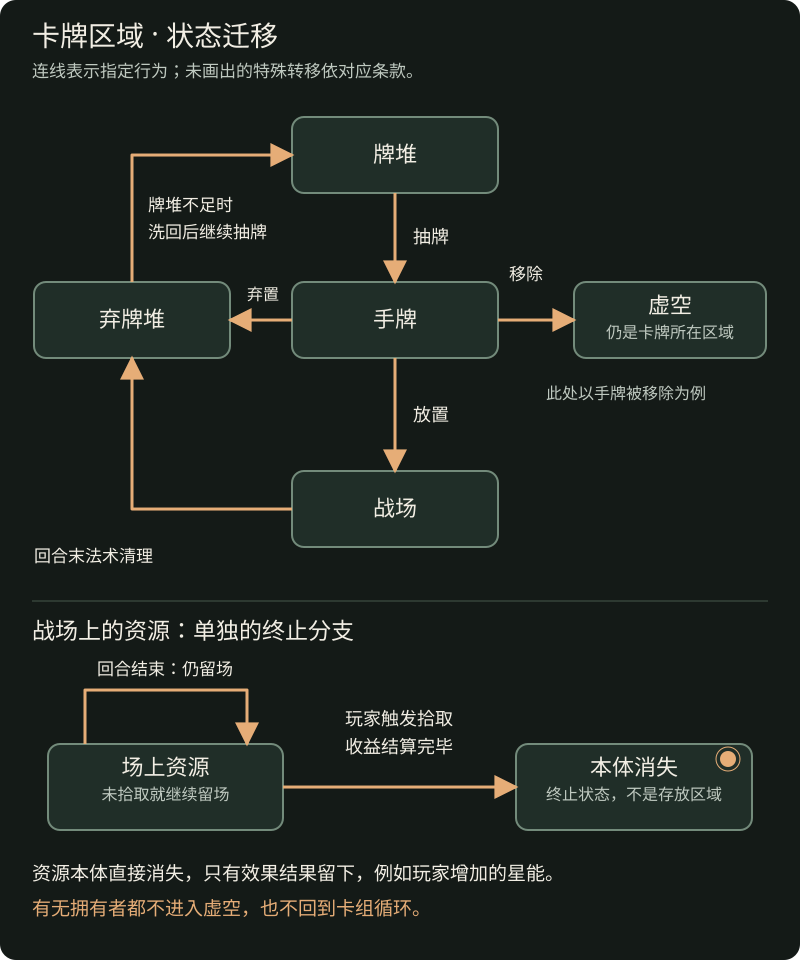

**第二章完整草案，待审阅。** 本章定义对局中的对象、属性、空间与区域，不表示所有细节已经确认。三种基础类型及资源牌核心规则已按本次讨论确认；信息可见性等其余边界的审阅说明见[第二章审阅事项](../maintenance/pending.md#第二章审阅事项)。

## 2.1 玩家与控制关系

**ELM-001 玩家、拥有者与控制者。** 玩家是星能、手牌、牌堆、弃牌堆和额外卡组的归属主体。模式规定参与玩家、阵营及对局目标。

一张卡牌的**拥有者**表示这张牌的归属，**控制者**表示当前由谁操作它，并用于判断友方与敌方关系。默认二者相同。

本段的拥有者、控制者和友敌关系依据旧长版第 2.2—2.4 节整理。此前补写的“控制权变化不改变拥有者或职业”是编辑归纳，并非原文明确条款；这两项变化的具体边界仍待审阅，见[出处与归纳说明](../maintenance/sources.md#玩家与控制关系的出处)。

以某位玩家为参照，该玩家控制的对象属于友方，对手控制的对象属于敌方。无玩家控制的野怪、地图物件是否视为敌方目标，由模式或物件规则明确规定。

“中立职业”是卡牌分类，不表示“没有控制者”。玩家控制的中立职业随从仍是该玩家的友方随从。拾取资格可以另有限制，见[移动与拾取](actions.md#移动与特殊位移)。

离场卡牌进入谁的弃牌堆、控制权变化保留哪些状态，由[卡牌生命周期](lifecycle.md)规定；不以“当前由谁操作”自动推断最终归属。

## 2.2 卡牌种类与分类维度

**ELM-002 基础类型。** 卡牌分为**随从牌、法术牌、资源牌**三类。资源牌是本次确认的新类型；“遗失的智慧”归入资源牌，不再按法术牌处理。

职业、种族、稀有度、收集属性是相互独立的分类维度。例如，一张牌可以同时是“某职业的机械随从、某稀有度、可收集卡牌”。这些标签本身不附带未写明的战斗能力。

英雄、野怪等描述身份，而非与三种基础类型并列的第四类。其他地图物件同样以对应卡牌表示，不能仅凭“物件”名称推断它一定是资源牌或具有随从能力。

### 2.2.1 随从牌

随从牌的卡面信息包含原始攻击、原始移动能力和原始生命等。进入游戏后，每一份具体随从都是独立的卡牌实例，维护当前生命、当前速度、本回合剩余移动点及攻击次数等属性；在战场上依规则移动、攻击或发动能力。

英雄是具有英雄身份的随从，其开局位置、构筑资格和与胜负的关系由模式规定。野怪的生成、控制、敌我关系及奖励也须分别规定。

### 2.2.2 法术牌

法术牌通过效果影响对局。普通放置后成为场上法术并占格，回合结束时移入弃牌堆。法术牌不具有随从牌的原始攻击、原始生命和原始移动能力；未带这些属性，不表示它是一张数值均为零的随从牌。

### 2.2.3 资源牌

**ELM-009 资源牌的特殊规则（已确认）。**

资源牌是一次性收益载体。拾取后卡牌本体消失，只留下拾取效果产生的结果，例如玩家增加的星能；它不会转化为玩家持有的一张资源卡，也不会作为已拾取卡牌留在虚空。

- **生成：** 资源牌通常由效果生成，生成位置必须是没有任何卡牌的空格；已有随从、法术或资源的格子均不符合条件。资源可以共存，不表示生成时可以选择已占用的格子。
- **共存：** 资源牌可以与其他卡牌重叠。其他卡牌可以放置或移动到它所在的格子；资源牌也不因格上已有其他卡牌就被占格规则阻止。共存只改变占格限制，不自动免除领地、箭头、阶段或明示成本。
- **收益：** 资源牌文本带有[拾取](../reference/keywords.md#拾取)效果，为触发拾取的玩家结算对应收益，例如获得 1 星能。收益由具体卡牌规定，不把该例子变成所有资源统一提供的数量。
- **持续：** 战场上的资源牌不会在回合结束时消失，也不参加场上法术清理；未被玩家拾取时继续留在原处。默认只有被玩家拾取才消失。
- **离场：** 拾取完毕后，资源牌直接移出游戏，无论是否具有拥有者，都不进入任何玩家的虚空、手牌、牌堆或弃牌堆。通常资源牌没有玩家归属，但归属并不改变这一处理。拾取并不将资源牌交给收益获得者。具体流程见[拾取与移出游戏](lifecycle.md#拾取)。
- **进入卡组循环的例外：** 通常资源牌不进入玩家手牌、牌堆或弃牌堆；若某个效果将其送入这些区域，则按所在区域的正常规则参与卡组循环。玩家可以将手中的资源牌按正常条件放置到战场，它仍保持资源牌类型及共存规则，不因此变成法术牌。

例如，玩家先从手牌放置一张资源牌，再将另一张卡牌放置到同一格，便会触发该资源牌的拾取效果；收益为该玩家结算，随后资源牌移出游戏。第二张牌的放置仍需满足除占格例外之外的正常条件。

“回合结束不消失”针对战场上的资源牌，不免除资源牌在手牌中通常适用的弃牌规则。资源本身可以是无归属中立卡牌，但玩家仍能拾取它；这与“无玩家控制的野怪移动经过资源不触发拾取”是不同事项。玩家控制的中立职业随从可以正常触发拾取。

通常的资源生成不会造成资源与其他牌或资源彼此重叠。特殊效果使资源进入手牌后再放置，与“由效果生成资源”不同；特殊放置的交互边界见[资源牌剩余边界](../maintenance/pending.md#资源牌剩余边界)。

## 2.3 通用属性与各类型专属属性

**ELM-003 卡牌信息（进入游戏前的定义）。** 卡牌信息描述这种牌本身：名称、类型、原始数值和效果文本等。同一种牌的多份拷贝共享这份定义。下表不包含某次对局里才产生的当前数值、进度或计数。

| 属性 | 游戏含义 | 适用与缺省说明 |
| --- | --- | --- |
| 名称与卡牌编号 | 辨认卡牌定义 | 不区分同一牌的不同对局拷贝。 |
| 基础类型 | 随从、法术或资源 | 身份与职业另外记录。 |
| 职业 | 职业归属，供构筑与效果引用 | 中立是职业分类；不等于无控制者。 |
| 种族 | 供效果引用的一个或多个种族标签 | 无种族不等于中立职业。 |
| 稀有度 | 供模式构筑等规则引用 | 不赋予规则优先权或额外战斗能力。 |
| 收集属性 | 能否直接加入构筑，或只能通过效果等方式获得 | 衍生牌不会仅因“衍生”身份就自动在回合结束时消失。 |
| 星能费用 | 卡牌的购买标价及相关构筑依据 | 不等于每次放置都再次支付此价格；英雄等特殊身份费用依模式说明。 |
| 箭头 | 对指定相邻格提供的放置支持 | 由卡面规定；资源牌类型本身不自动增加或删除箭头，没有箭头就不提供支持。 |
| 箭头需求 | 放置时所需支持数量 | 本稿普通放置默认至少 1 个；例外须明确说明。 |
| 原始攻击 | 随从当前攻击的初始计算依据 | 卡牌信息中的基础数值，不是结算时直接读取的当前攻击。 |
| 原始生命 | 随从生命属性的初始计算依据 | 当前生命和当前生命上限属于卡牌实例，不属于本栏。 |
| 原始移动能力 | 随从当前速度的初始计算依据 | 当前速度与本回合剩余移动点属于卡牌实例。 |
| 效果文本 | 本卡带来的具体行为、条件及例外 | 空白表示没有该卡自带的额外效果。关键词引用统一词条。 |

卡牌文本可以规定建造要求、耐久机制或能力限次；这些是效果规则的描述，不表示卡牌信息本身已经带有一条运行中的进度、剩余耐久或使用记录。

费用的增加、减少和支付见[星能与商店](economy.md)；属性变化与状态保留见[第六章](lifecycle.md)。

## 2.4 基础属性与对局状态

**ELM-004 卡牌实例（进入游戏后的具体卡牌）。** 一份卡牌进入一局游戏后成为独立实例。实例可以位于牌堆、手牌、战场等区域，不是只有进入战场才成为实例。两份同名牌共享卡牌信息，但各自记录自己的当前属性与状态。

| 实例属性或状态 | 记录内容 |
| --- | --- |
| 当前攻击 | 以原始攻击为依据、应用当前有效修正后的攻击数值。 |
| 当前生命与当前生命上限 | 当前剩余生命和此时可恢复的上限；受到伤害减少当前生命，不自动减少上限。 |
| 当前速度 | 实例当前的移动能力；以原始移动能力为依据，受有效效果修正。 |
| 本回合剩余移动点、剩余攻击次数 | 当前尚可消耗的行动额度；消耗移动点不等于降低当前速度。 |
| 耐久 | 由相关规则赋予的实例数值；不是所有卡牌都天然具有耐久。 |
| 建造进度与完成状态 | 本实例已经积累的进度，以及是否已完成建造。 |
| 能力使用次数、保留累计值 | 本实例在指定统计范围内已经发生的使用或累计记录。 |
| 所在区域、位置、控制关系 | 本实例当前处于何处、由谁控制。 |
| 护甲、圣盾等状态 | 由相应规则赋予并影响后续结算的状态。 |

这些属性只在适用时记录，不因“成为实例”就自动获得所有表中机制。初始值如何建立、何时刷新、到期或在区域转移后保留，由对应规则规定，不能一律理解为每回合清零。

例如，两份同名随从的原始生命都为 5；其中一份受伤后的当前生命可以是 2，另一份仍为 5。变化的是各自实例的当前生命，共享的卡牌信息没有因此被改写。一次效果指定“这张牌”时，不能用另一份同名拷贝替代。

### 2.4.1 效果关键词与状态

- **效果**规定卡牌如何影响游戏，例如造成伤害、提供持续修正，或在指定条件满足时执行某件事。
- **关键词**是固定效果规则的简写。例如[入场](../reference/keywords.md#入场)说明触发条件，[保留](../reference/keywords.md#保留)说明回合末手牌处理的例外。
- **状态**记录卡牌持续具有的特殊情况、标记或累计数值；状态本身如何影响结算，由相应规则定义。

“具有圣盾”是状态；[圣盾](../reference/keywords.md#圣盾)词条说明该状态如何抵挡伤害及消除。关键词与状态因此可以使用同一个名称。

“耀斑连射每次被保留时增加伤害”是效果；已经累计的保留次数或额外伤害是状态。这一描述本身不授予该牌“保留”，仍须另有规则使它被保留。

[可建造](../reference/keywords.md#可建造)描述进度如何变化以及完成时如何解锁；当前进度、是否建造完成则属于状态。建造中的白板状态与完成后的属性变化见该词条及第六章。

## 2.5 棋盘与空间关系

**ELM-005 格子、方向与距离。** 棋盘由格子组成，尺寸与双方领地由模式规定。领地表示空间归属，不等于格中卡牌的控制权；进入某方领地也不自动改变控制者。

本稿采用上下左右四向为普通相邻关系。两格的距离等于横向格差加纵向格差：斜对角紧邻的两格距离为 2，普通移动至少需要两步。距离不保证存在可通行路径。

箭头可以指向周围八个方向。因此，箭头指向范围与普通移动的一步范围不同。箭头随卡牌朝向指向具体棋盘格；本稿以该牌所属一方的朝向为基准，双方相对摆放时，箭头相对棋盘旋转半周。控制权改变是否改变朝向，留给控制权规则裁定。

**ELM-006 占格。** 本版不设高度。普通单位与场上法术占据格子，默认不能与另一个普通占格对象共存，也不能穿过其格子。资源牌依上文共存例外处理，不阻挡其他卡牌放置或移动到其所在格；进入后按拾取规则判断是否触发。

资源牌共存已在本次讨论确认，不依赖高度。其他共存、穿越或飞行能力必须明确规定，不能从已取消的高度规则补出许可。

图 2-A 只展示本章的空间关系，不表示标准模式的棋盘尺寸。点击图片可打开原图；箭头图中的八个方向表示可配置的方向，不表示每张牌同时拥有八个箭头。

## 2.6 游戏区域

**ELM-007 区域与流转。** 区域说明卡牌当前处于怎样的游戏位置。地图上的移动改变格子，不等于离开战场再重新入场。

| 区域 | 作用 |
| --- | --- |
| 牌堆 | 抽牌来源，通常从顶端依次抽取。其内容与真实抽牌顺序是不同信息。 |
| 手牌 | 可供放置、弃置、支付及保留等规则引用的牌。 |
| 弃牌堆 | 已弃置或按规则离场的牌；牌堆不足时可洗回，继续卡组循环。 |
| 额外卡组 | 商店候选的来源，不随主牌堆耗尽而自动洗入主牌堆。 |
| 商店 | 展示本次可购买候选的区域；展示不表示已经获得，也不等于已经消耗额外卡组中的那张牌。 |
| 战场 | 单位、场上法术、资源牌与其他地图物件所在的棋盘区域。 |
| 虚空 | 退出正常卡组循环的区域；[移除](../reference/keywords.md#移除)将牌送到这里，通常不能再被抽到或洗回。 |

**移出游戏不等同于进入虚空。** 资源被拾取后直接退出本局游戏，无论有无拥有者都不进入玩家虚空，也不创建可回洗的弃牌。相关术语见[移除](../reference/keywords.md#移除)与[拾取](lifecycle.md#拾取)。

[抽牌](rounds.md#回合开始)、[购买](economy.md)、[放置](actions.md#放置与箭头)分别规定对应转移。死亡、弃置、移除不是同一个动作，不能因结果都离开当前区域就替换使用。

### 2.6.1 区域迁移示意

图 2-B 是区域状态迁移示意。箭头上的文字说明发生哪种行为才会转移，不能仅凭两个区域之间有连线就任意移动卡牌。点击图片可打开原图。

图中战场返回弃牌堆的一条边仅表示已描述的回合末法术清理；死亡、购买、特殊区域转移和状态继承仍须依各自条款，未在图中补造。额外卡组与商店仍按上表定义，购买流程待第五章审阅后再加入图示。场上资源在回合末保持原状态，被拾取后则进入“本体消失”的终止状态，后者不是一个卡牌存放区域。

## 2.7 公开与隐藏信息

**ELM-008 可见信息草案。** 以下整理自旧规则与当前对局行为，尚待审阅；“界面尚未提供查看”不等于规则禁止查看。

| 信息 | 通常可见范围 |
| --- | --- |
| 星能及手牌、牌堆、弃牌堆数量 | 双方可见；时停的对手手牌数量按下述冻结规则显示。 |
| 自己的手牌 | 可查看具体卡牌。 |
| 自己的牌堆 | 可查看内容，不透露真实抽牌顺序。 |
| 自己的弃牌堆 | 可查看内容。 |
| 对手的手牌、牌堆、弃牌堆 | 默认只知数量，明确揭示的内容除外。 |
| 自己的商店候选 | 自己可见；不自动向对手公开。 |
| 战场 | 通常公开，时停采用下述特殊可见性。 |
| 额外卡组及虚空的完整内容 | 查看权限尚待裁定，不能据此推断公开或禁止查看。 |

时停期间，自己一侧的变化实时可见；对手战场和此前可见的手牌信息保持在本次时停开始时的状态。离开时停时统一揭示实际场面，但不因此公开原本隐藏的手牌身份。操作权限与可见性是不同规则，详见[时停](rounds.md#时停)。

## 2.8 关联章节

- [构筑与开局配置](../standard/setup.md)
- [状态变化与卡牌生命周期](lifecycle.md)
- [第二章审阅事项](../maintenance/pending.md#第二章审阅事项)
