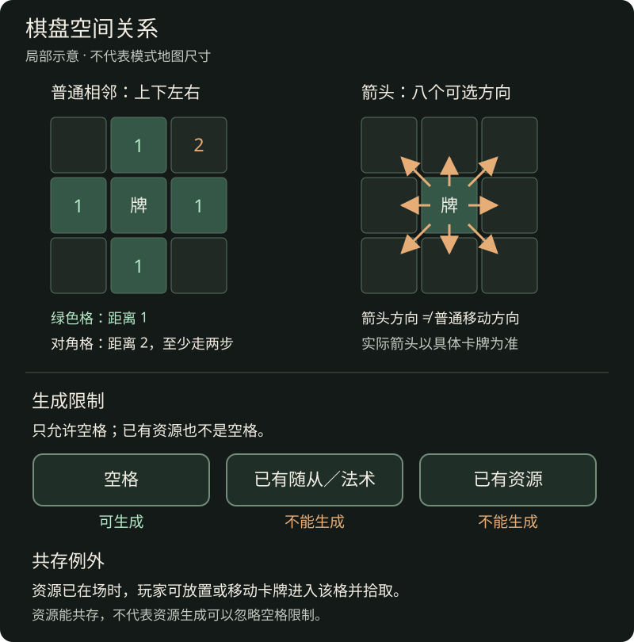
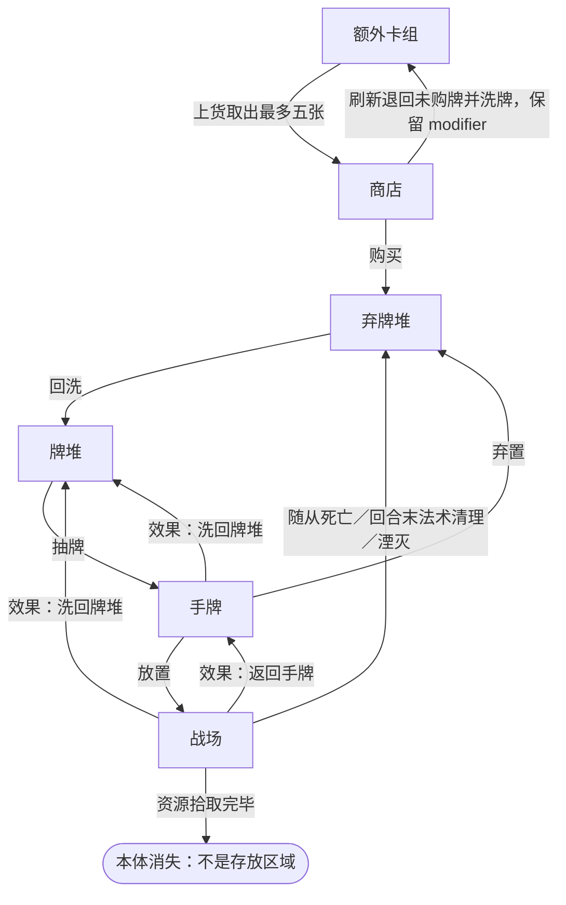
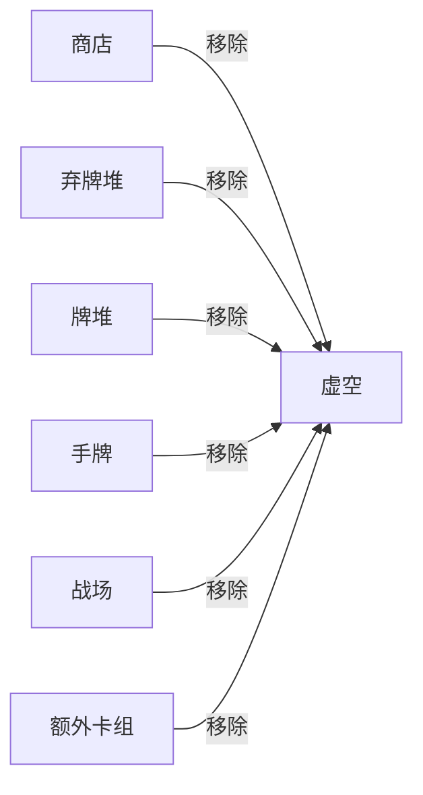

**第二章完整草案，待审阅。** 本章定义对局中的对象、属性、空间与区域，不表示所有细节已经确认。三种基础类型及资源牌核心规则已按本次讨论确认；信息可见性等其余边界的审阅说明见[第二章审阅事项](../maintenance/pending.md#第二章审阅事项)。

## 2.1 玩家与控制关系

**ELM-001 玩家、拥有者与控制者。** 玩家是星能、手牌、牌堆、弃牌堆和额外卡组的归属主体。模式规定参与玩家、阵营及对局目标。

**归属模型待审阅：** 用户提出将拥有者与控制者合并为一个“当前归属玩家”，另可记录创建者。此方案及真实卡牌案例集中在[归属模型评估](../maintenance/neutral-card-audit.md#归属模型评估)。本稿不把旧文区分两者的方案作为已确认的强制规则；跨玩家转区、离场去向和临时归还仍跟进 LIF-R05。

以某位玩家为参照，该玩家控制的对象属于友方，对手控制的对象属于敌方。无控制者的野怪、地图物件是否视为敌方目标，由模式或物件规则明确规定。

无控制者的野怪指当前没有任何玩家控制的野怪。“无控制者”描述控制关系，职业另按卡牌信息记录。

离场卡牌进入谁的弃牌堆、归属变化保留哪些状态，由[6.7](lifecycle.md#控制权变化)跟进；创建者是否记录不替代这些裁定。

## 2.2 卡牌种类与分类维度

**ELM-002 基础类型。** 卡牌分为**随从牌、法术牌、资源牌**三类。资源牌是本次确认的新类型；“遗失的智慧”归入资源牌，不再按法术牌处理。

职业、种族、稀有度、收集属性是相互独立的分类维度。例如，一张牌可以同时是“某职业的机械随从、某稀有度、可收集卡牌”。这些标签本身不附带未写明的战斗能力。

英雄、野怪等描述身份，而非与三种基础类型并列的第四类。其他地图物件同样以对应卡牌表示，不能仅凭“物件”名称推断它一定是资源牌或具有随从能力。

### 2.2.1 随从牌

随从牌的卡面信息包含原始攻击、原始移动能力和原始生命等。进入游戏后，每一份具体随从都是独立的卡牌实例，维护当前生命、当前速度、本回合剩余行动点及攻击次数等属性。

- **生成：** 随从可以随初始配置进入对局，也可以由效果生成。效果须指定生成的牌及目的区域；生成到手牌与直接召唤到战场不是同一行为。普通从手牌放置遵守[放置与箭头](actions.md#放置与箭头)，不能把效果生成一律视为普通放置。
- **共存：** 随从是普通占格对象，默认不能与另一随从或场上法术共占一格；可以进入资源所在格，并按[拾取](lifecycle.md#拾取)结算。同格时停部署的冲突在[湮灭](rounds.md#时停结束与湮灭)规则中处理。
- **收益：** 随从通过在战场上的移动、攻击及有效卡牌效果影响对局；进入战场时按[入场](../reference/keywords.md#入场)结算对应效果。随从类型本身不附带拾取收益，击杀野怪的奖励须由其效果或模式另行规定。
- **持续：** 场上随从跨回合留场，不因回合结束自动进入弃牌堆；行动额度按[回合开始](rounds.md#回合开始)刷新。具体效果规定的到期或离场另行处理。
- **离场：** 随从死亡后从战场进入弃牌堆；死亡条件和触发顺序见[死亡与消灭](lifecycle.md#死亡与消灭)。返回手牌、洗回牌堆或移除到虚空，分别按相应效果处理，不能都当作死亡。区域转移时的 modifier 处理见[6.5](lifecycle.md#区域转移与状态保留)。
- **卡组循环：** 具备相应构筑资格的随从可以进入初始牌堆，购买等途径获得的随从按对应规则加入循环；进入弃牌堆后可随回洗、抽牌再次进入手牌，再按条件放置。英雄和野怪的获得途径依[收集属性](#收集属性)及模式规定，不能从“随从”类型推断全部可构筑或购买。

英雄是具有英雄身份的随从，其开局位置、构筑资格和与胜负的关系由模式规定。野怪的生成、控制、敌我关系及奖励也须分别规定。

### 2.2.2 法术牌

法术牌通过效果影响对局，不具有随从牌的原始攻击、原始生命和原始移动能力；未带这些属性，不表示它是一张数值均为零的随从牌。

- **生成：** 法术可以随初始配置进入对局，也可以由效果生成到指定区域。普通从手牌放置遵守[放置与箭头](actions.md#放置与箭头)；生成、取得一张法术，不等于已经放置或已经结算其效果。
- **共存：** 普通放置后的法术占据战场格子，默认不能与另一场上法术或随从共占一格；资源牌的共存例外仍适用。进入资源格时引用[拾取规则](lifecycle.md#拾取)；时停同格冲突按[湮灭](rounds.md#时停结束与湮灭)处理。
- **收益：** 法术按卡牌文本提供伤害、修正或其他效果；从其他区域进入战场时，按[入场](../reference/keywords.md#入场)触发对应效果。不能把所有法术文本都默认为入场效果，持续、延迟及其他触发仍依具体文本的条件与时点。
- **持续：** 普通放置后作为场上法术存在；完成一次效果不等于本体立即消失。仍在战场的法术于[回合结束](rounds.md#回合结束)的法术清理步骤移入弃牌堆，明示的提前离场或其他例外另行处理。
- **离场：** 回合末法术清理是战场到弃牌堆的转移，不因去向相同就视作随从死亡。返回手牌、洗回牌堆或移除到虚空须有对应规则；modifier 按[6.5](lifecycle.md#区域转移与状态保留)处理。法术清理不等于一次性资源的本体消失。
- **卡组循环：** 具备相应构筑资格的法术可以进入初始牌堆，也可以按规则购买或获得；清理进入弃牌堆后，仍可回洗、抽取、再次放置。具体获得资格依[收集属性](#收集属性)，不由“法术”类型单独决定。

### 2.2.3 资源牌

**ELM-009 资源牌的特殊规则（已确认）。**

资源牌是通过[拾取](../reference/keywords.md#拾取)提供一次性收益的卡牌，通常没有玩家归属。

- **生成：** 资源牌通常由效果生成，生成位置必须是没有任何卡牌的空格；已有随从、法术或资源的格子均不符合条件。资源可以共存，不表示生成时可以选择已占用的格子。
- **共存：** 资源牌可以与其他卡牌重叠。其他卡牌可以放置或移动到它所在的格子；资源牌也不因格上已有其他卡牌就被占格规则阻止。共存只改变占格限制，不自动免除领地、箭头、阶段或明示成本。
- **收益：** 卡面规定[拾取](../reference/keywords.md#拾取)的具体收益，例如获得 1 星能；资格与收益接受玩家按该词条判断，数值不由资源类型统一规定。
- **持续：** 战场上的资源牌不会在回合结束时消失，也不参加场上法术清理；未被玩家拾取时继续留在原处。默认只有被玩家拾取才消失。
- **离场：** 拾取完毕后，资源牌直接移出游戏，无论是否具有拥有者，都不进入任何玩家的虚空、手牌、牌堆或弃牌堆。只有拾取效果产生的结果继续存在，例如玩家获得的星能。具体流程见[拾取与移出游戏](lifecycle.md#拾取)。
- **卡组循环：** 通常资源牌不进入玩家手牌、牌堆或弃牌堆；若某个效果将其送入这些区域，则按所在区域的正常规则参与卡组循环。玩家可以将手中的资源牌按正常条件放置到战场，它仍保持资源牌类型及共存规则，不因此变成法术牌；区域转移的 modifier 同样按[6.5](lifecycle.md#区域转移与状态保留)处理。

资源从手牌放置后被另一张牌重叠拾取的案例，见[4.2.2 放置与拾取](actions.md#放置与拾取)。

“回合结束不消失”针对战场上的资源牌，不免除资源牌在手牌中通常适用的弃牌规则。

特殊资源放置的交互边界见[资源牌剩余边界](../maintenance/pending.md#资源牌剩余边界)。

## 2.3 通用属性与各类型专属属性

**ELM-003 卡牌信息（进入游戏前的定义）。** 卡牌信息描述这种牌本身：名称、类型、原始数值和效果文本等。同一种牌的多份拷贝共享这份定义。下表不包含某次对局里才产生的当前数值、进度或计数。

| 属性 | 游戏含义 | 适用与缺省说明 |
| --- | --- | --- |
| 名称与卡牌编号 | 辨认卡牌定义 | 不区分同一牌的不同对局拷贝。 |
| 基础类型 | 随从、法术或资源 | 身份与职业另外记录。 |
| 职业 | 职业归属，供构筑与效果引用 | 中立是职业分类；不等于无控制者。 |
| 种族 | 供效果引用的一个或多个种族标签 | 无种族不等于中立职业。 |
| 稀有度 | 供模式构筑等规则引用 | 不赋予规则优先权或额外战斗能力。 |
| 收集属性 | 可收集卡、衍生卡、不可收集卡或英雄卡 | 决定构筑与获得途径，详见下方专节；与随从／法术／资源类型不同。 |
| 星能费用 | 卡牌的购买标价及相关构筑依据 | 不等于每次放置都再次支付此价格；英雄等特殊身份费用依模式说明。 |
| 箭头 | 对指定相邻格提供的放置支持 | 由卡面规定；资源牌类型本身不自动增加或删除箭头，没有箭头就不提供支持。 |
| 箭头需求 | 放置时所需支持数量 | 本稿普通放置默认至少 1 个；例外须明确说明。 |
| 原始攻击 | 随从当前攻击的初始计算依据 | 卡牌信息中的基础数值，不是结算时直接读取的当前攻击。 |
| 基础攻击范围 | 可攻击格子的基础距离范围 | 常规随从默认 1；实际攻击与反击使用各自当前有效范围，见[4.4](actions.md#攻击与反击)。 |
| 原始生命 | 随从生命属性的初始计算依据 | 当前生命和当前生命上限属于卡牌实例，不属于本栏。 |
| 原始移动能力 | 随从当前速度的初始计算依据 | 当前速度与本回合剩余行动点属于卡牌实例。 |
| 效果文本 | 本卡带来的具体行为、条件及例外 | 空白表示没有该卡自带的额外效果。关键词引用统一词条。 |

卡牌文本可以规定建造要求、耐久机制或能力限次；这些是效果规则的描述，不表示卡牌信息本身已经带有一条运行中的进度、剩余耐久或使用记录。

费用的增加、减少和支付见[星能与商店](economy.md)；属性变化与状态保留见[第六章](lifecycle.md)。

### 2.3.1 收集属性

收集属性共有四种，用来区分卡牌如何进入构筑或对局，不代替随从、法术、资源的基础类型：

| 收集属性 | 含义 |
| --- | --- |
| 可收集卡 | 可由玩家加入初始卡组或额外卡组，须满足模式的构筑限制。 |
| 衍生卡 | 由其他卡牌或规则生成、不能直接加入构筑的卡牌；可以按相应效果进入手牌、战场或其他区域。 |
| 不可收集卡 | 地图物件、野怪、事件等系统对象，不能加入玩家构筑；通常不进入商店候选，明确模式例外另行规定。 |
| 英雄卡 | 通过模式的英雄选择或英雄配置进入对局，与普通初始卡组／额外卡组的选牌途径区分；英雄选择与限制见第十章。英雄在基础类型上仍是随从牌。 |

收集属性不决定一张牌何时离场。**衍生卡不会仅因“衍生”身份自动消失**；它按自身基础类型及具体效果处理，例如衍生随从正常留场，衍生法术遵循回合末法术清理。其他章节直接引用此定义，不从“衍生”二字补出临时存续限制。

## 2.4 基础属性与对局状态

**ELM-004 卡牌实例（进入游戏后的具体卡牌）。** 一份卡牌进入一局游戏后成为独立实例。实例可以位于牌堆、手牌、战场等区域，不是只有进入战场才成为实例。两份同名牌共享卡牌信息，但各自记录自己的当前属性与状态。

| 实例属性或状态 | 记录内容 |
| --- | --- |
| 当前攻击 | 以原始攻击为依据、应用当前有效修正后的攻击数值。 |
| 当前攻击范围 | 以基础攻击范围为依据、应用当前有效修正后的可攻击范围。 |
| 当前生命与当前生命上限 | 当前剩余生命和此时可恢复的上限；受到伤害减少当前生命，不自动减少上限。 |
| 当前速度 | 实例当前的移动能力；以原始移动能力为依据，受有效效果修正。 |
| 本回合剩余行动点、剩余攻击次数 | 当前尚可消耗的行动额度；消耗行动点不等于降低当前速度。 |
| 剩余耐久 | 部分卡牌具有，消耗及跨循环保留见[6.2.5](lifecycle.md#耐久度)。 |
| 效果进度与完成标记 | 各项进度效果的累计值及一次性完成记录，见[6.2.6](lifecycle.md#进度)。 |
| 跨卡组循环的历史记录 | 例如本局此牌累计被打出的次数，不随清除 modifier 而归零。 |
| 建造进度与完成状态 | 本实例已经积累的进度，以及是否已完成建造。 |
| 能力使用次数 | 本实例在指定统计范围内已经发生的使用记录。 |
| 被保留的回合数 | 回合末实际被保留时增加；正向转区保留、逆向转区清零，见[6.2.7](lifecycle.md#被保留的回合数)。 |
| 所在区域、位置、控制关系 | 本实例当前处于何处、由谁控制。 |
| 护甲、圣盾等状态 | 由相应规则赋予并影响后续结算的状态。 |

这些属性只在适用时记录，不因“成为实例”就自动获得所有表中机制。初始值如何建立、何时刷新、到期或在区域转移后保留，由对应规则规定，不能一律理解为每回合清零。

例如，两份同名随从的原始生命都为 5；其中一份受伤后的当前生命可以是 2，另一份仍为 5。变化的是各自实例的当前生命，共享的卡牌信息没有因此被改写。一次效果指定“这张牌”时，不能用另一份同名拷贝替代。

### 2.4.1 效果关键词与状态

- **效果**规定卡牌如何影响游戏，例如造成伤害、提供持续修正，或在指定条件满足时执行某件事。
- **关键词**是固定效果规则的简写。例如[入场](../reference/keywords.md#入场)说明触发条件，[保留](../reference/keywords.md#保留)说明回合末手牌处理的例外。
- **状态**记录卡牌持续具有的特殊情况、标记或累计数值；状态本身如何影响结算，由相应规则定义。

“具有圣盾”是状态；[圣盾](../reference/keywords.md#圣盾)词条说明该状态如何抵挡伤害及消除。关键词与状态因此可以使用同一个名称。

“耀斑连射每次被保留时增加伤害”是效果；[已经累计的保留回合数](lifecycle.md#被保留的回合数)是状态。这一描述本身不授予该牌“保留”，仍须另有规则使它被保留。

[可建造](../reference/keywords.md#可建造)描述进度如何变化以及完成时如何解锁；当前进度、是否建造完成则属于状态。建造中的白板状态与完成后的属性变化见该词条及第六章。

## 2.5 棋盘与空间关系

**ELM-005 格子、方向与距离。** 棋盘由格子组成，尺寸与双方领地由模式规定。领地表示空间归属，不等于格中卡牌的控制权；进入某方领地也不自动改变控制者。

本稿采用上下左右四向为普通相邻关系。两格的距离等于横向格差加纵向格差：斜对角紧邻的两格距离为 2，普通移动至少需要两步。距离不保证存在可通行路径。

箭头可以指向周围八个方向。因此，箭头指向范围与普通移动的一步范围不同。箭头随卡牌朝向指向具体棋盘格；本稿以该牌所属一方的朝向为基准，双方相对摆放时，箭头相对棋盘旋转半周。控制权改变是否改变朝向，留给控制权规则裁定。

**ELM-006 占格。** 本版不设高度。普通单位与场上法术占据格子，默认不能与另一个普通占格对象共存，也不能穿过其格子。资源牌依上文共存例外处理，不阻挡其他卡牌放置或移动到其所在格；进入后按拾取规则判断是否触发。

资源牌共存已在本次讨论确认，不依赖高度。其他共存、穿越或飞行能力必须明确规定，不能从已取消的高度规则补出许可。

图 2-A 只展示本章的空间关系，不表示标准模式的棋盘尺寸。点击图片可打开原图；箭头图中的八个方向表示可配置的方向，不表示每张牌同时拥有八个箭头。

## 2.6 游戏区域

**ELM-007 区域与流转。** 区域说明卡牌当前处于怎样的游戏位置。地图上的移动改变格子，不等于离开战场再重新入场。

| 区域 | 作用 |
| --- | --- |
| 牌堆 | 抽牌来源，通常从顶端依次抽取。其内容与真实抽牌顺序是不同信息。 |
| 手牌 | 可供放置、弃置、支付及保留等规则引用的牌。 |
| 弃牌堆 | 已弃置或按规则离场的牌；牌堆不足时可洗回，继续卡组循环。 |
| 额外卡组 | 存放未陈列的商店牌源，不包含当前已在商店的牌；不随主牌堆耗尽而自动洗入主牌堆。 |
| 商店 | 存放当前已陈列、可以购买的牌；与额外卡组是独立区域，上货与退回均实际转区。 |
| 战场 | 单位、场上法术、资源牌与其他地图物件所在的棋盘区域。 |
| 虚空 | 退出正常卡组循环的区域；[移除](../reference/keywords.md#移除)将牌送到这里，通常不能再被抽到或洗回。 |

虚空是存放卡牌的区域；[资源牌拾取后的消失](#资源牌)没有目的存放区域，不能在图中接到虚空。

[抽牌](rounds.md#回合开始)、[购买](economy.md)、[放置](actions.md#放置与箭头)分别规定对应转移。死亡、弃置、移除不是同一个动作，不能因结果都离开当前区域就替换使用。

### 2.6.1 区域迁移示意

图 2-B 展示常见区域迁移。迁移必须由标注的行动或效果引发；商店的上货与刷新流程见[5.2.2](economy.md#陈列归属与区域)。连线本身不授予转移权限。

死亡、法术清理和湮灭虽然都可以将卡牌从战场送入弃牌堆，但不是同一种事件；各自的触发条件与后续效果分别判断。商店购买入弃牌堆沿用[旧规则书](../maintenance/sources.md#参考材料)的默认去向，报价、支付及候选更新见[第五章草案](economy.md#购买卡牌)。

**任一其他区域进入虚空都属于[移除](../reference/keywords.md#移除)**，不局限于从战场移除。下图的每条迁移同样需要有效规则或效果，不表示玩家可以任意移除卡牌。

资源被拾取后本体消失，不在虚空继续保存；不能将它接到移除的分支。场上随从与资源跨回合留场，法术则执行回合末清理，见[三类卡牌](#卡牌种类与分类维度)。

### 2.6.2 区域的正向与逆向顺序

**已确认的顺序：虚空 → 商店 → 弃牌堆 → 牌堆 → 手牌 → 战场。**

图 2-C 是[6.5 区域转移与状态保留](lifecycle.md#区域转移与状态保留)的顺序索引，不表示合法迁移路线；modifier 的保留、清除、例外及案例以该节为准。

### 2.6.3 额外卡组与商店的区域划分

**已确认：额外卡组与商店计为两个独立的游戏区域。** 额外卡组存放尚未陈列的牌，商店存放当前已陈列的可购牌；同一张牌不会同时位于两处。上货把牌从额外卡组送入商店，购买把该牌从商店送到购买目的地。

例如，两区合计有 10 张牌，取其中 5 张上货后，商店为 5 张、额外卡组为 5 张。刷新时先把商店中的牌退回额外卡组，再洗牌并重新上货；退回保留 modifier。商店显示数量和额外卡组剩余数量分别计算。上货、退回和洗牌的操作流程见[5.3](economy.md#商店刷新)，转区继承见[6.5](lifecycle.md#区域转移与状态保留)。

## 2.7 公开与隐藏信息

**ELM-008 可见信息草案。** 以下整理自旧规则与当前对局行为，尚待审阅；“界面尚未提供查看”不等于规则禁止查看。

| 信息 | 通常可见范围 |
| --- | --- |
| 星能及手牌、牌堆、弃牌堆数量 | 通常双方可见；时停期间对手星能及各区可见数量均保持冻结基准。 |
| 自己的手牌 | 可查看具体卡牌。 |
| 自己的牌堆 | 可查看内容，不透露真实抽牌顺序。 |
| 自己的弃牌堆 | 可查看内容。 |
| 对手的手牌、牌堆、弃牌堆 | 默认只知数量，明确揭示的内容除外。 |
| 自己的商店候选 | 自己可见；不自动向对手公开。 |
| 战场 | 通常公开，时停采用下述特殊可见性。 |
| 额外卡组及虚空的完整内容 | 查看权限尚待裁定，不能据此推断公开或禁止查看。 |

表中的时停冻结以[3.3 时停](rounds.md#时停)为准；该节定义冻结基准、独立部署与结束揭示。

## 2.8 关联章节

- [构筑与开局配置](../standard/setup.md)
- [状态变化与卡牌生命周期](lifecycle.md)
- [第二章审阅事项](../maintenance/pending.md#第二章审阅事项)
