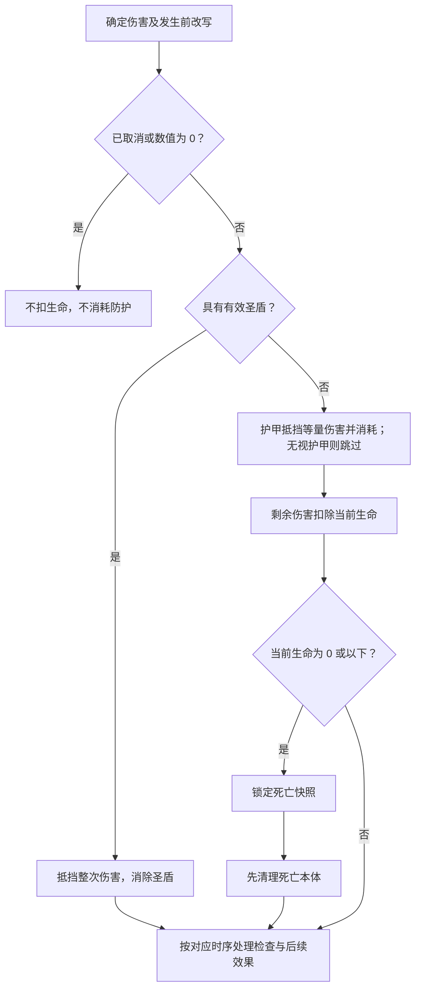
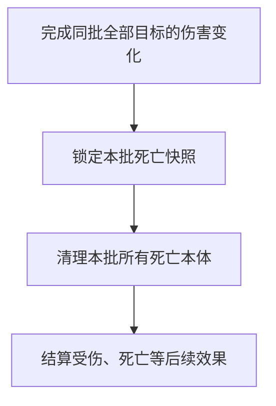
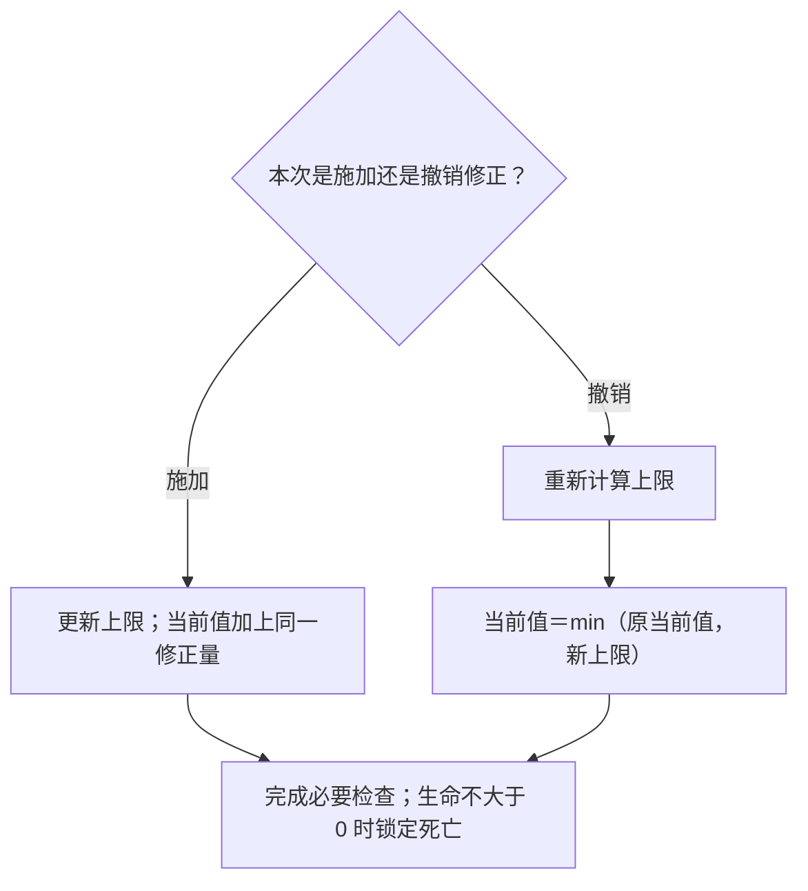
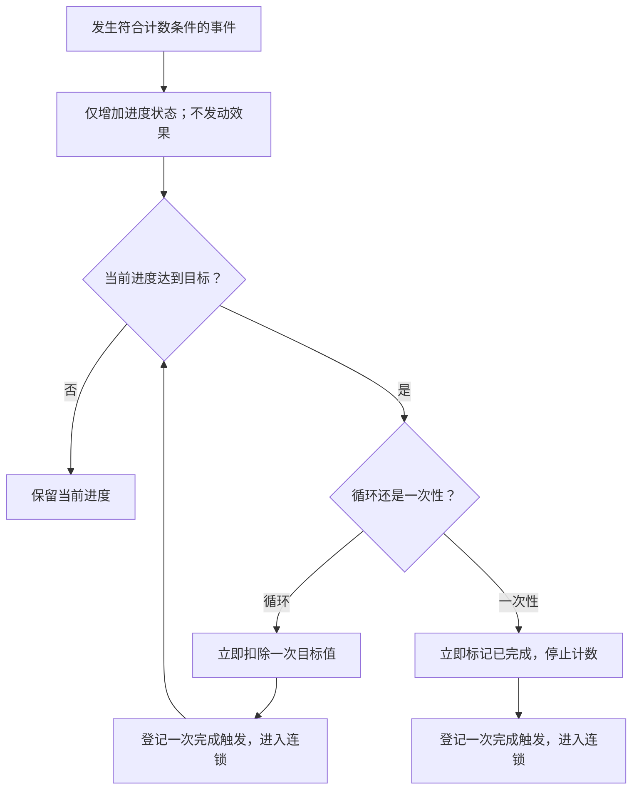
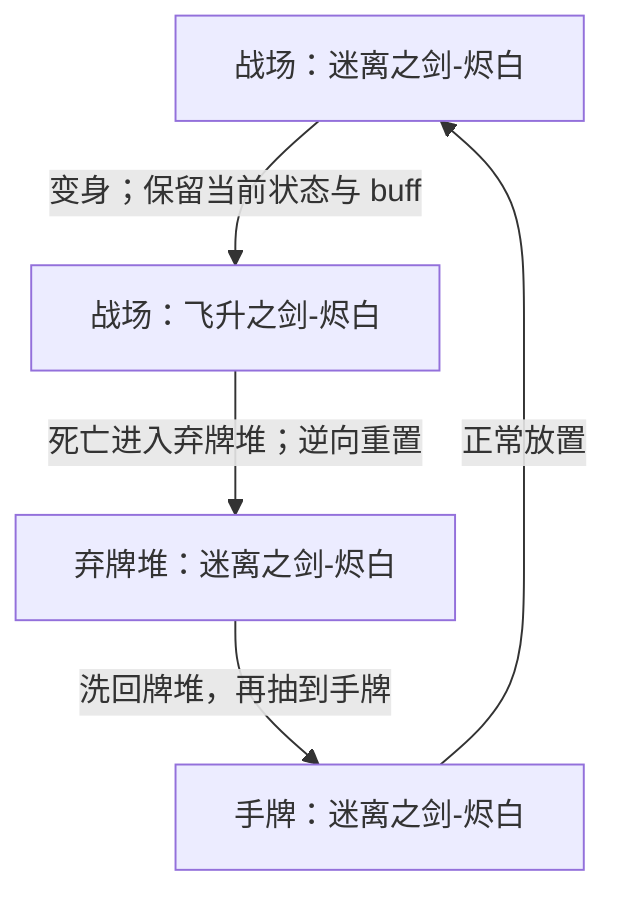
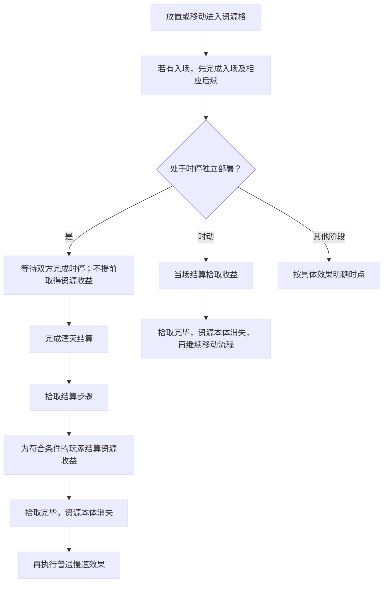

本章说明伤害、状态变化与卡牌生命周期。已确认条款作为裁定依据；尚缺参数的地方保留草案说明，集中见[第六章审阅事项](../maintenance/pending.md#第六章审阅事项)。

本章定义行动或效果引发的具体状态变化。全局资源生成方案属于标准对战的对局自动逻辑，不并入棋子状态规则。

## 6.1 伤害护甲与治疗

**LIF-003 伤害改变当前生命。** 一次伤害包含来源、目标和数值；先判断对应效果是否合法、有效，再应用伤害改写和防护。减少生命上限、直接设定生命或支付生命成本，不因最后生命变少就自动成为伤害。

### 6.1.1 单次伤害流程

**圣盾先于护甲已确认。** 以下流程承接该先后与死亡快照；零伤害等尚未单独裁定的细节仍按审阅表跟进：

1. 确定这次伤害的合法目标和数值，处理适用的改写、转移或取消。被取消的伤害不继续执行。
2. 剩余数值为 0 时不扣生命，也不消耗圣盾或护甲。
3. 伤害大于 0 且目标具有有效[圣盾](../reference/keywords.md#圣盾)时，抵挡这一次伤害并消除圣盾；不再消耗护甲。
4. 未被圣盾抵挡的伤害，由护甲按 1 点护甲抵挡 1 点伤害；只消耗实际用于抵挡的护甲。明确无视护甲时跳过这一步，不能由此跳过圣盾。
5. 剩余伤害扣除目标当前生命。立即检查死亡条件，锁定死亡快照并先清理本体，再处理受伤及死亡等后续效果，按[6.3.1](#确认死亡离场与死亡效果)处理；明确的同时伤害批次按[6.1.2](#伤害事实与多段伤害)整体处理，嵌套效果顺序见第八章。

图 6-A 展示单次防护与死亡快照；同时伤害按 6.1.2 整体处理，本图不决定多个后续触发的排序。生命为 5、护甲为 2，承受 4 点伤害时，护甲耗尽、当前生命成为 3；若同时有圣盾，则只失去圣盾，生命与护甲不变。

### 6.1.2 伤害事实与多段伤害

**伤害执行与伤害量分开。** 伤害对合法目标成功执行后，即使被圣盾完全抵挡，伤害事件仍已发生，步骤仍算成功；伤害量为 0 不使后续“然后”失效，主定义见[8.7.1](effects.md#不同失败阶段)。

**受伤时点以实际扣除生命为条件（已确认）。** “受到伤害”特指生命因伤害实际减少。圣盾或护甲完全抵挡时，不触发“受到伤害时／后”的效果；部分抵挡后仍扣除生命，则产生受伤时点。伤害步骤成功与受伤触发资格分别判断，因此完全抵挡可以满足前述“然后”，却不触发受伤效果。

“连续造成两次 1 点伤害”是两次伤害，不是一次 2 点伤害：圣盾至多抵挡其中第一次，第二次重新检查当时的防护。

**LIF-015 同时伤害整体处理（已确认）。** 对明确属于同一批的同时伤害，先完成本批全部目标的伤害变化，再锁定本批死亡快照并清理所有死亡本体，之后才处理受伤、死亡等后续效果。不能完整结算第一个目标及其触发后，再对第二个目标造成这批伤害；也不能因一方先被计算为致死而取消同批已经确定的反击伤害。

图 6-E 规定同批伤害、死亡清理和后续效果的先后；普通触发排序引用[8.5](effects.md#多个效果与连续结算)。多个伤害是否属于同一批须由产生它们的规则明确，不能仅因来自同一张牌就合并。

**LIF-016 伤害计数不包含过量部分（已确认）。** 用于“造成／受到多少伤害”及伤害进度累计的数值，等于经过改写、防止、圣盾和护甲之后实际用于扣减生命的伤害量，但最多计至受击前剩余的生命量。被防护抵挡的部分与超过剩余生命的部分不计入该值。

例如目标受击前剩余 2 生命，穿透防护的伤害为 5，本次伤害计数为 2；1 生命随从承受 10 点未抵挡伤害，伤害进度只增加 1。攻击力或伤害数值再高，也不能靠过量部分额外积累进度。**伤害扣血最低到 0**，过量部分不把生命继续扣成负数；这与施加生命 debuff 的等量调整不同。本条不增加“无限攻击力”这一属性取值。

死亡快照与清理见[6.3.1](#确认死亡离场与死亡效果)；同批后续及嵌套触发顺序仍见 T-01。

### 6.1.3 护甲与治疗

护甲是单位状态，不是玩家资源。获得护甲增加该单位的护甲量；护甲不在回合末自动清空，消耗、到期和跨区清理依相应规则。治疗不会自动补充护甲或重新赋予圣盾。

治疗提高当前生命，最多恢复到当前生命上限。当前生命为 2、上限为 5，治疗 4 点只能实际恢复 3 点。只有实际恢复大于 0 才产生实际治疗事件；合法零回复仍可算步骤成功，见[8.7.1](effects.md#不同失败阶段)。

直接消灭、减少生命上限或明确支付生命，与伤害分开判断；不能默认用圣盾或护甲支付这些变化。生命支付是否允许致死、能否使用未受伤状态等特殊条件，须由成本规则明确，不从本段补造一种通用行动。

## 6.2 属性变化

**LIF-004 原始值、修正与当前值分开。** 原始属性来自[卡牌信息](elements.md#通用属性与各类型专属属性)，对局中生效的 modifier 影响具体实例。原始定义没有因受伤、行动消耗或暂时加成而被改写。

### 6.2.1 生命上限与当前生命

**施加与撤销修正采用不同规则（已确认）。** 施加生命 buff／debuff 时，生命上限与当前生命等量增加／减少；撤销该修正时，只重新计算上限，当前生命变为 **min（撤销前当前生命，撤销后的生命上限）**，不反向加减原修正量。到期、沉默清除或光环来源消失导致修正撤销，都采用后一规则。

例如当前 1／上限 5，获得 +2 生命后为 3／7；立即撤销加成后为 3／5，不会额外扣 2。若加成期间受伤至 1／7，撤销后为 1／5，不会因移除这份 +2 加成死亡。当前 2／5 受到 −2 生命修正则为 0／3，仍立即按[死亡快照](#确认死亡离场与死亡效果)处理。

施加减益等量扣除，不在 0 截断；例如 1 生命受到 −3 生命修正后为 −2。属性修正不是伤害或治疗，不产生对应受伤／实际治疗事件。变身切换基础属性的联动见[6.6.2](#升级变形与复制)。

### 6.2.2 速度与剩余行动点

速度是当前移动额度的依据，剩余行动点是尚可花费的额度。移动花费行动点不会降低速度。

**施加速度修正时等量联动；撤销时只截取上限（已确认）。** 获得 +N／−N 速度时，当前速度和剩余行动点同时增加／减少 N。撤销修正时重新计算速度，剩余行动点变为 **min（撤销前剩余行动点，撤销后的速度）**，不按相反数补回或扣回。

例如速度 5、剩余行动点 1，受到 −3 速度后为速度 2、行动点 −2；不能支付移动成本。撤销减速后速度回到 5，行动点仍为 −2，不恢复为 1。回合开始仍按[3.2](rounds.md#回合开始)刷新；逆向转区的重置见[6.5.2](#特殊状态与-buff-速查)。

图 6-F 同时适用于生命与速度；当前值分别是剩余生命与行动点。伤害、治疗、变身及转区重置各按对应条款处理，不套用撤销修正算法。

三种移动方式见[4.3](actions.md#移动与特殊位移)；攻击次数与主动能力次数独立于移动额度。

### 6.2.3 持续加成与一次性修正

只在来源存在、范围或条件成立期间提供的持续加成，在条件变化时重新计算。例如提供生命上限的光环离场，应撤去对应贡献并按 6.2.1 调整当前生命。

**一次性赋予的 buff 未注明期限时，不默认在回合结束到期（已确认）。** 它持续到逆向转区、明确消除或其他适用的结束条件；仅本回合有效必须在文本中注明。一次性赋予“本回合 +2 攻击”的效果，按该修正自己的期限存在；它不因为施加者离场就自动结束。也不能因为一份光环曾作用过，就永久留下同一份攻击或生命加成。

多个数值修正采用[8.4.1](effects.md#数值运算与读值)的设定、加减、倍数及取整顺序。持续效果相互依赖时，不用反复叠加到数值不再变化的方式自行决定结果。

### 6.2.4 建造值

建造值是可建造卡牌实例的建造进度记录，需要区分：

- **当前建造值**：已固定建造值与当前未固定值之和。
- **未固定建造值**：当前时刻指向建筑所在格的有效箭头数。
- **已固定建造值**：回合结束时固定的进度，作为下回合继续计算的起点。
- **建造目标值**：对应卡牌规定的完成要求，用于判断建造进度是否已满。

箭头如何增加建造值、何时固定以及满值后的形态解锁，统一按[4.2.3 建造](actions.md#建造)处理。初次建造及逆向转区后重新建造，固定值为 0，未固定值依当时箭头建立；具体完成与固定时点仍引用该主定义。

### 6.2.5 耐久度

**LIF-009 耐久度（已确认）。** 耐久是部分卡牌具有的实例状态；没有耐久词条的牌不参与耐久消耗检查。「耐久度：N」为实例规定初始剩余耐久 N。

1. 卡牌实际从战场进入弃牌堆时，剩余耐久减少 1。
2. 随后检查剩余耐久；若小于或等于 0，将该牌从弃牌堆[移除](../reference/keywords.md#移除)至虚空。
3. 若仍大于 0，卡牌留在弃牌堆，保留该剩余值继续参与卡组循环；重新抽取、放置及逆向清除 modifier 都不会恢复耐久。

判断依据是这次真实区域转移。随从死亡、法术清理、湮灭、直接移入弃牌堆，以及献祭后从战场进入弃牌堆，都满足消耗条件；返回手牌、洗回牌堆或从手牌弃置不满足。先前的离场原因仍按[6.3](#死亡与消灭)判断，耐久耗尽的移除不把献祭或湮灭变成死亡。

例如「太空临时工」耐久为 2，第一次从战场进入弃牌堆后剩余 1；再次打出并从战场进入弃牌堆，剩余降至 0，随后进入虚空。

**先完成耐久耗尽的本体处理，再处理离场／死亡触发。** 战场进入弃牌堆后扣耐久，耗尽则先移除；已经触发的效果不因本体进入虚空取消。后天赋予耐久的卡文必须区分“设为 N”与“增加 N”，不使用含糊的默认；尚未设计的来源失效等例外随具体效果明写。

### 6.2.6 进度

**LIF-010 进度的累计与完成（已确认核心）。** 每项进度效果维护自己的当前进度、目标值，以及需要的一次性完成标记。伤害量计数统一读取[6.1.2](#伤害事实与多段伤害)的已裁定数值，不计过量伤害。设计须明确计数条件和每次增加量：抽 5 张牌按张数统计，获得 4 星能按数量统计，不能把一次批量获得仅计为一次。

- **累计只更新状态。** 满足计数条件时增加进度；增加本身不算发动或触发效果，不向效果连锁加入结算项。产生计数的原事件仍照常结算。
- **达到目标才触发完成效果。** 当前进度达到或超过目标值时，产生相应的完成触发，并按通用结算规则进入连锁；不在更新计数时直接执行奖励。
- **循环进度保留余量。** 每完成一次，立即从当前进度扣除一次目标值，再检查是否还能完成。一次累计跨过多个目标值，产生对应次数的完成触发。扣除发生在登记完成时，不等奖励结算结束。
- **一次性进度只自然完成一次。** 完成时立即标记已完成，停止后续累计；不等奖励结算完毕才标记。普通一次性进度可按下文逆向转区规则重置；外部直接触发已完成任务按下文处理，不重开自然累计。

例如「星光运输管线」当前 3/4，一次获得 3 星能，完成一次后剩余 2/4；若当前 3/4、一次获得 10 星能，则完成三次、剩余 1/4。三个完成效果各自进入连锁，彼此及其他触发的排序仍依[第八章](effects.md)。

图 6-C 仅说明累计、登记完成与更新状态的关系；“进入连锁”不表示当场执行奖励，也不规定多个效果的排序。已完成的一次性进度不再进入图中的累计流程。

**目标值变化：** 「超越进制」将进度要求改为原始目标值的 75%，结果向上取整；它不把主动次数上限等其他计数要求一并改变。降低目标值后立即检查已有进度；若达标，按新目标值完成并扣除，循环进度继续检查余量。例如目标 4 降为 3，已有 3 点进度立即完成一次。目标值恢复不撤销此前已经完成的次数。

**直接触发：** 效果明确要求“触发一个进度效果”时，令选定进度效果产生一次完成效果并进入连锁，不增加、扣除或重置原进度，也不将这一操作记作自然完成。即使一次性进度已完成，外部仍可令它执行一次完成效果；不重开任务，也不改变完成标记。完成效果被反制，不返还已经扣除的循环进度、不撤销已登记的一次性完成标记。对象的选择、合法性和操作窗口仍依原效果要求。「借时蜉蝣」与「集群主脑-埃米莉丝」使用此含义。

**当前进度的转区规则（已确认）：** 普通进度效果的当前进度初始为 0，属于[逆向重置型状态](#状态的转区保留类型)：正向转区保留数值，逆向转区重置为 0。特殊任务需要跨区保留时，必须明确写出例外，不能只凭“一次性”或“任务”的名称推断。

「迷离之剑-烬白」的拾取变身进度为**一次性进度**；其他本轮整理的机械天国累计效果采用循环进度。变身发生时保留当前状态，见[6.6.2](#升级变形与复制)。**普通一次性进度的完成标记也属于逆向重置型状态（已确认）**：逆向转区时连同当前进度重置为未完成，可重新累计；明确跨区保留的特殊任务例外。烬白变身后逆向还原，再次入场能够重新完成进度并变身。**默认仅在来源位于战场且该效果有效时计数**；其他区域须明示。停止计数不等于清零，记录仍依转区规则保留。变身延续的同一项进度保留记录，新获得的不同进度从 0 开始；旧形态不再提供的效果停止计数，不能将其数值灌给另一项效果。建造仍由[4.2.3](actions.md#建造)规定，不自动采用这里的循环扣除机制。

**机械天国的具体进度选择（已确认）。** 天庭乐师计入自己的完成效果；集群主脑随机选择三个不同的有效进度效果，不足三个则选择全部；借时蜉蝣面对同一张牌的多个有效进度效果，由玩家选择一个，非己方操作窗口由系统合法随机选择。

### 6.2.7 被保留的回合数

**LIF-011 保留回合数（已确认核心）。** 「被保留的回合数」是卡牌实例的累计状态，初始为 0。每次回合结束，该牌实际被保留在手牌中时，计数增加 1；同一回合的这次保留只计一次。仅仅获得[保留](../reference/keywords.md#保留)词条，或在回合中进入手牌，不会立即增加计数。

**该状态随逆向区域转移清零。** 按[6.5](#区域转移与状态保留)判断转移方向：手牌回到牌堆、手牌进入弃牌堆，以及战场进入弃牌堆或返回手牌等逆向转移，将保留回合数重置为 0。手牌放置到战场属于正向转移，保留该数值供入场等效果读取；不能在打出时先清零，使相关效果无法取得已经积累的回合数。

例如「耀斑连射」被保留两个回合后，计数为 2；放置到战场时仍为 2，其卡文可据此计算额外伤害。若从手牌被弃置或洗回牌堆，计数立即变为 0；之后再抽到也不会恢复此前累计值。该数值和[耐久](#耐久度)、整局累计打出次数采用不同的转区保留规则。

「太阳雨」「见习阳炎射击」引用“已被保留过”的条件；「日珀蜂蜜」「耀斑连射」「耀变星能石」引用保留次数计算收益；它们都可引用本状态，而不各自维护第二套普通保留计数。保留计数本身不授予保留词条。

**有效保留回合数**指本次效果读取的保留次数：以实际累计值为基础，再应用该效果适用的“视作保留”修正。它是读值，不是另一份累计状态。

**实际累计与“视作”分开。** 「烈阳圣女-阿蕾缇娅」「烈阳恩典」「高等阳炎术」的“视作保留”只影响效果读值，不改变实际保留记录，也不额外产生“每次被保留时”的触发。例如实际保留 2 回合、结算时额外视作 2 回合，读取 4，实际记录仍为 2，不额外触发两次唱诗班诗童。实际被保留时先增加计数，再产生相应触发。“本回合获得保留”先保护本次弃牌、更新计数，再到期，顺序见[3.6](rounds.md#回合结束)。保留判断、清理批次及后续触发统一采用[3.6](rounds.md#回合结束)；结束效果产生的手牌会进入随后快照，清理后续产生的手牌不追加、不增加本次保留计数。

## 6.3 死亡与消灭

**LIF-005 死亡的判定（已确认）。** 随从满足以下任一条件时，按死亡处理：

- 当前生命值降至 **0 或以下**；在受伤后续效果结算前，立即锁定死亡快照。
- 有效效果明确要求**消灭**该随从。

死亡依据发生的原因判定，**不能用“从战场进入弃牌堆”反推死亡**。直接将卡牌移入弃牌堆、献祭随从都不属于死亡，不因此触发死亡效果。直接消灭也不先制造一笔伤害；只抵挡伤害的圣盾与护甲不默认阻止消灭。

### 6.3.1 确认死亡、离场与死亡效果

**LIF-014 死亡快照（已确认）。** 一旦随从满足死亡条件，就锁定本次死亡对象与原因，记录死亡结算需要的离场前信息，形成死亡快照。伤害扣血后先做这项判定，不等待“受到伤害后”的效果先回复生命；锁定后不因后续治疗或数值变化撤销本次死亡。

例如，假设随从当前生命为 1，具有“受到伤害后，回复自身 2 点生命”：受到 1 点伤害使生命降至 0，立即锁定死亡并先清理本体。该回复不能使它在这次伤害中存活。伤害发生前的有效防止或替换仍先处理；被防止的伤害不会凭空产生致死结果。

快照锁定的是**这次已经成立的死亡**，同一次死亡只处理一次，不反复重判。后续效果使其他随从新满足死亡条件时，那是新的死亡事件，另行记录与处理；不能用旧快照排除后续真实发生的死亡。明确的同时伤害按[6.1.2](#伤害事实与多段伤害)先处理全部伤害、再锁定本批快照并清理全部本体；撤去生命光环按[6.2.1](#生命上限与当前生命)只截取新上限，不能把消失的加成当成新的等量生命扣减。

**死亡确认后：先清理本体，再结算死亡效果。**

1. 锁定死亡快照，记录死亡对象、原因、离场前所在格及本次死亡效果所需的信息。这只是保留结算依据，尚不执行后续效果。
2. 将本体从战场清理，送入弃牌堆，依[6.5](#区域转移与状态保留)处理 modifier。本体不再占据原格；依赖它在场的箭头、持续作用按各自规则停止。
3. 再处理本次死亡引发的有效死亡效果，使用快照中的离场前信息。本体已经离场，不会仅因此丢失本次应结算的死亡效果。已经触发的受伤效果也不因来源离场而取消，见[8.7.2](effects.md#来源离场封锁与控制权变化)；相互排序见[8.5.2](effects.md#同时满足条件的效果)。

例如“死亡时，在其所在格子上召唤一个僵尸”，使用死亡随从离场前的格子。先清理死亡随从，便不会被它自己的本体阻挡召唤；若该格因其他变化已经被占用，仍检查召唤的实际合法性，不获得无视占格的许可。

死亡及其他后续效果按[8.5](effects.md#多个效果与连续结算)处理；必要清理后检查胜负，见[8.8](effects.md#检查与行动完成时点)。快照保存该死亡效果明确需要的离场前信息，不用转区重置后的值改写死亡事实。

### 6.3.2 不同离场原因

| 发生的原因 | 是否属于死亡 | 对应处理 |
| --- | --- | --- |
| 当前生命降至 0 或以下 | 是 | 按 6.3.1 锁定死亡快照，先清理本体，再结算后续效果；后续回复不撤销死亡。 |
| 有效效果明确“消灭”随从 | 是 | 同上，不要求先扣生命。 |
| 效果直接将卡牌从战场移入弃牌堆 | 否 | 处理该次区域转移及其实际满足的触发条件。 |
| 献祭自己的随从 | 否 | 按献祭效果或成本说明处理；不触发死亡效果。去向须由相应规则说明，不能从“献祭”推断为消灭。 |
| 法术清理、湮灭、返回手牌、洗回牌堆、移除或资源拾取后的消失 | 不因这些离场行为本身构成死亡 | 按各自规则处理；最终区域相同不使原因等同。 |

“移入弃牌堆”或“被献祭”仍可满足明确观察相应事件的效果；不算死亡不等于没有后续结算。若效果有其他独立步骤，再分别判断实际发生的事件。

**击杀归给直接致死的来源（已确认）。** 伤害、明确消灭或生命减益直接导致死亡时，归给对应来源；献祭、湮灭、直接移入弃牌堆不产生击杀。没有可归属来源的规则性死亡，不授予某名玩家击杀收益。控制变化后的离场接受玩家见[6.7](#控制权变化)；英雄死亡与胜负的关系由模式规定。

## 6.4 抽牌弃牌与洗牌

**LIF-006 按具体卡牌移动处理。** 抽牌、弃牌与洗牌改变区域和顺序，不额外创造另一份同名牌。区域正逆向规则同时适用。

### 6.4.1 抽牌与空牌堆

抽牌从本方牌堆顶端取牌进入手牌。一次要求抽多张时，按抽取顺序取得相应数量；每张都对应实际存在的一份牌。

仍需抽牌而牌堆已空时，将本方弃牌堆洗成新的牌堆，再继续未完成的抽取。原牌堆尚有牌时，不把弃牌堆提前混进去。两堆都为空时，无法继续的抽取停止，不凭空发牌；本稿通用规则不附加疲劳伤害或直接判负。

例如需抽 5 张，牌堆有 2 张、弃牌堆有 4 张：先抽 2 张，再洗回弃牌堆并抽 3 张，最后牌堆余 1 张。额外卡组、虚空和战场中的牌不参与这次回洗。

回合开始的一批抽牌按[3.2](rounds.md#回合开始)先完成该批再处理抽牌引发的效果。其他效果写“抽 N 张”还是“重复 N 次抽一张”时，其批次边界与触发插入点需要按第八章说明，不能默认为完全相同。

### 6.4.2 弃牌与回合末快照

弃牌将指定手牌送入弃牌堆；它是手牌到弃牌堆的逆向转移，清除 modifier。需要挑选、随机或弃置全部时，按产生该弃牌的规则确定对象，不把一种选择方式套到所有弃牌。

回合末弃牌的取样时点、清单范围和处理步骤统一见[3.6 回合结束](rounds.md#回合结束)；[保留](../reference/keywords.md#保留)的含义由词条定义。

### 6.4.3 洗回与指定位置

“洗回牌堆”将指定牌纳入牌堆并重新确定所需的随机顺序；明确放在牌堆顶端或底端的效果按其指定位置处理，不自动改成洗牌。

各来源洗回牌堆的 modifier 处理见[6.5](#区域转移与状态保留)。随机取样见[8.2.4](effects.md#随机选择与随机伤害)；多张顶／底插入未指定次序时仍须补全效果说明。

## 6.5 区域转移与状态保留

**LIF-002 正逆向与 modifier（已确认核心）。** modifier（修正）指对局中施加在具体卡牌实例上、使其偏离原始卡牌定义的改变，例如攻击加成、费用修正或后天赋予的效果。它不改写同名牌共享的原始定义。

按 **虚空 →〔额外卡组／商店〕→ 弃牌堆 → 牌堆 → 手牌 → 战场** 比较来源和目的区域：

- **正向：** 目的区域在来源之后，转移本身不清除 modifier；允许跨过中间区域。
- **同级：** 额外卡组与商店是两个不同区域，但同级；彼此转移保留 modifier，仍真实发生转区。
- **逆向：** 目的区域在来源之前，清除 modifier，将牌恢复为原始状态。原始卡面自带的效果不是后天 modifier，不因清除修正而被删除。
- **先有合法转移，再判断保留。** 排序不授予行动，不要求牌逐区前进，也不阻止规则允许的逆向转移。某个修正自身到期、被消除，或明确规定不同继承方式时，仍执行其有效规则。

| 区域变化 | 方向 | modifier 处理 |
| --- | --- | --- |
| 商店 → 弃牌堆（购买） | 正向 | 保留。 |
| 额外卡组 ↔ 商店（上货／刷新退回） | 同级转区 | 保留 modifier，不恢复原始状态；指定区域目标关系仍因离区失效。 |
| 手牌／战场 → 额外卡组 | 逆向 | 清除 modifier，恢复原始状态。 |
| 弃牌堆 → 牌堆（回洗） | 正向 | 保留。 |
| 牌堆 → 手牌（抽牌）、手牌 → 战场（放置） | 正向 | 保留。 |
| 弃牌堆 → 战场（有明确效果允许时） | 正向，跨区 | 保留；不能由此推断存在免费复活行动。 |
| 战场 → 弃牌堆（随从死亡、法术清理或湮灭） | 逆向 | 清除，恢复原始状态；不因此把三种事件视作同义词。 |
| 战场 → 手牌（返回）、手牌 → 弃牌堆（弃置） | 逆向 | 清除，恢复原始状态。 |
| 手牌／战场 → 牌堆（洗回） | 逆向 | 清除，恢复原始状态。 |
| 序列中任一其他区域 → 虚空（移除） | 逆向 | 清除，恢复原始状态。 |

例如，某随从手牌获得 +2 攻击后被放置到战场，仍保有该修正；它死亡进入弃牌堆时失去该修正，后续回洗和抽牌不会恢复已经清除的 +2 攻击。

**适用边界：** 同一区域内移动没有正逆向之分；棋盘移动不属于本条的跨区转移。额外卡组与其他区域的转移按上述同级位置比较。资源拾取后的本体消失没有目的存放区域，不是向虚空的逆向转移。

耐久及明确跨卡组循环的历史记录按[6.5.1](#状态的转区保留类型)保留，不属于逆向转区一并重置的 modifier；[保留回合数](#被保留的回合数)则采用正向保留、逆向清零。当前生命、剩余行动点和圣盾有无属于逆向重置的属性，处理见[6.5.2](#特殊状态与-buff-速查)；建造记录依[4.2.3](actions.md#建造)重建。不能把全部实例记录都视作 modifier，也不因重置另建卡牌身份或改变拥有者。

### 6.5.1 状态的转区保留类型

**LIF-012 状态按转区时如何保留分类。** 这两类说明某份状态在同一卡牌实例跨区域时如何处理；它们不改变卡牌定义，也不赋予新的区域转移权限。

| 类型 | 正向转区 | 逆向转区 | 例子 |
| --- | --- | --- | --- |
| **跨区保留型状态** | 保留已有记录。 | 保留已有记录，不随清除 modifier 重置。 | 剩余耐久、此牌本局累计被打出的次数。 |
| **逆向重置型状态** | 保留已有记录。 | 按该状态的定义重置：数值回到规定初始值，或清除后天赋予的状态／修正。 | 保留回合数、普通效果当前进度；后天攻击加成、护甲和圣盾。 |

“重置”不统一等于数值置 0：保留回合数和普通进度的初始值为 0，后天 +2 攻击则是移除该加成，不是把卡牌攻击设为 0。重置操作须有明确的初始值或清除含义。

**转区保留与有效期限是不同维度。** 跨区保留型仍会按自身规则消耗或结束，例如耐久减少；逆向重置型也不表示回合末自动消失，例如没有另定期限的护甲不会仅因回合结束归零。“本回合”修正会按规定到期，“在来源有效且目标处于范围内”贡献会在条件不满足时停止。额外卡组与商店之间的同级转区同样保留记录。

**buff 与状态的关系：** buff 是有利修正的通称，例如攻击增加、获得护甲或临时获得保留；减益也是修正。耐久、历史记录、进度等状态不因具有数值就都属于 buff。后天赋予的修正依 modifier 规则清除；原始卡面自带的能力仍属于卡牌定义，不能与“该能力产生的状态”混为一项。清除一份获得的圣盾，不等于删除卡面上能够再次赋予圣盾的能力。

每一种状态的规则必须交代：记录对象、初始值、更新／消耗条件、有效区域、转区保留类型，以及到期或刷新条件。初始化依下表及对应主定义；特殊任务保留例外须明确，不能仅凭名称覆盖默认。复制、变形和更换控制者另按各自规则处理，不由跨区保留类型直接决定。

### 6.5.2 特殊状态与 buff 速查

**逆向转区刷新当前属性（已确认）。** 清除相应修正、还原应还原的形态后，当前生命与剩余行动点按重置后的有效生命上限／速度重建，圣盾有无按卡面原生状态恢复；耐久等跨区保留记录不刷新。进入战场时应用当时有效的属性和条件。此重置不是治疗，也不是普通撤销 buff 的 min 运算；转区前已经锁定的死亡不因此撤销。建造中与完成时的能力封锁和额度按[4.2.3](actions.md#建造)处理。

本表索引各状态的含义和已有裁定；具体步骤只由链接的主定义维护。“待裁定”明确表示目前还不能据此唯一推演该项交互。

| 状态或修正 | 记录什么、怎样使用 | 转区保留类型／处理 | 消耗、到期或主定义 |
| --- | --- | --- | --- |
| 剩余耐久 | 该实例剩余耐久值。 | 跨区保留型。 | 战场实际进入弃牌堆时消耗；耗尽移除，见[6.2.5](#耐久度)。 |
| 整局累计打出次数 | 该实例本局已经打出的历史次数。 | 跨区保留型；清除 buff 不撤销历史。 | 具体何种放置算“打出”仍须统一事件口径，见 R-04。 |
| 被保留的回合数 | 已完成的实际保留次数，供卡面条件或数值读取。 | 逆向重置型，重置为 0。 | 回合末更新；“视作”交互见[6.2.7](#被保留的回合数)。 |
| 普通效果当前进度 | 每项进度效果各自累计的数值。 | 逆向重置型，重置为 0；特殊任务须明示例外。 | 完成时扣除循环目标等规则见[6.2.6](#进度)。 |
| 一次性进度完成标记 | 该项一次性进度是否已经自然完成。 | 变身时保留；普通进度逆向转区重置为未完成，特殊任务明示例外。 | 完成时立即标记，见[6.2.6](#进度)。 |
| 护甲 | 尚可用于抵挡伤害的护甲量。 | 获得的护甲是后天修正，按逆向重置型清除；没有原生护甲来源时回到 0。 | 按实际抵挡量消耗；不自动回合末清空，见[6.1.3](#护甲与治疗)。 |
| 当前生命 | 当前剩余生命。 | 逆向重置型；按本节恢复有效上限。 | 伤害、治疗与属性修正分别见[6.1](#伤害护甲与治疗)、[6.2.1](#生命上限与当前生命)。 |
| 圣盾有无 | 当前是否具有圣盾。 | 逆向重置型；恢复原生状态，后天赋予的清除。 | 两态抵挡规则见[圣盾](../reference/keywords.md#圣盾)。 |
| 后天获得的保留 | 是否享有回合末弃牌的例外；不是保留次数。 | 逆向重置型，清除赋予的修正；卡面原生保留不因此删除。 | 如注明本回合则还有到期条件，见[保留](../reference/keywords.md#保留)。 |
| 攻击、生命、移动、费用或箭头的后天修正 | 改变对应属性、费用或可用箭头；每项有自己的运算和数值。 | 逆向重置型，移除后天改变，按余下有效规则计算结果。 | 临时期限与当前生命／行动额度联动见[6.2](#属性变化)；不把所有数值一律归零。 |
| 普通变身的形态改变 | 当前采用的变身形态。 | 逆向重置型，撤销普通变身并还原原始形态。 | 变身发生时保留状态和 buff；详见[6.6.2](#升级变形与复制)。 |
| 明确的永久变身 | 明示跨区保留的形态改变。 | 跨区保留型；只改变形态自身的转区规则。 | 不将其他 buff 一并永久化，见[6.6.2](#升级变形与复制)。 |
| 持续光环提供的加成 | 来源在有效期间对范围内目标提供的修正。 | 不视为目标永久获得的一份独立 buff；目标离开作用区域时停止贡献。 | 持续与一次性赋予的差别见[6.2.3](#持续加成与一次性修正)，不能把“正向保留”解释为光环离场后继续有效。 |
| 建造进度与建造形态 | 已积累的建造进度，以及当前形态的能力封锁。 | 逆向重置后重新建造，固定值从 0 建立。 | 箭头、固定进度及完成解锁见[4.2.3](actions.md#建造)。 |
| 本回合攻击／主动能力使用额度 | 本次在场期间可用的攻击或能力次数。 | 离场再入场刷新，见[4.1.2](actions.md#新入场随从的行动)；不删除已经发生的攻击／发动事实。 | 回合刷新见[3.2](rounds.md#回合开始)，能力默认次数见[4.5](actions.md#主动能力)。 |
| 剩余行动点 | 当前可用于移动的额度。 | 逆向重置型；按本节恢复有效速度对应额度。 | 施加与撤销修正分别见[6.2.2](#速度与剩余行动点)，建造完成见[4.2.3](actions.md#建造)。 |
| 沉默 | 清除已有效果、buff 和可清除状态，保留受伤、行动消耗及历史记录；新贴 buff 仍有效。 | 沉默自身是逆向重置型 modifier，逆向转区清除。 | 一次清除与后续赋予分开，具体边界见[沉默](../reference/keywords.md#沉默)。 |

## 6.6 生成召唤升级与变形

**LIF-007 新实例与既有实例分开。** 生成、召唤、升级和变形不能仅因画面上都“出现一张牌”就视作同一种行为。

### 6.6.1 生成与召唤

**生成**产生新的卡牌实例；效果须说明生成哪种牌、几份、归属和目的区域。新实例从自己的原始定义及明确赋予的状态开始，不自动复制另一份同名牌的伤势、modifier 或已用次数。

生成到手牌，不等于已经放置；生成到弃牌堆，不等于已经抽到。生成进入战场时，处理适用的入场条件和效果；不能从“生成”两字推断可以叠在任何占用格。

**召唤**让指定随从进入战场。须根据效果区分：是从既有区域调来那张牌，还是先生成新实例再入场。既有牌跨区时应用 6.5；直接在战场变形不等于一次从其他区域进入战场。

召唤或生成可能满足[入场](../reference/keywords.md#入场)，但不自动计为玩家普通放置。新入场随从当回合可以在己方时动行动，见[4.1.2](actions.md#新入场随从的行动)；离场重入的攻击／能力次数刷新也依该节；部署限制与其他初始额度仍按对应规则，不额外增加等待下一回合的限制。

各类型的生成和占格要求见[2.2](elements.md#卡牌种类与分类维度)；生成须满足对应类型的限制。

### 6.6.2 升级、变形与复制

升级或变形改变某份牌所采用的形态或定义；效果须说明结果、持续时间及适用区域。名称变化本身不代表本体消失，也不代表新生成了另一张卡。

**本稿区分：** 若只是原格中的形态改变，没有从其他区域进入战场，就不单凭换了卡面触发入场。若效果明确先移走旧牌、再让另一张牌进入，则分别处理真实发生的离场和入场。

**LIF-013 变身与状态继承（已确认）。** 本节的“变身／变形”指同一卡牌实例改变形态。变身发生时，保留当前状态和 buff，不因切换卡面而清空：已有护甲、圣盾、耐久、保留计数、进度记录、行动使用记录及后天属性修正等继续按各自规则维护。变身不等于生成一张全新、满状态的卡牌，也不自行刷新行动或能力次数。

形态决定采用哪套卡面属性与能力；保留已有 buff 不代表仍使用旧形态的全部基础属性或能力。持续光环仍按来源、范围与有效条件提供贡献，不能因变身保留规则而锁住本已失效的光环。**变身基础属性差值等量影响当前值（已确认）。** 原当前生命 2／上限 5，变身后基础生命高 5，则成为 7／10，保留缺失的 3 点生命；速度差值同样调整剩余行动点，不刷新攻击／能力次数。这是切换基础形态，不是撤销 buff。进度记录的同项延续与新项初始化见[6.2.6](#进度)。

**普通变身采用逆向重置规则。** 变身形成的形态改变与普通 buff 一样，正向转区保留，逆向转区撤销并还原原始形态。转区时，其他状态／buff 也分别按自己的[保留类型](#状态的转区保留类型)处理；不能把“变身发生时保留”解释成“之后转区也保留所有状态”。

例如「迷离之剑-烬白」完成进度后成为「飞升之剑-烬白」，当时已有的状态和 buff 保留。飞升形态死亡，从战场进入弃牌堆这一刻就发生逆向重置，牌还原为迷离之剑；后续洗回牌堆、抽到手牌再放置，仍是迷离之剑。若直接返回手牌或洗回牌堆，同样在该次逆向转移时还原。死亡原因与离场前信息仍按[6.3](#死亡与消灭)记录，不能用还原后的形态改写已经发生的死亡事实。

图 6-D 展示普通变身的形态循环，不省略死亡效果、放置成本或其他应有结算。

**明确“永久变身”是例外。** 效果文本写明“永久变身”时，形态改变跨区保留，不因逆向转区还原；变身发生时同样保留当前状态和 buff。此例外只保留形态，不使其他 buff、保留回合数或普通进度一并永久保留，也不自动免除到期、消耗或其他明确改变形态的效果。**永久变身更新还原基准。** A 永久变成 B，再普通变成 C，逆向转区后回到 B；其他状态仍各自重置或保留。

“升级”若明确通过上述变身改变形态，采用对应规则；其他升级机制仍须说明自身含义，不能仅凭名称默认属于永久变身。

**复制必须明确采用哪一种（已确认）：**

- **原始版复制：** 按被复制牌的原始定义生成新实例，建立原始状态，不继承其伤害、后天 buff、进度、已用次数或已消耗耐久。原始定义与永久变身的还原基准如有不同，卡文须明确所指形态，不能擅自改成当前形态。
- **相同的复制：** 产生新的卡牌实例，保留被复制对象当时的形态、全部状态与 buff，包括当前生命、行动余额、圣盾有无、耐久、进度／完成标记、使用记录及形态还原依据；不能因“生成了新实例”就先清空这些记录。相同复制直接生成到战场时，使用复制所得的当前值与使用记录，不用普通新实例初始化覆盖；正常入场触发仍发生，建造特例照常适用。此后真实逆向转区、离场重入时，再分别按通用规则重置或刷新。

复制的目标区域、位置和归属由效果规定；单写“复制”而未说明原始版或相同复制，属于需要补全文案的设计，不默选一种。

## 6.7 控制权变化

**LIF-008 只有明确效果改变控制权。** 当前控制者决定谁能在适用窗口操作该牌，以及以该玩家为参照的友敌关系；变化后重新检查依赖这些关系的合法目标和持续效果。

### 6.7.1 控制权与其他变化分开

**当前待审阅方案：** 合并拥有者与控制者，统一记录当前归属玩家；创建者只作历史来源。该方案的收益、真实卡牌案例与临时归还边界见[归属模型评估](../maintenance/neutral-card-audit.md#归属模型评估)。

归属变化是否影响箭头朝向、已产生效果的选择者、离场接收玩家，以及行动点与限次是否保留，统一列为 **LIF-R05**；不能仅凭合并两个名称就推导出额度刷新或职业变化。

### 6.7.2 控制改变后的拾取与离场

仅在原格改变控制权，没有发生[拾取词条](../reference/keywords.md#拾取)要求的进入行为，不自动补一次拾取。

若采用统一归属，仍须明确默认离场进入当前归属玩家的区域，以及进入另一玩家私人区域是否同步改变归属。临时控制到期的返回对象也需要规定。明确写出接收玩家的转区效果按其文本处理。

## 6.8 拾取

**LIF-001 拾取的结算流程。** 拾取资格、触发行为与收益接受玩家统一由[拾取词条](../reference/keywords.md#拾取)定义；资源的生成、共存、留场及离场特性见[2.2.3 资源牌](elements.md#资源牌)。本节只定义一次合法拾取怎样完成。

### 6.8.1 拾取完成流程

**拾取默认属于慢速动作（已确认）。** 时动阶段因移动进入资源格时当场结算拾取；时停部署中只形成待处理的拾取机会，不即时结算资源收益；统一在[3.3.1](rounds.md#时停结束与湮灭)的“湮灭结算 → 拾取结算 → 慢速效果结算”中处理。不能预支尚未结算的拾取收益，也不能将拾取混排到普通慢速之后。

图 6-B 展示本次确认的时停拾取位置，资源本体仍在拾取收益完成后消失。入场与拾取的先后由[4.2.2](actions.md#放置与拾取)引用此流程。

执行资格重检、收益对象及其他阶段的拾取时点，集中见[资源牌剩余边界](../maintenance/pending.md#资源牌剩余边界)。

## 6.9 关联章节

- [游戏要素](elements.md)
- [通用结算逻辑](effects.md)
- [关键词库与术语索引](../reference/keywords.md)
- [第六章审阅事项](../maintenance/pending.md#第六章审阅事项)
