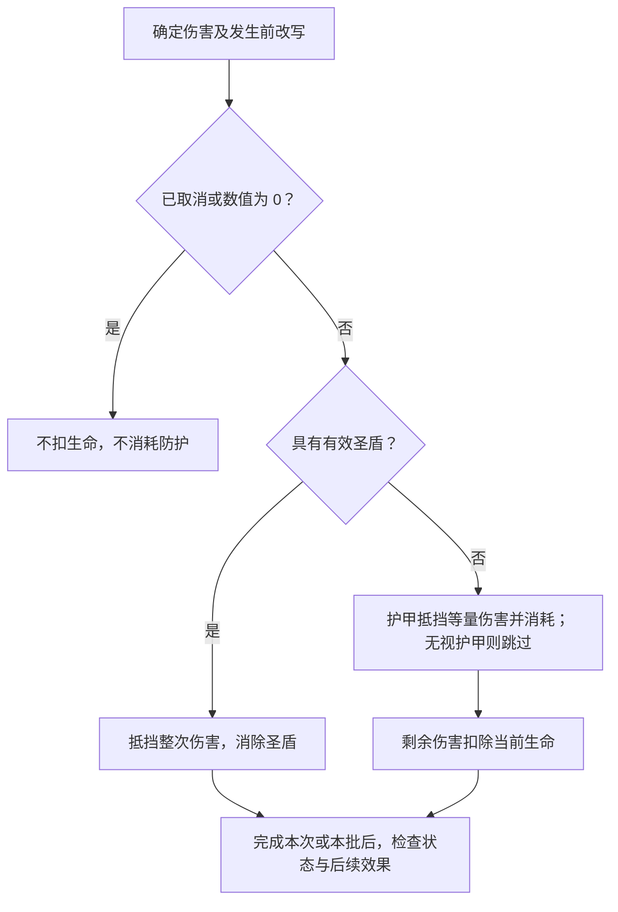
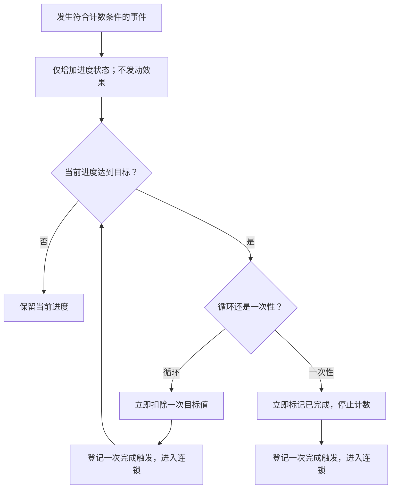
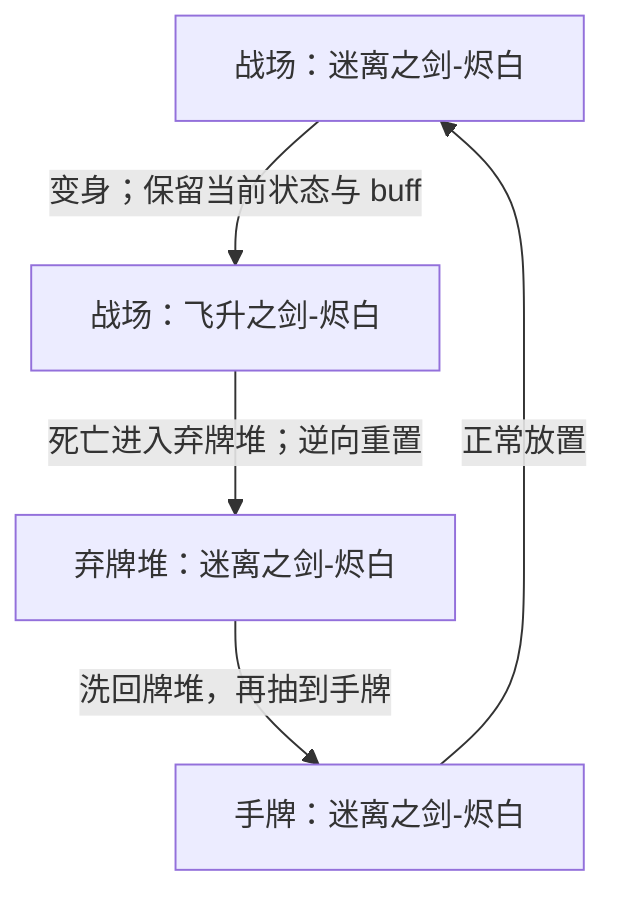
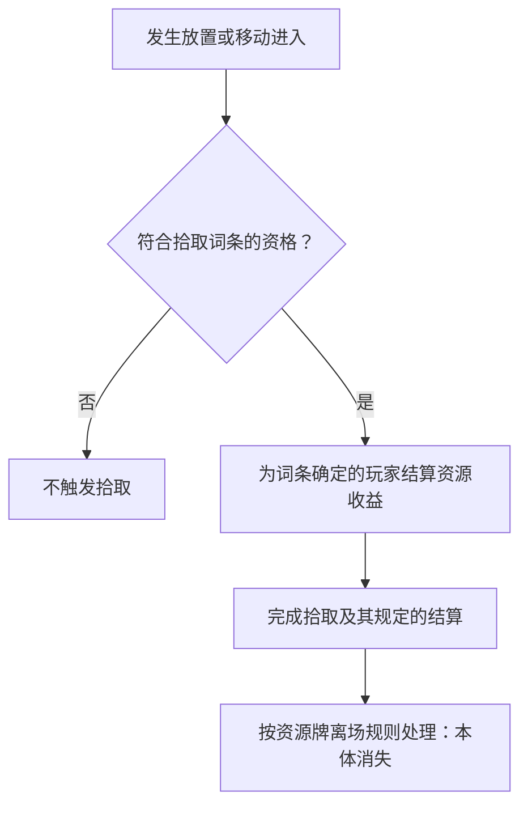

**第六章完整草案，待集中审阅。** 死亡入弃牌堆、区域正逆向、资源拾取及建造封锁承接用户已确认规则。伤害细节、数值联动与部分生命周期顺序采用有来源的草案；分歧与提案见[第六章审阅事项](../maintenance/pending.md#第六章审阅事项)。

本章定义行动或效果引发的具体状态变化。全局资源生成方案属于标准对战的对局自动逻辑，不并入棋子状态规则。

## 6.1 伤害护甲与治疗

**LIF-003 伤害改变当前生命。** 一次伤害包含来源、目标和数值；先判断对应效果是否合法、有效，再应用伤害改写和防护。减少生命上限、直接设定生命或支付生命成本，不因最后生命变少就自动成为伤害。

### 6.1.1 单次伤害流程

本稿按旧长版采用以下先后，圣盾优先护甲等细节随本章审阅：

1. 确定这次伤害的合法目标和数值，处理适用的改写、转移或取消。被取消的伤害不继续执行。
2. 剩余数值为 0 时不扣生命，也不消耗圣盾或护甲。
3. 伤害大于 0 且目标具有有效[圣盾](../reference/keywords.md#圣盾)时，抵挡这一次伤害并消除圣盾；不再消耗护甲。
4. 未被圣盾抵挡的伤害，由护甲按 1 点护甲抵挡 1 点伤害；只消耗实际用于抵挡的护甲。明确无视护甲时跳过这一步，不能由此跳过圣盾。
5. 剩余伤害扣除目标当前生命。完成对应的单次变化或同时批次后，依第八章处理必要检查及后续效果。

图 6-A 展示本稿的单次防护顺序，不决定同一批多个目标或多个触发的排序。生命为 5、护甲为 2，承受 4 点伤害时，护甲耗尽、当前生命成为 3；若同时有圣盾，则只失去圣盾，生命与护甲不变。

### 6.1.2 伤害事实与多段伤害

**本稿默认：** 只有实际扣除当前生命才满足通常的“受到伤害／造成伤害”条件。全部被圣盾或护甲抵挡时不触发通常受伤效果，但可以满足明确写出的“抵挡伤害”等专属条件。

“连续造成两次 1 点伤害”是两次伤害，不是一次 2 点伤害：圣盾至多抵挡其中第一次，第二次重新检查当时的防护。多个目标同时受伤则按该批次的规则处理，不能因为先计算了某个目标，就直接取消另一个目标已经确定的伤害。

**尚需裁定：** 目标剩余生命为 2 而穿透防护的伤害为 5 时，供“受到多少伤害”引用的量算 5 还是 2；本稿不把超额伤害自动截断。批量伤害的受伤触发能否在死亡确认前救回目标，见 LIF-R03。

### 6.1.3 护甲与治疗

护甲是单位状态，不是玩家资源。获得护甲增加该单位的护甲量；护甲不在回合末自动清空，消耗、到期和跨区清理依相应规则。治疗不会自动补充护甲或重新赋予圣盾。

治疗提高当前生命，最多恢复到当前生命上限。当前生命为 2、上限为 5，治疗 4 点只能实际恢复 3 点。本稿沿用“实际恢复大于 0 才满足通常治疗触发”的处理；满生命或治疗 0 点不凭空产生一次有效恢复。

直接消灭、减少生命上限或明确支付生命，与伤害分开判断；不能默认用圣盾或护甲支付这些变化。生命支付是否允许致死、能否使用未受伤状态等特殊条件，须由成本规则明确，不从本段补造一种通用行动。

## 6.2 属性变化

**LIF-004 原始值、修正与当前值分开。** 原始属性来自[卡牌信息](elements.md#通用属性与各类型专属属性)，对局中生效的 modifier 影响具体实例。原始定义没有因受伤、行动消耗或暂时加成而被改写。

### 6.2.1 生命上限与当前生命

本稿采用旧长版的统一上限联动方案，短版存在另一种负面修正算法，需审阅：

- 上限增加多少，当前生命同时增加多少，保留此前缺失的生命量。
- 上限降低时，将当前生命限制在新上限以内；当前生命已经低于新上限时，不再额外扣除同样差值。
- 上限联动导致当前生命降至 0 或以下时，按[6.3](#死亡与消灭)检查死亡。上限变化不是治疗或伤害，不自动触发对应的受伤／治疗效果。

例：当前 2／上限 5，获得 +3 上限后为 5／8；失去这份加成时成为 5／5。当前 2／上限 5，受到 −2 上限修正，本稿结果为 2／3；旧短版会算成 0／3。这个分歧记录为 **LIF-R01**，不以两种算法混用。

### 6.2.2 速度与剩余行动点

速度表示当前移动额度的计算依据，剩余行动点表示本回合尚可花费的额度。移动花费行动点不会降低速度。

本稿采用与上限变化一致的方案：速度增加多少，剩余行动点增加多少；速度降低时，将剩余行动点限制在新速度以内且不低于 0。回合开始再按[3.2](rounds.md#回合开始)刷新，不因一次加速直接重新获得整回合额度。负面速度修正是否应等量扣剩余额度，与上述生命分歧一起审阅。

三种移动方式的消耗、权限及停止条件见[4.3](actions.md#移动与特殊位移)。攻击次数与主动能力次数独立于移动额度。

### 6.2.3 持续加成与一次性修正

只在来源存在、范围或条件成立期间提供的持续加成，在条件变化时重新计算。例如提供生命上限的光环离场，应撤去对应贡献并按 6.2.1 调整当前生命。

一次性赋予“本回合 +2 攻击”的效果，按该修正自己的期限存在；它不因为施加者离场就自动结束。也不能因为一份光环曾作用过，就永久留下同一份攻击或生命加成。

多个加减、倍乘、设定数值及上限规则同时作用时，非交换的计算顺序需要统一裁定。持续效果相互依赖时，不用反复叠加到数值不再变化的方式自行决定结果。

### 6.2.4 建造值

建造值是可建造卡牌实例的建造进度记录，需要区分：

- **当前建造值**：该实例当前已积累的建造进度。
- **已固定建造值**：回合结束时固定的进度，作为下回合继续计算的起点。
- **建造目标值**：对应卡牌规定的完成要求，用于判断建造进度是否已满。

箭头如何增加建造值、何时固定以及满值后的形态解锁，统一按[4.2.3 建造](actions.md#建造)处理。初次建造及转区后重新建造时，当前值与已固定值如何初始化，仍见 **LIF-R08**；不直接套用普通效果进度的归零规则。

### 6.2.5 耐久度

**LIF-009 耐久度（已确认）。** 耐久是部分卡牌具有的实例状态；没有耐久词条的牌不参与耐久消耗检查。「耐久度：N」为实例规定初始剩余耐久 N。

1. 卡牌实际从战场进入弃牌堆时，剩余耐久减少 1。
2. 随后检查剩余耐久；若小于或等于 0，将该牌从弃牌堆[移除](../reference/keywords.md#移除)至虚空。
3. 若仍大于 0，卡牌留在弃牌堆，保留该剩余值继续参与卡组循环；重新抽取、放置及逆向清除 modifier 都不会恢复耐久。

判断依据是这次真实区域转移。随从死亡、法术清理、湮灭、直接移入弃牌堆，以及献祭后从战场进入弃牌堆，都满足消耗条件；返回手牌、洗回牌堆或从手牌弃置不满足。先前的离场原因仍按[6.3](#死亡与消灭)判断，耐久耗尽的移除不把献祭或湮灭变成死亡。

例如「太空临时工」耐久为 2，第一次从战场进入弃牌堆后剩余 1；再次打出并从战场进入弃牌堆，剩余降至 0，随后进入虚空。

后天赋予耐久时如何处理已有剩余值、赋予来源消失后的状态，以及耐久移除与同次离场触发的具体排序，集中跟进 **LIF-R09**；不由 modifier 通则自动推导。

### 6.2.6 进度

**LIF-010 进度的累计与完成（已确认核心）。** 每项进度效果维护自己的当前进度、目标值，以及需要的一次性完成标记。设计须明确计数条件和每次增加量：抽 5 张牌按张数统计，获得 4 星能按数量统计，不能把一次批量获得仅计为一次。

- **累计只更新状态。** 满足计数条件时增加进度；增加本身不算发动或触发效果，不向效果连锁加入结算项。产生计数的原事件仍照常结算。
- **达到目标才触发完成效果。** 当前进度达到或超过目标值时，产生相应的完成触发，并按通用结算规则进入连锁；不在更新计数时直接执行奖励。
- **循环进度保留余量。** 每完成一次，立即从当前进度扣除一次目标值，再检查是否还能完成。一次累计跨过多个目标值，产生对应次数的完成触发。扣除发生在登记完成时，不等奖励结算结束。
- **一次性进度只自然完成一次。** 完成时立即标记已完成，停止后续累计；不等奖励结算完毕才标记。对已完成任务重新开启或直接触发的额外规则须明示。

例如「星光运输管线」当前 3/4，一次获得 3 星能，完成一次后剩余 2/4；若当前 3/4、一次获得 10 星能，则完成三次、剩余 1/4。三个完成效果各自进入连锁，彼此及其他触发的排序仍依[第八章](effects.md)。

图 6-C 仅说明累计、登记完成与更新状态的关系；“进入连锁”不表示当场执行奖励，也不规定多个效果的排序。已完成的一次性进度不再进入图中的累计流程。

**目标值变化：** 「超越进制」将进度要求改为原始目标值的 75%，结果向上取整；它不把主动次数上限等其他计数要求一并改变。降低目标值后立即检查已有进度；若达标，按新目标值完成并扣除，循环进度继续检查余量。例如目标 4 降为 3，已有 3 点进度立即完成一次。目标值恢复不撤销此前已经完成的次数。

**直接触发：** 效果明确要求“触发一个进度效果”时，令选定进度效果产生一次完成效果并进入连锁，不增加、扣除或重置原进度，也不将这一操作记作自然完成。对象的选择、合法性和操作窗口仍依原效果要求。「借时蜉蝣」与「集群主脑-埃米莉丝」使用此含义。

**当前进度的转区规则（已确认）：** 普通进度效果的当前进度初始为 0，属于[逆向重置型状态](#状态的转区保留类型)：正向转区保留数值，逆向转区重置为 0。特殊任务需要跨区保留时，必须明确写出例外，不能只凭“一次性”或“任务”的名称推断。

「迷离之剑-烬白」的拾取变身进度为**一次性进度**；其他本轮整理的机械天国累计效果采用循环进度。变身发生时保留当前状态，见[6.6.2](#升级变形与复制)。一次性完成标记怎样跨区继承、不同形态如何对应各项进度记录、哪些区域允许计数，以及外部直接触发已完成任务的许可，继续跟进 **LIF-R10**；当前进度归零不自动表示已完成任务重新开放。建造仍由[4.2.3](actions.md#建造)规定，不自动采用这里的循环扣除机制。

### 6.2.7 被保留的回合数

**LIF-011 保留回合数（已确认核心）。** 「被保留的回合数」是卡牌实例的累计状态，初始为 0。每次回合结束，该牌实际被保留在手牌中时，计数增加 1；同一回合的这次保留只计一次。仅仅获得[保留](../reference/keywords.md#保留)词条，或在回合中进入手牌，不会立即增加计数。

**该状态随逆向区域转移清零。** 按[6.5](#区域转移与状态保留)判断转移方向：手牌回到牌堆、手牌进入弃牌堆，以及战场进入弃牌堆或返回手牌等逆向转移，将保留回合数重置为 0。手牌放置到战场属于正向转移，保留该数值供入场等效果读取；不能在打出时先清零，使相关效果无法取得已经积累的回合数。

例如「耀斑连射」被保留两个回合后，计数为 2；放置到战场时仍为 2，其卡文可据此计算额外伤害。若从手牌被弃置或洗回牌堆，计数立即变为 0；之后再抽到也不会恢复此前累计值。该数值和[耐久](#耐久度)、整局累计打出次数采用不同的转区保留规则。

「太阳雨」「见习阳炎射击」引用“已被保留过”的条件；「日珀蜂蜜」「耀斑连射」「耀变星能石」引用保留次数计算收益；它们都可引用本状态，而不各自维护第二套普通保留计数。保留计数本身不授予保留词条。

**实际累计与“视作”分开。** 「烈阳圣女-阿蕾缇娅」在效果结算时额外视作保留两回合，「烈阳恩典」「高等阳炎术」也有视作保留的文本。其附加值如何影响读取，以及是否产生“每次被保留时”的触发，不能仅凭本条推导；统一跟进 **LIF-R11**。同样，唱诗班诗童等牌的保留触发怎样衔接计数更新与结束结算，由对应时序裁定。

## 6.3 死亡与消灭

**LIF-005 死亡的判定（已确认）。** 随从满足以下任一条件时，按死亡处理：

- 当前生命值降至 **0 或以下**。
- 有效效果明确要求**消灭**该随从。

死亡依据发生的原因判定，**不能用“从战场进入弃牌堆”反推死亡**。直接将卡牌移入弃牌堆、献祭随从都不属于死亡，不因此触发死亡效果。直接消灭也不先制造一笔伤害；只抵挡伤害的圣盾与护甲不默认阻止消灭。

### 6.3.1 确认死亡、离场与死亡效果

**已确认顺序：先清理本体，再结算死亡效果。**

1. 确认死亡对象与原因，记录其离场前所在格及本次死亡效果所需的信息。这只是保留结算依据，尚不执行死亡效果。
2. 将本体从战场清理，送入弃牌堆，依[6.5](#区域转移与状态保留)处理 modifier。本体不再占据原格；依赖它在场的箭头、持续作用按各自规则停止。
3. 再处理本次死亡引发的有效死亡效果，使用该效果要求的离场前信息。本体已经离场，不会仅因此丢失本次应结算的死亡效果。

例如“死亡时，在其所在格子上召唤一个僵尸”，使用死亡随从离场前的格子。先清理死亡随从，便不会被它自己的本体阻挡召唤；若该格因其他变化已经被占用，仍检查召唤的实际合法性，不获得无视占格的许可。

死亡前受伤触发能否救回目标、多个死亡及其他后续效果如何排序、胜负检查插在哪里，以及除位置外还需保留哪些数值，继续见[审阅事项](../maintenance/pending.md#第六章审阅事项)。这些边界不改变上述已确认的本体与死亡效果先后。

### 6.3.2 不同离场原因

| 发生的原因 | 是否属于死亡 | 对应处理 |
| --- | --- | --- |
| 当前生命降至 0 或以下 | 是 | 按 6.3.1 清理本体，再结算死亡效果。 |
| 有效效果明确“消灭”随从 | 是 | 同上，不要求先扣生命。 |
| 效果直接将卡牌从战场移入弃牌堆 | 否 | 处理该次区域转移及其实际满足的触发条件。 |
| 献祭自己的随从 | 否 | 按献祭效果或成本说明处理；不触发死亡效果。去向须由相应规则说明，不能从“献祭”推断为消灭。 |
| 法术清理、湮灭、返回手牌、洗回牌堆、移除或资源拾取后的消失 | 不因这些离场行为本身构成死亡 | 按各自规则处理；最终区域相同不使原因等同。 |

“移入弃牌堆”或“被献祭”仍可满足明确观察相应事件的效果；不算死亡不等于没有后续结算。若效果有其他独立步骤，再分别判断实际发生的事件。

击杀归属应依据明确造成死亡的事件及其规则；上限下降、无来源效果或多方共同作用时的归属仍需裁定。控制变化后的离场接受玩家见[6.7](#控制权变化)；英雄死亡与胜负的关系由模式规定。

## 6.4 抽牌弃牌与洗牌

**LIF-006 按具体卡牌移动处理。** 抽牌、弃牌与洗牌改变区域和顺序，不额外创造另一份同名牌。区域正逆向规则同时适用。

### 6.4.1 抽牌与空牌堆

抽牌从本方牌堆顶端取牌进入手牌。一次要求抽多张时，按抽取顺序取得相应数量；每张都对应实际存在的一份牌。

仍需抽牌而牌堆已空时，将本方弃牌堆洗成新的牌堆，再继续未完成的抽取。原牌堆尚有牌时，不把弃牌堆提前混进去。两堆都为空时，无法继续的抽取停止，不凭空发牌；本稿通用规则不附加疲劳伤害或直接判负。

例如需抽 5 张，牌堆有 2 张、弃牌堆有 4 张：先抽 2 张，再洗回弃牌堆并抽 3 张，最后牌堆余 1 张。额外卡组、虚空和战场中的牌不参与这次回洗。

回合开始的一批抽牌按[3.2](rounds.md#回合开始)先完成该批再处理抽牌引发的效果。其他效果写“抽 N 张”还是“重复 N 次抽一张”时，其批次边界与触发插入点需要按第八章说明，不能默认为完全相同。

### 6.4.2 弃牌与回合末快照

弃牌将指定手牌送入弃牌堆；它是手牌到弃牌堆的逆向转移，清除 modifier。需要挑选、随机或弃置全部时，按产生该弃牌的规则确定对象，不把一种选择方式套到所有弃牌。

回合末弃牌的取样时点、清单范围和处理步骤统一见[3.6 回合结束](rounds.md#回合结束)；[保留](../reference/keywords.md#保留)的含义由词条定义。

快照后才获得／失去保留，以及同一张快照牌先离开手牌又返回时是否仍参与这次弃牌，须明确审阅。

### 6.4.3 洗回与指定位置

“洗回牌堆”将指定牌纳入牌堆并重新确定所需的随机顺序；明确放在牌堆顶端或底端的效果按其指定位置处理，不自动改成洗牌。

各来源洗回牌堆的 modifier 处理见[6.5](#区域转移与状态保留)。洗牌的完整随机分布及多张顶／底插入的次序仍列为审阅边界。

## 6.5 区域转移与状态保留

**LIF-002 正逆向与 modifier（已确认核心）。** modifier（修正）指对局中施加在具体卡牌实例上、使其偏离原始卡牌定义的改变，例如攻击加成、费用修正或后天赋予的效果。它不改写同名牌共享的原始定义。

按 **虚空 → 商店 → 弃牌堆 → 牌堆 → 手牌 → 战场** 比较来源和目的区域：

- **正向：** 目的区域在来源之后，转移本身不清除 modifier；允许跨过中间区域。
- **逆向：** 目的区域在来源之前，清除 modifier，将牌恢复为原始状态。原始卡面自带的效果不是后天 modifier，不因清除修正而被删除。
- **先有合法转移，再判断保留。** 排序不授予行动，不要求牌逐区前进，也不阻止规则允许的逆向转移。某个修正自身到期、被消除，或明确规定不同继承方式时，仍执行其有效规则。

| 区域变化 | 方向 | modifier 处理 |
| --- | --- | --- |
| 商店 → 弃牌堆（购买） | 正向 | 保留。 |
| 商店 → 额外卡组（刷新退回） | 已确认的专门转区规则 | 保留 modifier，不恢复原始状态。 |
| 弃牌堆 → 牌堆（回洗） | 正向 | 保留。 |
| 牌堆 → 手牌（抽牌）、手牌 → 战场（放置） | 正向 | 保留。 |
| 弃牌堆 → 战场（有明确效果允许时） | 正向，跨区 | 保留；不能由此推断存在免费复活行动。 |
| 战场 → 弃牌堆（随从死亡、法术清理或湮灭） | 逆向 | 清除，恢复原始状态；不因此把三种事件视作同义词。 |
| 战场 → 手牌（返回）、手牌 → 弃牌堆（弃置） | 逆向 | 清除，恢复原始状态。 |
| 手牌／战场 → 牌堆（洗回） | 逆向 | 清除，恢复原始状态。 |
| 序列中任一其他区域 → 虚空（移除） | 逆向 | 清除，恢复原始状态。 |

例如，某随从手牌获得 +2 攻击后被放置到战场，仍保有该修正；它死亡进入弃牌堆时失去该修正，后续回洗和抽牌不会恢复已经清除的 +2 攻击。

**适用边界：** 同一区域内移动没有正逆向之分；棋盘移动不属于本条的跨区转移。额外卡组除表中刷新退回例外外的一般继承方式仍待明确。资源拾取后的本体消失没有目的存放区域，不是向虚空的逆向转移。

耐久及明确跨卡组循环的历史记录按[6.5.1](#状态的转区保留类型)保留，不属于逆向转区一并重置的 modifier；[保留回合数](#被保留的回合数)则采用正向保留、逆向清零。当前生命、行动额度、建造进度、能力使用记录等其他实例数据，在“恢复原始状态”时的逐项初始化，以及清除与离场／入场触发的先后，仍须在对应结算条款明确；不能仅凭本条把全部实例记录都视作 modifier，也不能因此另建卡牌身份或改变拥有者。

### 6.5.1 状态的转区保留类型

**LIF-012 状态按转区时如何保留分类。** 这两类说明某份状态在同一卡牌实例跨区域时如何处理；它们不改变卡牌定义，也不赋予新的区域转移权限。

| 类型 | 正向转区 | 逆向转区 | 例子 |
| --- | --- | --- | --- |
| **跨区保留型状态** | 保留已有记录。 | 保留已有记录，不随清除 modifier 重置。 | 剩余耐久、此牌本局累计被打出的次数。 |
| **逆向重置型状态** | 保留已有记录。 | 按该状态的定义重置：数值回到规定初始值，或清除后天赋予的状态／修正。 | 保留回合数、普通效果当前进度；后天攻击加成、护甲和圣盾。 |

“重置”不统一等于数值置 0：保留回合数和普通进度的初始值为 0，后天 +2 攻击则是移除该加成，不是把卡牌攻击设为 0。重置操作须有明确的初始值或清除含义。

**转区保留与有效期限是不同维度。** 跨区保留型仍会按自身规则消耗或结束，例如耐久减少；逆向重置型也不表示回合末自动消失，例如没有另定期限的护甲不会仅因回合结束归零。“本回合”修正会按规定到期，“在来源有效且目标处于范围内”贡献会在条件不满足时停止。特殊的商店刷新退回继续按本节既有例外保留 modifier；额外卡组其他迁移仍待明确。

**buff 与状态的关系：** buff 是有利修正的通称，例如攻击增加、获得护甲或临时获得保留；减益也是修正。耐久、历史记录、进度等状态不因具有数值就都属于 buff。后天赋予的修正依 modifier 规则清除；原始卡面自带的能力仍属于卡牌定义，不能与“该能力产生的状态”混为一项。清除一份获得的圣盾，不等于删除卡面上能够再次赋予圣盾的能力。

每一种状态的规则必须交代：记录对象、初始值、更新／消耗条件、有效区域、转区保留类型，以及到期或刷新条件。尚未规定的生命与行动额度初始化、建造记录和特殊完成标记不能仅按名称强行归类；具体缺口见 LIF-R08／LIF-R10／LIF-R12。复制、变形和更换控制者另按各自规则处理，不由跨区保留类型直接决定。

### 6.5.2 特殊状态与 buff 速查

本表索引各状态的含义和已有裁定；具体步骤只由链接的主定义维护。“待裁定”明确表示目前还不能据此唯一推演该项交互。

| 状态或修正 | 记录什么、怎样使用 | 转区保留类型／处理 | 消耗、到期或主定义 |
| --- | --- | --- | --- |
| 剩余耐久 | 该实例剩余耐久值。 | 跨区保留型。 | 战场实际进入弃牌堆时消耗；耗尽移除，见[6.2.5](#耐久度)。 |
| 整局累计打出次数 | 该实例本局已经打出的历史次数。 | 跨区保留型；清除 buff 不撤销历史。 | 具体何种放置算“打出”仍须统一事件口径，见 R-04。 |
| 被保留的回合数 | 已完成的实际保留次数，供卡面条件或数值读取。 | 逆向重置型，重置为 0。 | 回合末更新；“视作”交互见[6.2.7](#被保留的回合数)。 |
| 普通效果当前进度 | 每项进度效果各自累计的数值。 | 逆向重置型，重置为 0；特殊任务须明示例外。 | 完成时扣除循环目标等规则见[6.2.6](#进度)。 |
| 一次性进度完成标记 | 该项一次性进度是否已经自然完成。 | 变身时保留；跨区继承及不同形态效果的对应仍见 LIF-R10，不能由当前值归零推断重新开放。 | 完成时立即标记，见[6.2.6](#进度)。 |
| 护甲 | 尚可用于抵挡伤害的护甲量。 | 获得的护甲是后天修正，按逆向重置型清除；没有原生护甲来源时回到 0。 | 按实际抵挡量消耗；不自动回合末清空，见[6.1.3](#护甲与治疗)。 |
| 后天获得的圣盾 | 当前具有的一份抵挡下一次伤害的状态。 | 逆向重置型，清除获得的状态。 | 抵挡后消除；叠加、原生圣盾的重新建立等边界仍须明确，见[圣盾](../reference/keywords.md#圣盾)及 LIF-R12。 |
| 后天获得的保留 | 是否享有回合末弃牌的例外；不是保留次数。 | 逆向重置型，清除赋予的修正；卡面原生保留不因此删除。 | 如注明本回合则还有到期条件，见[保留](../reference/keywords.md#保留)。 |
| 攻击、生命、移动、费用或箭头的后天修正 | 改变对应属性、费用或可用箭头；每项有自己的运算和数值。 | 逆向重置型，移除后天改变，按余下有效规则计算结果。 | 临时期限与当前生命／行动额度联动见[6.2](#属性变化)；不把所有数值一律归零。 |
| 普通变身的形态改变 | 当前采用的变身形态。 | 逆向重置型，撤销普通变身并还原原始形态。 | 变身发生时保留状态和 buff；详见[6.6.2](#升级变形与复制)。 |
| 明确的永久变身 | 明示跨区保留的形态改变。 | 跨区保留型；只改变形态自身的转区规则。 | 不将其他 buff 一并永久化，见[6.6.2](#升级变形与复制)。 |
| 持续光环提供的加成 | 来源在有效期间对范围内目标提供的修正。 | 不视为目标永久获得的一份独立 buff；目标离开作用区域时停止贡献。 | 持续与一次性赋予的差别见[6.2.3](#持续加成与一次性修正)，不能把“正向保留”解释为光环离场后继续有效。 |
| 建造进度与建造形态 | 已积累的建造进度，以及当前形态的能力封锁。 | 转区初始化仍待 LIF-R08 裁定。 | 箭头、固定进度及完成解锁见[4.2.3](actions.md#建造)。 |
| 本回合剩余行动额度／能力使用记录 | 当前可用行动点、攻击或能力额度。 | 转区、重入是否刷新仍需对应裁定；不因名称带“本回合”自行补满。 | 回合刷新见[3.2](rounds.md#回合开始)，能力默认次数见[4.5](actions.md#主动能力)。 |
| 沉默 | 具体封锁哪些能力尚未统一。 | 完整作用及转区处理待裁定。 | 仅依已明示的封锁规则判断，见[沉默](../reference/keywords.md#沉默)。 |

## 6.6 生成召唤升级与变形

**LIF-007 新实例与既有实例分开。** 生成、召唤、升级和变形不能仅因画面上都“出现一张牌”就视作同一种行为。

### 6.6.1 生成与召唤

**生成**产生新的卡牌实例；效果须说明生成哪种牌、几份、归属和目的区域。新实例从自己的原始定义及明确赋予的状态开始，不自动复制另一份同名牌的伤势、modifier 或已用次数。

生成到手牌，不等于已经放置；生成到弃牌堆，不等于已经抽到。生成进入战场时，处理适用的入场条件和效果；不能从“生成”两字推断可以叠在任何占用格。

**召唤**让指定随从进入战场。须根据效果区分：是从既有区域调来那张牌，还是先生成新实例再入场。既有牌跨区时应用 6.5；直接在战场变形不等于一次从其他区域进入战场。

召唤或生成可能满足[入场](../reference/keywords.md#入场)，但不自动计为玩家普通放置。具体部署限制、初始行动额度与入场当回合是否可行动，仍按对应规则；本稿不新增未经确认的“召唤疲劳”。

各类型的生成和占格要求见[2.2](elements.md#卡牌种类与分类维度)；生成须满足对应类型的限制。

### 6.6.2 升级、变形与复制

升级或变形改变某份牌所采用的形态或定义；效果须说明结果、持续时间及适用区域。名称变化本身不代表本体消失，也不代表新生成了另一张卡。

**本稿区分：** 若只是原格中的形态改变，没有从其他区域进入战场，就不单凭换了卡面触发入场。若效果明确先移走旧牌、再让另一张牌进入，则分别处理真实发生的离场和入场。

**LIF-013 变身与状态继承（已确认）。** 本节的“变身／变形”指同一卡牌实例改变形态。变身发生时，保留当前状态和 buff，不因切换卡面而清空：已有护甲、圣盾、耐久、保留计数、进度记录、行动使用记录及后天属性修正等继续按各自规则维护。变身不等于生成一张全新、满状态的卡牌，也不自行刷新行动或能力次数。

形态决定采用哪套卡面属性与能力；保留已有 buff 不代表仍使用旧形态的全部基础属性或能力。持续光环仍按来源、范围与有效条件提供贡献，不能因变身保留规则而锁住本已失效的光环。新形态属性上限与当前值的联动、不同形态的效果记录如何对应，分别引用[6.2 属性变化](#属性变化)及 LIF-R04／LIF-R10。

**普通变身采用逆向重置规则。** 变身形成的形态改变与普通 buff 一样，正向转区保留，逆向转区撤销并还原原始形态。转区时，其他状态／buff 也分别按自己的[保留类型](#状态的转区保留类型)处理；不能把“变身发生时保留”解释成“之后转区也保留所有状态”。

例如「迷离之剑-烬白」完成进度后成为「飞升之剑-烬白」，当时已有的状态和 buff 保留。飞升形态死亡，从战场进入弃牌堆这一刻就发生逆向重置，牌还原为迷离之剑；后续洗回牌堆、抽到手牌再放置，仍是迷离之剑。若直接返回手牌或洗回牌堆，同样在该次逆向转移时还原。死亡原因与离场前信息仍按[6.3](#死亡与消灭)记录，不能用还原后的形态改写已经发生的死亡事实。

图 6-D 展示普通变身的形态循环，不省略死亡效果、放置成本或其他应有结算。

**明确“永久变身”是例外。** 效果文本写明“永久变身”时，形态改变跨区保留，不因逆向转区还原；变身发生时同样保留当前状态和 buff。此例外只保留形态，不使其他 buff、保留回合数或普通进度一并永久保留，也不自动免除到期、消耗或其他明确改变形态的效果。永久变身后再次叠加普通变身时，以哪个形态为还原基准仍见 LIF-R04，不由这一简单例外扩写出多层覆盖顺序。

“升级”若明确通过上述变身改变形态，采用对应规则；其他升级机制仍须说明自身含义，不能仅凭名称默认属于永久变身。

复制须说明复制卡牌定义还是当前实例状态。未说明时不把一张已积累伤害或建造进度的牌复制成拥有同样记录的牌；这个默认仍需随具体复制设计确认，不能靠视觉相同决定。

## 6.7 控制权变化

**LIF-008 只有明确效果改变控制权。** 当前控制者决定谁能在适用窗口操作该牌，以及以该玩家为参照的友敌关系；变化后重新检查依赖这些关系的合法目标和持续效果。

### 6.7.1 控制权与其他变化分开

**当前待审阅方案：** 合并拥有者与控制者，统一记录当前归属玩家；创建者只作历史来源。该方案的收益、真实卡牌案例与临时归还边界见[归属模型评估](../maintenance/neutral-card-audit.md#归属模型评估)。

归属变化是否影响箭头朝向、已产生效果的选择者、离场接收玩家，以及行动点与限次是否保留，统一列为 **LIF-R05**；不能仅凭合并两个名称就推导出额度刷新或职业变化。

### 6.7.2 控制改变后的拾取与离场

仅在原格改变控制权，没有发生[拾取词条](../reference/keywords.md#拾取)要求的进入行为，不自动补一次拾取。

若采用统一归属，仍须明确默认离场进入当前归属玩家的区域，以及进入另一玩家私人区域是否同步改变归属。临时控制到期的返回对象也需要规定。明确写出接收玩家的转区效果按其文本处理。

## 6.8 拾取

**LIF-001 拾取的结算流程。** 拾取资格、触发行为与收益接受玩家统一由[拾取词条](../reference/keywords.md#拾取)定义；资源的生成、共存、留场及离场特性见[2.2.3 资源牌](elements.md#资源牌)。本节只定义一次合法拾取怎样完成。

### 6.8.1 拾取完成流程

图 6-B 的先后是：先结算拾取收益，拾取完毕后才处理资源本体。放置引发的入场效果先于拾取，顺序主定义见[4.2.2](actions.md#放置与拾取)。

同一资源的重复进入、拾取者中途离场或更换控制者等未决交互集中于[资源牌剩余边界](../maintenance/pending.md#资源牌剩余边界)及 LIF-R06。

## 6.9 关联章节

- [游戏要素](elements.md)
- [通用结算逻辑](effects.md)
- [关键词库与术语索引](../reference/keywords.md)
- [第六章审阅事项](../maintenance/pending.md#第六章审阅事项)
