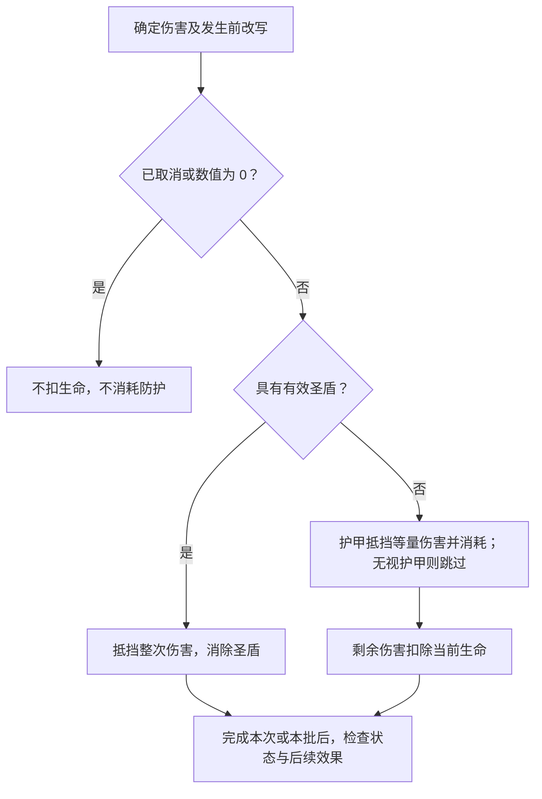
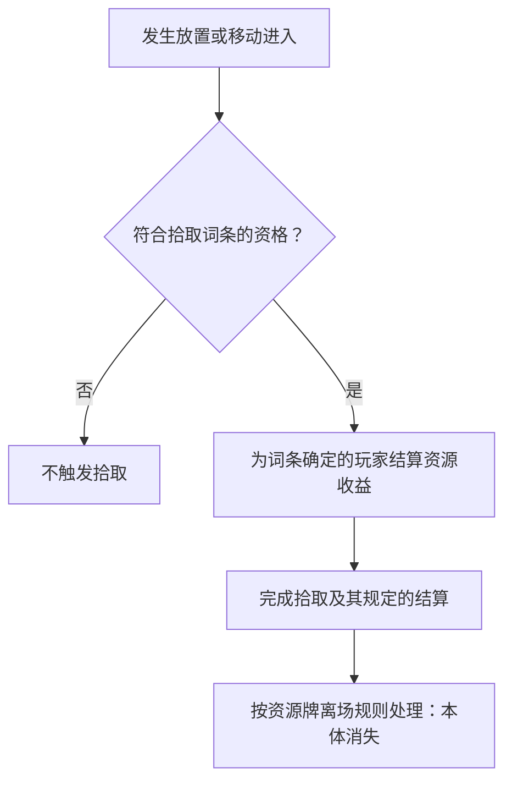

**第六章完整草案，待集中审阅。** 死亡入弃牌堆、区域正逆向、资源拾取及建造封锁承接用户已确认规则。伤害细节、数值联动与部分生命周期顺序采用有来源的草案；分歧与提案见[第六章审阅事项](../maintenance/pending.md#第六章审阅事项)。

本章定义行动或效果引发的具体状态变化。全局资源生成方案属于标准对战的对局自动逻辑，不并入棋子状态规则。

## 6.1 伤害护甲与治疗

**LIF-003 伤害改变当前生命。** 一次伤害包含来源、目标和数值；先判断对应效果是否合法、有效，再应用伤害改写和防护。减少生命上限、直接设定生命或支付生命成本，不因最后生命变少就自动成为伤害。

### 6.1.1 单次伤害流程

本稿按旧长版采用以下先后，圣盾优先护甲等细节随本章审阅：

1. 确定这次伤害的合法目标和数值，处理适用的改写、转移或取消。被取消的伤害不继续执行。
2. 剩余数值为 0 时不扣生命，也不消耗圣盾或护甲。
3. 伤害大于 0 且目标具有有效[圣盾](../reference/keywords.md#圣盾)时，抵挡这一次伤害并消除圣盾；不再消耗护甲。
4. 未被圣盾抵挡的伤害，由护甲按 1 点护甲抵挡 1 点伤害；只消耗实际用于抵挡的护甲。明确无视护甲时跳过这一步，不能由此跳过圣盾。
5. 剩余伤害扣除目标当前生命。完成对应的单次变化或同时批次后，依第八章处理必要检查及后续效果。

图 6-A 展示本稿的单次防护顺序，不决定同一批多个目标或多个触发的排序。生命为 5、护甲为 2，承受 4 点伤害时，护甲耗尽、当前生命成为 3；若同时有圣盾，则只失去圣盾，生命与护甲不变。

### 6.1.2 伤害事实与多段伤害

**本稿默认：** 只有实际扣除当前生命才满足通常的“受到伤害／造成伤害”条件。全部被圣盾或护甲抵挡时不触发通常受伤效果，但可以满足明确写出的“抵挡伤害”等专属条件。

“连续造成两次 1 点伤害”是两次伤害，不是一次 2 点伤害：圣盾至多抵挡其中第一次，第二次重新检查当时的防护。多个目标同时受伤则按该批次的规则处理，不能因为先计算了某个目标，就直接取消另一个目标已经确定的伤害。

**尚需裁定：** 目标剩余生命为 2 而穿透防护的伤害为 5 时，供“受到多少伤害”引用的量算 5 还是 2；本稿不把超额伤害自动截断。批量伤害的受伤触发能否在死亡确认前救回目标，见 LIF-R03。

### 6.1.3 护甲与治疗

护甲是单位状态，不是玩家资源。获得护甲增加该单位的护甲量；护甲不在回合末自动清空，消耗、到期和跨区清理依相应规则。治疗不会自动补充护甲或重新赋予圣盾。

治疗提高当前生命，最多恢复到当前生命上限。当前生命为 2、上限为 5，治疗 4 点只能实际恢复 3 点。本稿沿用“实际恢复大于 0 才满足通常治疗触发”的处理；满生命或治疗 0 点不凭空产生一次有效恢复。

直接消灭、减少生命上限或明确支付生命，与伤害分开判断；不能默认用圣盾或护甲支付这些变化。生命支付是否允许致死、能否使用未受伤状态等特殊条件，须由成本规则明确，不从本段补造一种通用行动。

## 6.2 属性变化

**LIF-004 原始值、修正与当前值分开。** 原始属性来自[卡牌信息](elements.md#通用属性与各类型专属属性)，对局中生效的 modifier 影响具体实例。原始定义没有因受伤、行动消耗或暂时加成而被改写。

### 6.2.1 生命上限与当前生命

本稿采用旧长版的统一上限联动方案，短版存在另一种负面修正算法，需审阅：

- 上限增加多少，当前生命同时增加多少，保留此前缺失的生命量。
- 上限降低时，将当前生命限制在新上限以内；当前生命已经低于新上限时，不再额外扣除同样差值。
- 上限联动导致当前生命降至 0 或以下时，按[6.3](#死亡与消灭)检查死亡。上限变化不是治疗或伤害，不自动触发对应的受伤／治疗效果。

例：当前 2／上限 5，获得 +3 上限后为 5／8；失去这份加成时成为 5／5。当前 2／上限 5，受到 −2 上限修正，本稿结果为 2／3；旧短版会算成 0／3。这个分歧记录为 **LIF-R01**，不以两种算法混用。

### 6.2.2 速度与剩余行动点

速度表示当前移动额度的计算依据，剩余行动点表示本回合尚可花费的额度。移动花费行动点不会降低速度。

本稿采用与上限变化一致的方案：速度增加多少，剩余行动点增加多少；速度降低时，将剩余行动点限制在新速度以内且不低于 0。回合开始再按[3.2](rounds.md#回合开始)刷新，不因一次加速直接重新获得整回合额度。负面速度修正是否应等量扣剩余额度，与上述生命分歧一起审阅。

三种移动方式的消耗、权限及停止条件见[4.3](actions.md#移动与特殊位移)。攻击次数与主动能力次数独立于移动额度。

### 6.2.3 持续加成与一次性修正

只在来源存在、范围或条件成立期间提供的持续加成，在条件变化时重新计算。例如提供生命上限的光环离场，应撤去对应贡献并按 6.2.1 调整当前生命。

一次性赋予“本回合 +2 攻击”的效果，按该修正自己的期限存在；它不因为施加者离场就自动结束。也不能因为一份光环曾作用过，就永久留下同一份攻击或生命加成。

多个加减、倍乘、设定数值及上限规则同时作用时，非交换的计算顺序需要统一裁定。持续效果相互依赖时，不用反复叠加到数值不再变化的方式自行决定结果。

### 6.2.4 建造与其他实例记录

建造进度的累计、固定、封锁及解锁统一见[可建造](../reference/keywords.md#可建造)。本节只处理实例记录的生命周期：完成时是否恢复行动额度、是否补触发入场，以及转区后的进度初始化，见 LIF-R08。

耐久、能力使用次数、保留累计值同样是具体实例的记录。统计范围和设计要求见[7.6.8](effect-design/dictionary/usage.md)，主动能力默认见[4.5](actions.md#主动能力)。不要把所有记录都在回合末清空，也不要从“耐久”一词自行推导某次离场必进虚空。

## 6.3 死亡与消灭

**LIF-005 死亡的判定（已确认）。** 随从满足以下任一条件时，按死亡处理：

- 当前生命值降至 **0 或以下**。
- 有效效果明确要求**消灭**该随从。

死亡依据发生的原因判定，**不能用“从战场进入弃牌堆”反推死亡**。直接将卡牌移入弃牌堆、献祭随从都不属于死亡，不因此触发死亡效果。直接消灭也不先制造一笔伤害；只抵挡伤害的圣盾与护甲不默认阻止消灭。

### 6.3.1 确认死亡、离场与死亡效果

**已确认顺序：先清理本体，再结算死亡效果。**

1. 确认死亡对象与原因，记录其离场前所在格及本次死亡效果所需的信息。这只是保留结算依据，尚不执行死亡效果。
2. 将本体从战场清理，送入弃牌堆，依[6.5](#区域转移与状态保留)处理 modifier。本体不再占据原格；依赖它在场的箭头、持续作用按各自规则停止。
3. 再处理本次死亡引发的有效死亡效果，使用该效果要求的离场前信息。本体已经离场，不会仅因此丢失本次应结算的死亡效果。

例如“死亡时，在其所在格子上召唤一个僵尸”，使用死亡随从离场前的格子。先清理死亡随从，便不会被它自己的本体阻挡召唤；若该格因其他变化已经被占用，仍检查召唤的实际合法性，不获得无视占格的许可。

死亡前受伤触发能否救回目标、多个死亡及其他后续效果如何排序、胜负检查插在哪里，以及除位置外还需保留哪些数值，继续见[审阅事项](../maintenance/pending.md#第六章审阅事项)。这些边界不改变上述已确认的本体与死亡效果先后。

### 6.3.2 不同离场原因

| 发生的原因 | 是否属于死亡 | 对应处理 |
| --- | --- | --- |
| 当前生命降至 0 或以下 | 是 | 按 6.3.1 清理本体，再结算死亡效果。 |
| 有效效果明确“消灭”随从 | 是 | 同上，不要求先扣生命。 |
| 效果直接将卡牌从战场移入弃牌堆 | 否 | 处理该次区域转移及其实际满足的触发条件。 |
| 献祭自己的随从 | 否 | 按献祭效果或成本说明处理；不触发死亡效果。去向须由相应规则说明，不能从“献祭”推断为消灭。 |
| 法术清理、湮灭、返回手牌、洗回牌堆、移除或资源拾取后的消失 | 不因这些离场行为本身构成死亡 | 按各自规则处理；最终区域相同不使原因等同。 |

“移入弃牌堆”或“被献祭”仍可满足明确观察相应事件的效果；不算死亡不等于没有后续结算。若效果有其他独立步骤，再分别判断实际发生的事件。

击杀归属应依据明确造成死亡的事件及其规则；上限下降、无来源效果或多方共同作用时的归属仍需裁定。控制变化后的离场接受玩家见[6.7](#控制权变化)；英雄死亡与胜负的关系由模式规定。

## 6.4 抽牌弃牌与洗牌

**LIF-006 按具体卡牌移动处理。** 抽牌、弃牌与洗牌改变区域和顺序，不额外创造另一份同名牌。区域正逆向规则同时适用。

### 6.4.1 抽牌与空牌堆

抽牌从本方牌堆顶端取牌进入手牌。一次要求抽多张时，按抽取顺序取得相应数量；每张都对应实际存在的一份牌。

仍需抽牌而牌堆已空时，将本方弃牌堆洗成新的牌堆，再继续未完成的抽取。原牌堆尚有牌时，不把弃牌堆提前混进去。两堆都为空时，无法继续的抽取停止，不凭空发牌；本稿通用规则不附加疲劳伤害或直接判负。

例如需抽 5 张，牌堆有 2 张、弃牌堆有 4 张：先抽 2 张，再洗回弃牌堆并抽 3 张，最后牌堆余 1 张。额外卡组、虚空和战场中的牌不参与这次回洗。

回合开始的一批抽牌按[3.2](rounds.md#回合开始)先完成该批再处理抽牌引发的效果。其他效果写“抽 N 张”还是“重复 N 次抽一张”时，其批次边界与触发插入点需要按第八章说明，不能默认为完全相同。

### 6.4.2 弃牌与回合末快照

弃牌将指定手牌送入弃牌堆；它是手牌到弃牌堆的逆向转移，清除 modifier。需要挑选、随机或弃置全部时，按产生该弃牌的规则确定对象，不把一种选择方式套到所有弃牌。

回合末弃牌的取样时点、清单范围和处理步骤统一见[3.6 回合结束](rounds.md#回合结束)；[保留](../reference/keywords.md#保留)的含义由词条定义。

快照后才获得／失去保留，以及同一张快照牌先离开手牌又返回时是否仍参与这次弃牌，须明确审阅。

### 6.4.3 洗回与指定位置

“洗回牌堆”将指定牌纳入牌堆并重新确定所需的随机顺序；明确放在牌堆顶端或底端的效果按其指定位置处理，不自动改成洗牌。

各来源洗回牌堆的 modifier 处理见[6.5](#区域转移与状态保留)。洗牌的完整随机分布及多张顶／底插入的次序仍列为审阅边界。

## 6.5 区域转移与状态保留

**LIF-002 正逆向与 modifier（已确认核心）。** modifier（修正）指对局中施加在具体卡牌实例上、使其偏离原始卡牌定义的改变，例如攻击加成、费用修正或后天赋予的效果。它不改写同名牌共享的原始定义。

按 **虚空 → 商店 → 弃牌堆 → 牌堆 → 手牌 → 战场** 比较来源和目的区域：

- **正向：** 目的区域在来源之后，转移本身不清除 modifier；允许跨过中间区域。
- **逆向：** 目的区域在来源之前，清除 modifier，将牌恢复为原始状态。原始卡面自带的效果不是后天 modifier，不因清除修正而被删除。
- **先有合法转移，再判断保留。** 排序不授予行动，不要求牌逐区前进，也不阻止规则允许的逆向转移。某个修正自身到期、被消除，或明确规定不同继承方式时，仍执行其有效规则。

| 区域变化 | 方向 | modifier 处理 |
| --- | --- | --- |
| 商店 → 弃牌堆（购买） | 正向 | 保留。 |
| 商店 → 额外卡组（刷新退回） | 已确认的专门转区规则 | 保留 modifier，不恢复原始状态。 |
| 弃牌堆 → 牌堆（回洗） | 正向 | 保留。 |
| 牌堆 → 手牌（抽牌）、手牌 → 战场（放置） | 正向 | 保留。 |
| 弃牌堆 → 战场（有明确效果允许时） | 正向，跨区 | 保留；不能由此推断存在免费复活行动。 |
| 战场 → 弃牌堆（随从死亡、法术清理或湮灭） | 逆向 | 清除，恢复原始状态；不因此把三种事件视作同义词。 |
| 战场 → 手牌（返回）、手牌 → 弃牌堆（弃置） | 逆向 | 清除，恢复原始状态。 |
| 手牌／战场 → 牌堆（洗回） | 逆向 | 清除，恢复原始状态。 |
| 序列中任一其他区域 → 虚空（移除） | 逆向 | 清除，恢复原始状态。 |

例如，某随从手牌获得 +2 攻击后被放置到战场，仍保有该修正；它死亡进入弃牌堆时失去该修正，后续回洗和抽牌不会恢复已经清除的 +2 攻击。

**适用边界：** 同一区域内移动没有正逆向之分；棋盘移动不属于本条的跨区转移。额外卡组除表中刷新退回例外外的一般继承方式仍待明确。资源拾取后的本体消失没有目的存放区域，不是向虚空的逆向转移。

当前生命、行动额度、建造进度、能力使用记录等实例数据，在“恢复原始状态”时的逐项初始化，以及清除与离场／入场触发的先后，仍须在对应结算条款明确；不能仅凭本条把全部实例记录都视作 modifier，也不能因此另建卡牌身份或改变拥有者。

## 6.6 生成召唤升级与变形

**LIF-007 新实例与既有实例分开。** 生成、召唤、升级和变形不能仅因画面上都“出现一张牌”就视作同一种行为。

### 6.6.1 生成与召唤

**生成**产生新的卡牌实例；效果须说明生成哪种牌、几份、归属和目的区域。新实例从自己的原始定义及明确赋予的状态开始，不自动复制另一份同名牌的伤势、modifier 或已用次数。

生成到手牌，不等于已经放置；生成到弃牌堆，不等于已经抽到。生成进入战场时，处理适用的入场条件和效果；不能从“生成”两字推断可以叠在任何占用格。

**召唤**让指定随从进入战场。须根据效果区分：是从既有区域调来那张牌，还是先生成新实例再入场。既有牌跨区时应用 6.5；直接在战场变形不等于一次从其他区域进入战场。

召唤或生成可能满足[入场](../reference/keywords.md#入场)，但不自动计为玩家普通放置。具体部署限制、初始行动额度与入场当回合是否可行动，仍按对应规则；本稿不新增未经确认的“召唤疲劳”。

各类型的生成和占格要求见[2.2](elements.md#卡牌种类与分类维度)；生成须满足对应类型的限制。

### 6.6.2 升级、变形与复制

升级或变形改变某份牌所采用的形态或定义；效果须说明结果、持续时间及适用区域。名称变化本身不代表本体消失，也不代表新生成了另一张卡。

**本稿区分：** 若只是原格中的形态改变，没有从其他区域进入战场，就不单凭换了卡面触发入场。若效果明确先移走旧牌、再让另一张牌进入，则分别处理真实发生的离场和入场。

变形保留哪些伤势、modifier、行动额度、次数、控制关系，以及“原始状态”在永久升级后指升级前还是升级后的定义，都需由该机制明确。不能把“逆向清 modifier”解释为必然撤销所有升级，也不能默认永久升级已被批准。

复制须说明复制卡牌定义还是当前实例状态。未说明时不把一张已积累伤害或建造进度的牌复制成拥有同样记录的牌；这个默认仍需随具体复制设计确认，不能靠视觉相同决定。

## 6.7 控制权变化

**LIF-008 只有明确效果改变控制权。** 当前控制者决定谁能在适用窗口操作该牌，以及以该玩家为参照的友敌关系；变化后重新检查依赖这些关系的合法目标和持续效果。

### 6.7.1 控制权与其他变化分开

**供审阅的缺省方案：** 单纯改变控制权只改变控制关系，不自动改变拥有者、职业、原始定义、位置或所在区域，也不自动刷新行动点、攻击次数和主动能力次数。若同时移动或转区，分别按明确发生的变化处理。

该方案是本章提出的控制权默认语义，不是从旧文明确引用出的已批准条款。是否采用，连同箭头朝向、临时控制到期后返回谁、已产生的效果由谁选择等问题，统一列为 **LIF-R05**。

### 6.7.2 控制改变后的拾取与离场

仅在原格改变控制权，没有发生[拾取词条](../reference/keywords.md#拾取)要求的进入行为，不自动补一次拾取。

控制权变化后，死亡或其他离场究竟进入原拥有者还是当前控制者的区域，旧两版不一致，尚须统一；不要把“谁能操作”直接当成“所有区域都归谁”。明确写出接受玩家的转区效果按其文本处理。

## 6.8 拾取

**LIF-001 拾取的结算流程。** 拾取资格、触发行为与收益接受玩家统一由[拾取词条](../reference/keywords.md#拾取)定义；资源的生成、共存、留场及离场特性见[2.2.3 资源牌](elements.md#资源牌)。本节只定义一次合法拾取怎样完成。

### 6.8.1 拾取完成流程

图 6-B 的先后是：先结算拾取收益，拾取完毕后才处理资源本体。它不决定拾取与其他入场效果谁先处理，这项交互见[8.5.3](effects.md#放置入场与拾取的衔接)。

同一资源的重复进入、拾取者中途离场或更换控制者等未决交互集中于[资源牌剩余边界](../maintenance/pending.md#资源牌剩余边界)及 LIF-R06。

## 6.9 关联章节

- [游戏要素](elements.md)
- [通用结算逻辑](effects.md)
- [关键词库与术语索引](../reference/keywords.md)
- [第六章审阅事项](../maintenance/pending.md#第六章审阅事项)
