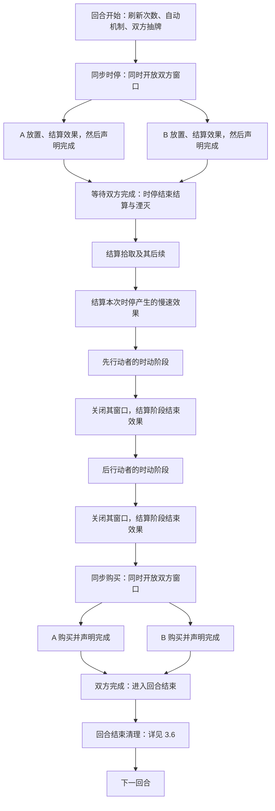
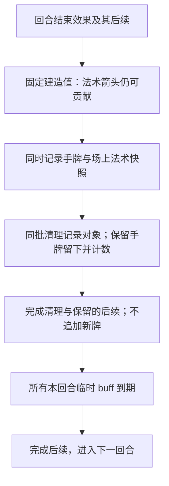

本章说明回合中的阶段与转换。已确认条款作为裁定依据；本轮规则已固定为试玩基线，集中见[第三章审阅事项](../maintenance/pending.md#第三章审阅事项)。

## 3.1 回合总览

**RND-001 回合结构。** 双人对战的一回合依次经过：

**回合开始 → 双方同步时停 → 时停结束结算 → 先行动玩家的时动阶段 → 后行动玩家的时动阶段 → 双方同步购买 → 回合结束。**

“同步”表示双方同时进入同一阶段、各自操作；不要求双方在同一瞬间作出每个选择。阶段转换须等待双方均完成。时动阶段则按顺序逐人进行；正常情况下，N 名玩家每回合共有 N 个时动阶段，每人一个。当前版本不提供额外时动阶段。

图 3-A 中“先行动者／后行动者”由本回合的排序决定，不固定为某个玩家。自动流程也会结算效果，但不会因此开放玩家操作窗口。

### 3.1.1 操作窗口

操作窗口的定义、双人权限图及窗口外自动选择统一见[4.1.1 操作窗口](actions.md#操作窗口)。本章仅说明各阶段在何时开放与关闭窗口。

## 3.2 回合开始

**RND-002 开始顺序。** 回合开始是系统流程，不是任何玩家的操作窗口：

1. **刷新行动额度和效果发动次数。** 场上单位的行动点恢复至当前速度，攻击次数按对应规则恢复；按回合统计的效果发动次数重新计数，包含主动能力和触发效果的每回合限次。按本次入场或整局统计的限次不因此刷新。
2. **执行模式规定的回合开始自动机制。** 标准对战的资源生成在此处理；数量、位置与生成失败规则见[对局自动逻辑](../standard/automatic.md#资源生成)。
3. **双方抽牌（已确认）。** 每人再抽取 5 张，加上已经确定在本回合生效的额外抽牌数量。这是再抽取相应数量，不是将手牌补至 5 张；保留的手牌不减少本次抽牌量。
4. **处理抽牌引发的效果。** 按[批量结算通则](effects.md#批量结算通则)，本批抽取完成后处理相关效果。此时双方都没有操作窗口；任何原本要求玩家选择的步骤，按[4.1.1 操作窗口](actions.md#操作窗口)自动选择，不暂停等待玩家输入。
5. **进入同步时停。** 双方抽牌相关结算全部完成后，同时进入时停，开放双方窗口，再处理时停阶段开始效果。

空牌堆与回洗依[6.4.1](lifecycle.md#抽牌与空牌堆)处理。首回合先洗初始牌堆，再采用同一流程，不重复额外发一次基础手牌。

**效果时点的设计约定：** 今后的阶段起始效果优先写为“时停阶段开始时”，不另设“回合开始效果”作为本章的一个统一触发步骤。这样效果发生时玩家已有操作窗口，可以进行选择。旧卡仍写“回合开始时”的文案需要逐张核对迁移，不能不加区分地改写所有文本。

“本回合额外抽一张”若是基础抽牌数量的修正，仍须在本次抽牌前生效；它不等同于抽完后才触发的一次额外抽牌。开始流程和阶段开始效果的区别不能让额外抽牌失去原有作用。

## 3.3 时停

**RND-003 同步部署。** 双方同时进入时停，分别开放自己的操作窗口。回合开始的抽牌及相关结算全部完成后，先固定本次冻结基准；开放窗口后，处理本次阶段开始满足条件的效果，再由玩家放置手牌，处理[入场](../reference/keywords.md#入场)及其相关效果。

时停不提供玩家主动发动场上能力的操作，也不允许普通移动、攻击、购买或商店刷新。入场效果或其他满足条件的触发效果，与玩家主动点选发动能力不同；前者需要选择时，按操作窗口规则处理。

普通放置仍遵循部署区域、箭头及占格条件；明确允许非己方领土放置的卡牌，依其有效例外处理。放置步骤见[第四章](actions.md#放置与箭头)。

**RND-004 冻结场面与独立放置。** 时停不只是隐藏对手新放下的卡牌，而是冻结双方相互观察、据以部署的战场与对手状态：

- 进入时停时、开始效果结算前，以当时场面和可见信息作为本次冻结基准。正常的战场行动停止，既有单位不能在此阶段进行普通移动、攻击或主动能力操作。
- 玩家能看到自己本轮放置、入场及相关结算的变化；对手的战场、星能、手牌数量等可见状态保持在时停开始时，不随对手的本轮操作实时更新。
- 双方各自依据冻结基准，以及自己本轮合法放置和结算产生的变化继续操作。不能因对手已经先提交了一张尚未揭示的牌，就让另一方失去原本可放置的同格位置。
- 因此，在各自放置条件均合法时，双方可能在本次时停中向同一格放入卡牌。这不是由提交快慢决定谁抢占成功，而是在时停结束时统一处理。

**冻结牌与新入场牌。** 固定本次时停基准时已在战场上的牌称为冻结牌；本次时停中新进入战场的牌称为新入场牌，包括普通放置和效果召唤。该区别只描述本次时停的身份，不是卡牌原生能力。下次固定时停基准时，仍在场的牌重新归为冻结牌。冻结牌的移除、死亡、回手等转区结算不能在独立时停中快速执行；新入场牌在本方独立局面中可以按有效效果转区，仍须满足目标、费用及其他合法性要求。

冻结不使原本隐藏的卡牌身份变成公开信息。放置与入场触发当场发生；未标明[快速](../reference/keywords.md#快速)的入场效果先完成规定的目标准备，再登记到本次时停结束的慢速队列，正文此时不执行。快速入场效果当场结算；持续光环、替换及其他作用不因入场默认速度而改成待结算事项。其他触发和进度效果保留各自规定的时机，不把发生前替换或阻止推迟到变化发生后。独立时停中不提供反制对手本次新发动效果的能力。资源拾取仍进入下述专门步骤，不在独立部署期间提前取得收益。

### 3.3.1 时停结束与湮灭

**RND-005 结束结算。** 玩家完成本方当前放置、结算及选择后，可以声明完成时停并关闭自己的窗口；另一方仍可在其窗口内继续。双方均完成后，进行统一结束结算：

1. 结束双方独立部署，汇合本次时停的放置结果。
2. 检查同格部署冲突。只有一张冲突牌具有有效免湮灭时，它留下，另一张湮灭；双方都没有免湮灭，或双方都具有免湮灭时，双方一起湮灭。合法的非资源牌与资源共存不构成这类冲突；资源本身不能堆叠。
3. 依据合并时的场面一次确定全部冲突及应湮灭的牌，按[批量结算通则](effects.md#批量结算通则)统一将本体清理至各自弃牌堆，再处理湮灭后续；某格的后续不能改变另一格已确定的本批结果。双方均免湮灭不产生普通卡牌同格共存的例外。
**指定格的湮灭安排。** 「科学纪元驱魔师」在入场或时停开始触发时，于时停选择窗口按冻结场面选定两个空格；时停末在湮灭阶段、拾取与普通慢速正文之前，检查这些格子当时的法术并湮灭，包括对手本次时停新放置的法术。它指定的是格子，不提前锁定法术身份；不湮灭这些格子上的随从或资源。被湮灭法术对应的待结算慢速入场按[湮灭通则](../reference/keywords.md#湮灭)取消。

4. **结算拾取。** 拾取默认是慢速动作；时停期间不即时取得拾取收益，在湮灭结算完成后统一处理，完整规则见[6.8](lifecycle.md#拾取)。
5. **结算慢速效果。** 拾取结算完成后，再处理本次时停产生的慢速效果及其后续。
6. 结束结算全部完成后，按 3.4.1 的顺序进入第一名玩家的时动阶段。

**固定顺序：湮灭结算 → 拾取结算 → 慢速效果结算。** 拾取虽然属于慢速动作，但有自己的专门步骤，不能与普通慢速效果混排。

双方的操作窗口此时均已关闭。已登记的目标保持原指定关系，不能改选；只有执行到此时才产生的选择按窗口外规则处理。队列按下节的确认提交顺序处理；本次结算期间新产生的后续效果当场按普通时序完成，不重新等待下一轮慢速步骤。

湮灭是在时停末处理已经发生的同格放置，不是追溯认定某一方的放置从未成功。阶段结束时双方窗口均已关闭，因此此处效果需要选择时由系统自动选择。

「裂隙惘生德雷克」（SA-004-01）的免湮灭按上述双方比较处理：对普通牌时留下，对同样免湮灭的牌时一起湮灭。

湮灭不因进入弃牌堆而算作死亡，见[6.3](lifecycle.md#死亡与消灭)。它是否满足特定弃置词条、与同一时点的其他结束效果如何排序，仍须由[湮灭条目](../reference/keywords.md#湮灭)和结算章节明确。

### 3.3.2 待结算效果的登记与顺序

**先准备，再登记。** 入场效果触发后，在效果所属玩家的操作窗口中完成当前可以确定且必须预先指定的目标、模式或分配，以及适用的发动成本，然后登记正文。依赖正文执行结果才能产生的选择，留到对应步骤；除矿石扫描等已明确提前随机的特例外，卡文明示的随机选取与分配同样留在正文执行时，以当时的合法候选进行，不在入场准备时预抽或锁定候选。对手本回合新放置且届时仍合法的单位可以被选中，详见[8.2.1](effects.md#选择时点与操作窗口)。本人准备尚未完成时，对手仍可继续独立操作。

**确认提交先后。** 每份合法登记由对局服务端确认，获得唯一且递增的结算序号；时停末按序号从小到大处理。以服务端确认登记的次序为准，不使用玩家设备上的时间。操作与网络到达先后可能影响效果顺序。同一行动产生多项需要登记的效果，先按[8.5.2](effects.md#同时满足条件的效果)确定登记先后；尚未完成选择的效果不提前占据队列位置。重复发送同一次已经接受的提交，不产生新的效果。

**目标失效。** 先登记消灭随从 A，再登记给 A 加 buff：前一项使 A 离场后，后一项对应目标失效；不自动更换目标。若登记顺序相反，则先施加 buff，再处理消灭。A 离场后重新入场也不恢复旧的指定关系，见[8.2.3](effects.md#无合法选项与目标失效)。来源离场不自动取消已登记正文，其他独立步骤仍依各自成功条件处理。

**一份效果及其后续完成后再取下一份。** 队列中 A 先于 B，A 引发 C 时，先完成 A 的正文、必要检查以及 C 及其后续，再处理 B。时停末才新触发的普通后续不重新加入下一轮时停队列。明确同时批次保持整体结算边界。

**待结算信息。** 玩家可以查看本人已知的待结算效果、来源、已选目标、相对顺序和当前状态。揭示前不能通过该列表、数量或编号间隙推知对方未公开的牌与操作。揭示后也不额外公开本来隐藏的卡牌身份。单位离场或重新入场，不把旧目标关系显示成针对新入场身份的效果。

## 3.4 时动

**RND-006 每位玩家各有自己的时动阶段。** 正常情况下，每位玩家每回合获得一个时动阶段，依序进行；双人对战就是两个时动阶段。“你的时动阶段开始时”指你的阶段开始，不指对手的阶段开始，也不指整轮第一次有人进入时动。

玩家进入自己的时动阶段时开放本人的操作窗口，处理本次阶段开始满足条件的全部效果，以及明确安排在此时到期的延迟效果，再进行普通行动。其中，“你的时动阶段开始时”只匹配该阶段所属玩家的相应效果；对手若有响应本次阶段开始的效果，也须正常检查和结算。多个开始效果及延迟效果的排序依第八章，不从卡面展示顺序推断。

当前玩家可以移动、攻击、发动主动能力或声明完成；其他玩家此时没有操作窗口。其他玩家的触发、持续效果仍可生效，但涉及其选择时转为系统自动选择。

当前玩家的行动、结算与选择全部完成后，可以声明完成，关闭窗口并处理本次阶段结束满足条件的全部效果，包括对手能够响应的效果。随后才进入下一名玩家的时动阶段。所有人的本回合时动阶段完成后，双方同时进入购买阶段。

### 3.4.1 时动行动顺序

本次时停结束时确定正常时动阶段的顺序，后续不因牌离场或状态变化重新排序：

1. 本次时停放置计数较少的一方先进入自己的时动阶段；计数由下述实际次数与适用修正计算。
2. 数量相同时，较早声明完成时停的一方先进入。
3. 前两项仍相同时，采用对局开始前确定的玩家席位顺序（试玩暂定）。

**实际放置次数与时停放置计数（已确认）。** 排序的基础只统计玩家在本次时停中从手牌执行的普通放置；效果额外放置、召唤、生成均不增加这个基础数。放置失败不计数，成功后又离场不扣回。高等阳炎术只因玩家打出它本身增加1次，不因随后效果放下三张牌而增加3次。

在此基础上应用空亡时主等修正，得到用于比较先后的**时停放置计数**；后续卡文也可以明确读取这个调整后的计数值。**实际放置记录与事件不被倒改。** 例如本次普通放置3张，计数修正−2后按1比较；实际发生的三次放置仍保留。卡牌监听“发生放置”或统计实际放置次数时，按真实事件及其条件处理，不能用排序修正减去历史或进度；效果放置仍可产生真实放置事件。

时停放置计数允许为负，同类减免奖励逐次相加；不将其截断为0。实际放置次数仍为非负的真实记录。

## 3.5 购买

**RND-007 同步购买。** 所有玩家同时进入购买阶段、同时开放各自的窗口，并分别获得自己的商店候选。数量、价格、刷新与购入去向见[第五章](economy.md)。

双方可以同时购买、刷新及处理本方购买效果的选择，不按时动顺序轮流购买。一方正在处理选择，不妨碍另一方操作。购买窗口不允许普通放置、移动、攻击或发动只允许时动使用的主动能力。

玩家完成本方当前结算后可以声明完成，关闭自己的窗口，不能再购买、刷新或亲自作效果选择；另一方仍可继续。双方均完成且相关结算结束后，结束购买阶段并进入回合结束流程。购买阶段结束效果按窗口外自动选择规则处理。

## 3.6 回合结束

**RND-008 回合结束的固定顺序（已确认）。** 双方操作窗口关闭后，依次处理：

1. **结算回合结束效果及其后续。** 无玩家操作窗口，需要选择时由系统自动选择。
2. **固定建造值。** 按[4.2.3](actions.md#建造)将当时有效箭头的贡献加入下一回合固定值。此时场上法术和本回合临时 buff 尚未清理，仍有效的箭头可以贡献建造值。
3. **同时记录手牌与场上法术快照。** 记录所有玩家此刻的手牌，以及战场上需要回合末清理的法术。快照是在结束效果完成、建造值固定之后建立，不是在刚进入回合结束时建立。
4. **清理被记录的牌，并结算保留。** 快照手牌中具有有效[保留](../reference/keywords.md#保留)的牌留下，按[6.2.7](lifecycle.md#被保留的回合数)增加一次保留计数；其余快照手牌和被记录的场上法术组成同一清理批次，移入对应弃牌堆。先完成这批变化及必要检查，再处理其弃牌、离场、保留等后续效果，不在清理一张牌后插入普通触发来改变其余清单。
5. **本回合所有临时 buff 到期。** 本回合限定的修正统一在上述清理及其后续完成后到期，不只延后临时保留。撤销生命／速度修正按[6.2](lifecycle.md#属性变化)处理。到期不补弃手牌，不倒扣已固定的建造值，也不撤销保留计数。
6. 完成相关后续后，进入下一回合。

图 3-B 的快照位于结束效果之后、临时 buff 到期之前；新牌是否参与本次清理，以该快照时点为界。

**快照不追加。** 回合结束效果期间抽取或生成的手牌，以及新增的场上法术，会在步骤 3 被记录。步骤 4 的弃牌、离场或保留触发新产生的牌不加入这次清理，也不凭空获得一次保留计数。例如结束效果抽到 B，B 要参加快照；清理 A 后才抽到 C，C 不参加本次快照。

**随从与资源不参加场上法术清理。** [基础类型](elements.md#卡牌种类与分类维度)决定该清理范围，[收集属性](elements.md#收集属性)不增加自动消失规则。保留保护的是手牌清理，不免除场上法术清理。

涉及替换而离区重入等特殊目标关系，按[8.2.3](effects.md#无合法选项与目标失效)判断，不重复执行已完成的清理。星能与下一回合额度分别见[5.1](economy.md#星能)、[3.2](#回合开始)。

## 3.7 阶段完成与转换

**RND-009 完成声明关闭本人的操作窗口。** 声明完成不取消已经触发的效果，也不使持续效果停止生效；之后再发生要求本人选择的效果，按窗口外自动选择处理，而不是重新打开窗口。

自己尚有未完成的行动、结算或窗口内选择时，不能通过声明完成跳过它们。同步时停和购买中，对方仍在独立操作不阻止本人完成；整个阶段转换则须等所有玩家均完成，且相关结算全部结束。

每位玩家先完成当前行动及其应在此次处理的后续事项，再开始自己的下一项普通行动。自己的选择正在等待时，不自动关闭另一方在同步阶段已拥有的窗口。

本章规定时间结构与权限。同一时点多个效果的先后、目标失效和后续效果插入方式见[通用结算逻辑](effects.md)。模式规定的对局结束条件仍按其检查时点处理，不因流程图画出了下一阶段就强行继续游戏。

## 3.8 关联章节

- [行动规则](actions.md)
- [通用结算逻辑](effects.md)
- [标准对战的对局自动逻辑](../standard/automatic.md)
- [第三章审阅事项](../maintenance/pending.md#第三章审阅事项)
