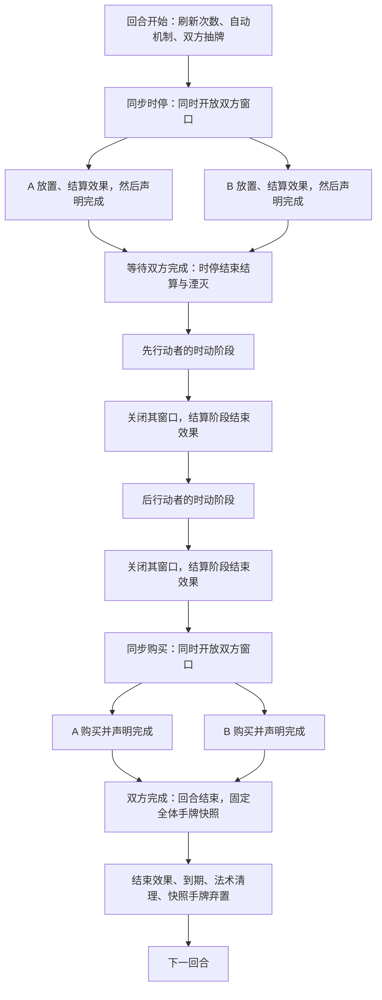
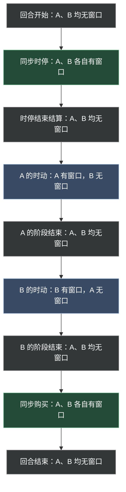

**第三章修订稿。** 本轮确认了同步时停与购买、操作窗口及窗口外自动选择、冻结与湮灭、每人独立时动阶段和回合末手牌快照。其他尚未审定的排序细节仍保留草稿，见[第三章审阅事项](../maintenance/pending.md#第三章审阅事项)。

## 3.1 回合总览

**RND-001 回合结构。** 双人对战的一回合依次经过：

**回合开始 → 双方同步时停 → 时停结束结算 → 先行动玩家的时动阶段 → 后行动玩家的时动阶段 → 双方同步购买 → 回合结束。**

“同步”表示双方同时进入同一阶段、各自操作；不要求双方在同一瞬间作出每个选择。阶段转换须等待双方均完成。时动阶段则按顺序逐人进行；正常情况下，N 名玩家每回合共有 N 个时动阶段，每人一个。额外时动阶段由明确效果另行增加。

图 3-A 中“先行动者／后行动者”由本回合的排序决定，不固定为某个玩家。自动流程也会结算效果，但不会因此开放玩家操作窗口。

### 3.1.1 操作窗口

**RND-010 操作窗口。** 操作窗口是某位玩家可以执行当前阶段允许的行动、并亲自完成效果选择的一段时间。应分别判断每位玩家是否拥有窗口，不能只看整个对局是否处于某个阶段。

| 时点或阶段 | 玩家 A | 玩家 B |
| --- | --- | --- |
| 回合开始：刷新、生成、抽牌及抽牌效果 | 无窗口 | 无窗口 |
| 同步时停，包括时停阶段开始效果 | 有窗口，直到本人声明完成 | 有窗口，直到本人声明完成 |
| 时停结束结算，包括湮灭 | 无窗口 | 无窗口 |
| A 的时动阶段，包括 A 的阶段开始效果 | 有窗口，直到本人声明完成 | 无窗口 |
| B 的时动阶段，包括 B 的阶段开始效果 | 无窗口 | 有窗口，直到本人声明完成 |
| 同步购买 | 有窗口，直到本人声明完成 | 有窗口，直到本人声明完成 |
| 阶段结束效果、回合结束清理 | 对应窗口已关闭 | 对应窗口已关闭 |

表中假定 A 先行动；B 先行动时交换两个时动阶段。某玩家提前完成同步阶段后，即使对方仍在操作，该玩家自己的窗口也已经关闭。

图 3-B 按时间从上到下排列：绿色表示同步阶段中双方各有窗口，蓝色表示仅阶段所属玩家有窗口，灰色表示双方均无窗口。颜色只是辅助，节点文字给出完整权限。同步阶段内，每名玩家声明完成时，本人窗口立即关闭；共同结束位置只表示阶段最终汇合，不保证两人等时长。

**窗口内外的效果选择：** 应作出选择的玩家拥有操作窗口时，由该玩家选择；不拥有窗口时，由系统自动选择，不等待该玩家输入。具体效果没有规定自动选择方式时，默认从合法选项中随机选取。自动选择仍须遵守目标、数量和其他合法性要求，不因此增加候选范围，也不会替玩家发起一项原本不能发动的主动能力。

例如，回合开始抽牌触发的选择、阶段结束触发的选择，以及对方时动阶段中己方效果要求的选择，都采用自动选择。没有合法选项、多个选择互相约束及可选项如何转换，统一在[效果与结算时序](effects.md#目标模式与数量选择)细化。

阶段开始时先开放该阶段应有的窗口，再结算阶段开始效果；开始效果尚未结算完时不能抢先执行下一项普通行动。阶段结束效果则在相应窗口关闭后处理。

## 3.2 回合开始

**RND-002 开始顺序。** 回合开始是系统流程，不是任何玩家的操作窗口：

1. **刷新行动额度和效果发动次数。** 场上单位的移动点恢复至当前速度，攻击次数按对应规则恢复；按回合统计的效果发动次数重新计数，包含主动能力和触发效果的每回合限次。按本次入场或整局统计的限次不因此刷新。
2. **执行模式规定的回合开始自动机制。** 标准对战的资源生成在此处理；数量、位置与生成失败规则见[对局自动逻辑](../standard/automatic.md#资源生成)。
3. **双方抽牌。** 每人抽取 5 张，加上已经确定在本回合生效的额外抽牌数量。这是再抽取相应数量，不是将手牌补至 5 张；保留的手牌不减少本次抽牌量。
4. **处理抽牌引发的效果。** 本批抽取完成后处理相关效果。此时双方都没有操作窗口；任何原本要求玩家选择的步骤，按 3.1.1 自动选择，不暂停等待玩家输入。
5. **进入同步时停。** 双方抽牌相关结算全部完成后，同时进入时停，开放双方窗口，再处理时停阶段开始效果。

需要继续抽牌而牌堆为空时，将弃牌堆洗入牌堆继续抽取。两堆都为空时，停止无法完成的抽取；通用规则不附加疲劳伤害，也不因抽空直接判负。首回合先洗初始牌堆，再采用同一流程，不重复额外发一次基础手牌。

**效果时点的设计约定：** 今后的阶段起始效果优先写为“时停阶段开始时”，不另设“回合开始效果”作为本章的一个统一触发步骤。这样效果发生时玩家已有操作窗口，可以进行选择。旧卡仍写“回合开始时”的文案需要逐张核对迁移，不能不加区分地改写所有文本。

“本回合额外抽一张”若是基础抽牌数量的修正，仍须在本次抽牌前生效；它不等同于抽完后才触发的一次额外抽牌。开始流程和阶段开始效果的区别不能让额外抽牌失去原有作用。

## 3.3 时停

**RND-003 同步部署。** 双方同时进入时停，分别开放自己的操作窗口。本稿在时停阶段开始效果之前先固定本次冻结基准；开放窗口后，处理本次阶段开始满足条件的效果，再由玩家放置手牌，处理[入场](../reference/keywords.md#入场)及其相关效果。

时停不提供玩家主动发动场上能力的操作，也不允许普通移动、攻击、购买或商店刷新。入场效果或其他满足条件的触发效果，与玩家主动点选发动能力不同；前者需要选择时，按操作窗口规则处理。

普通放置仍遵循部署区域、箭头及占格条件；明确允许非己方领土放置的卡牌，依其有效例外处理。放置步骤见[第四章](actions.md#放置与箭头)。

**RND-004 冻结场面与独立放置。** 时停不只是隐藏对手新放下的卡牌，而是冻结双方相互观察、据以部署的战场与对手状态：

- 进入时停时、开始效果结算前，以当时场面和可见信息作为本次冻结基准。正常的战场行动停止，既有单位不能在此阶段进行普通移动、攻击或主动能力操作。
- 玩家能看到自己本轮放置、入场及相关结算的变化；对手的战场、星能、手牌数量等可见状态保持在时停开始时，不随对手的本轮操作实时更新。
- 双方各自依据冻结基准，以及自己本轮合法放置和结算产生的变化继续操作。不能因对手已经先提交了一张尚未揭示的牌，就让另一方失去原本可放置的同格位置。
- 因此，在各自放置条件均合法时，双方可能在本次时停中向同一格放入卡牌。这不是由提交快慢决定谁抢占成功，而是在时停结束时统一处理。

冻结不使原本隐藏的卡牌身份变成公开信息，也不将本方的放置和入场效果推迟到时动才发生。涉及跨双方的效果如何影响冻结基准、共享资源收益及结算结果，须按具体交互说明，不能用实时更新对手状态代替这些规则。

### 3.3.1 时停结束与湮灭

**RND-005 结束结算。** 玩家完成本方当前放置、结算及选择后，可以声明完成时停并关闭自己的窗口；另一方仍可在其窗口内继续。双方均完成后，进行统一结束结算：

1. 结束双方独立部署，汇合本次时停的放置结果。
2. 检查双方同格放置造成的占格冲突，并先判断明确的免湮灭等例外是否有效；资源牌原本允许的合法共存仍按其例外处理。
3. 没有适用例外时，同格冲突的双方两张卡牌在此时**湮灭，直接进入各自的弃牌堆**，不是进入虚空，也不是资源拾取后的本体消失。
4. 完成湮灭及其有效例外引发的相关后续效果，再统一揭示结束结算后的场面和双方状态。
5. 结束结算全部完成后，按 3.4.1 的顺序进入第一名玩家的时动阶段。

湮灭是在时停末处理已经发生的同格放置，不是追溯认定某一方的放置从未成功。阶段结束时双方窗口均已关闭，因此此处效果需要选择时由系统自动选择。

卡牌可以明确规定湮灭例外。例如现有卡表中的“裂隙惘生德雷克”（SA-004-01）允许放置在非己方领土，并注明不会因时停放置重合而湮灭。应先判断该例外是否有效，再处理其对应部分，不能把“双方一律弃置”写成不可例外的规则。

湮灭是否触发某种死亡、弃置或其他词条，以及与同一时点的其他结束效果如何排序，须由[湮灭条目](../reference/keywords.md#湮灭)和结算章节明确；不能因为最终去了弃牌堆就把这些不同事件视为同义词。

## 3.4 时动

**RND-006 每位玩家各有自己的时动阶段。** 正常情况下，每位玩家每回合获得一个时动阶段，依序进行；双人对战就是两个时动阶段。“你的时动阶段开始时”指你的阶段开始，不指对手的阶段开始，也不指整轮第一次有人进入时动。

玩家进入自己的时动阶段时开放本人的操作窗口，处理本次阶段开始满足条件的全部效果，以及明确安排在此时到期的延迟效果，再进行普通行动。其中，“你的时动阶段开始时”只匹配该阶段所属玩家的相应效果；对手若有响应本次阶段开始的效果，也须正常检查和结算。多个开始效果及延迟效果的排序依第七章，不从卡面展示顺序推断。

当前玩家可以移动、攻击、发动主动能力或声明完成；其他玩家此时没有操作窗口。其他玩家的触发、持续效果仍可生效，但涉及其选择时转为系统自动选择。

当前玩家的行动、结算与选择全部完成后，可以声明完成，关闭窗口并处理本次阶段结束满足条件的全部效果，包括对手能够响应的效果。随后才进入下一名玩家的时动阶段。所有人的本回合时动阶段完成后，双方同时进入购买阶段。

额外时动阶段是明确效果产生的例外。例如“空亡时主”的现有文本提供额外时动阶段；其插入位置和与其他阶段的交互另行规定，不将正常的 N 个阶段理解为永远不能增加。

### 3.4.1 时动行动顺序

本次时停结束时确定正常时动阶段的顺序，后续不因牌离场或状态变化重新排序：

1. 本次时停成功放置卡牌数量较少的一方先进入自己的时动阶段。
2. 数量相同时，较早声明完成时停的一方先进入。
3. 前两项仍相同时，本稿采用对局开始前确定的玩家席位顺序；此最终平局方案仍待审阅。

本稿计入普通手牌放置及效果明确执行的“放置”；召唤或生成不计入。放置失败不计数；成功放置后又离场，不扣回计数。这项计数口径仍随行动章节审阅，不把所有[入场](../reference/keywords.md#入场)都计为放置。

## 3.5 购买

**RND-007 同步购买。** 所有玩家同时进入购买阶段、同时开放各自的窗口，并分别获得自己的商店候选。数量、价格、刷新与购入去向见[第五章](economy.md)。

双方可以同时购买、刷新及处理本方购买效果的选择，不按时动顺序轮流购买。一方正在处理选择，不妨碍另一方操作。购买窗口不允许普通放置、移动、攻击或发动只允许时动使用的主动能力。

玩家完成本方当前结算后可以声明完成，关闭自己的窗口，不能再购买、刷新或亲自作效果选择；另一方仍可继续。双方均完成且相关结算结束后，结束购买阶段并进入回合结束流程。购买阶段结束效果按窗口外自动选择规则处理。

## 3.6 回合结束

**RND-008 同一时点固定手牌快照。** 进入回合结束流程的瞬间，先同时记录所有玩家此刻的手牌实例清单，作为本次回合末弃牌的手牌快照。这个记录发生在本流程的结束效果及清理之前，不是等到逐个处理玩家时才分别记录。

随后依次处理：

1. 结算回合结束效果及本次应完成的后续效果。双方均无操作窗口，需要选择时由系统自动选择。
2. 使在本回合结束到期的临时效果和状态失效，并处理明确到期的形态还原。
3. 清理仍在战场上的法术牌。本稿默认送入拥有者的弃牌堆，逐张处理区域转移及其后续效果。
4. 按确定的处理顺序，仅对初始快照列出的手牌执行本次回合末弃牌；[保留](../reference/keywords.md#保留)仍免于这次弃置。已经不在手牌的对象不能再次作为手牌弃置。
5. 清理和后续结算全部完成后，回合号增加，进入下一回合开始。

**快照不会扩充。** 进入本流程以后，因回合结束效果、弃牌效果或其他效果链新生成、抽取或获得的手牌，都不加入本次快照，也不被追加执行这次回合末弃牌。例如进入回合结束时有 A、B 两张牌，A 被弃置后使玩家抽到 C，本次清单仍只有 A、B，C 留在手牌。

**场上清理依据卡牌类型。** 法术牌在回合结束时移入弃牌堆；随从牌与资源牌不会仅因回合结束而被清除。具体效果规定的到期或离场仍适用。收集属性与留场规则的关系见[2.3.1 收集属性](elements.md#收集属性)，本节不另建一套衍生卡规则。

星能跨回合保留。行动额度和按回合统计的效果次数在下一次回合开始刷新。快照确定后发生保留变化的准确判断时点，以及同批清理的先后，仍需在第六、七章细化。

## 3.7 阶段完成与转换

**RND-009 完成声明关闭本人的操作窗口。** 声明完成不取消已经触发的效果，也不使持续效果停止生效；之后再发生要求本人选择的效果，按窗口外自动选择处理，而不是重新打开窗口。

自己尚有未完成的行动、结算或窗口内选择时，不能通过声明完成跳过它们。同步时停和购买中，对方仍在独立操作不阻止本人完成；整个阶段转换则须等所有玩家均完成，且相关结算全部结束。

每位玩家先完成当前行动及其应在此次处理的后续事项，再开始自己的下一项普通行动。自己的选择正在等待时，不自动关闭另一方在同步阶段已拥有的窗口。

本章规定时间结构与权限。同一时点多个效果的先后、目标失效和后续效果插入方式见[效果与结算时序](effects.md)。模式规定的对局结束条件仍按其检查时点处理，不因流程图画出了下一阶段就强行继续游戏。

## 3.8 关联章节

- [行动规则](actions.md)
- [效果与结算时序](effects.md)
- [标准对战的对局自动逻辑](../standard/automatic.md)
- [第三章审阅事项](../maintenance/pending.md#第三章审阅事项)
