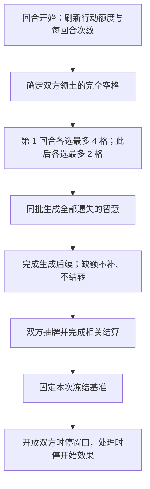

本章是标准对战的审阅草案，定义玩家操作之外的模式自动变化。**第一版仅启用遗失的智慧自动生成（已确认）**；野怪系统留待后续设计，本版不自动生成或调度野怪。通用回合、卡牌状态与效果本身仍引用各自主定义。

## 11.1 资源生成

### 11.1.1 生成时点与数量

**STD-010 标准对战每回合为双方领土分别生成遗失的智慧。** 时点位于[3.2 回合开始](../common/rounds.md#回合开始)的“刷新行动额度和效果发动次数”之后、“双方抽牌”之前。

| 回合 | 每名玩家领土的本次生成额度 | 双方合计最多生成 |
| --- | --- | --- |
| 第 1 回合 | 4 张 | 8 张 |
| 第 2 回合及以后 | 2 张 | 4 张 |

本次生成发生在回合开始，早于本回合时停冻结快照。新生成与此前未拾取的资源均进入该快照，双方在时停阶段都能看到；本规则不公开时停开始后另一方尚未合并的新操作。

数量指本次新增资源，不是把场上资源补到该数量。旧资源留在场上，不扣减新一回合的生成额度。例如某方领土在第 2 回合开始时剩余 3 张智慧，只要有足够空格，仍新增 2 张，变成 5 张。

### 11.1.2 随机位置与空间不足

**STD-011 各自领土独立随机，生成必须使用完全空格。** 每次生成按以下步骤处理：

1. 在本次生成开始时，分别确定双方领土中没有任何卡牌的格子；英雄、随从、法术和资源所在格都不是空格。
2. 每方从自己的候选空格中等概率、无重复地选取本次额度数量的格子；不足时选取全部候选格。
3. 让本批所有资源在选定格子上生成，再按[批量结算通则](../common/effects.md#批量结算通则)处理由此引出的效果；不在生成第一张后插入普通触发，改变本批其他生成位置。

少生成的缺额直接作废，不转给对方、不改到无归属领土，也不积欠至下一回合。本批后续效果即使腾出了新空格，也不回头补足。领土划分取自本局已采用的[地图配置](setup.md#棋盘与领土)。

## 11.2 生成后的处理

**STD-012 自动生成的遗失的智慧是无玩家归属的资源牌，拾取效果为拾取者所属玩家获得 1 星能。**

生成在某玩家领土中，不等于归该玩家拥有，也不预留给该玩家拾取。资源生成只建立资源本体，不立即授予星能；谁能拾取、何时获得收益及资源如何消失，统一见[6.8 拾取](../common/lifecycle.md#拾取)。

生成后的共存、持续留场与离场方式采用[2.2.3 资源牌](../common/elements.md#资源牌)，本章不重复建立一套资源生命周期。卡牌效果也可以生成资源，其数量、位置与时点依相应卡文，不占用或扣减本章的每回合自动生成额度。

## 11.3 与回合流程的衔接

**STD-013 资源生成完成后才继续抽牌与时停。** 本机制发生时双方均无操作窗口；由生成引出的效果如需选择，按[窗口外选择](../common/actions.md#操作窗口)处理。

图 11-A 展示本模式在通用回合开始流程中的插入位置。资源生成本身不增加一个玩家阶段，也不允许玩家在生成与抽牌之间提前放置卡牌。任何步骤发生胜负结果时，依[第九章](overview.md#胜负判定时点)结束对局。

## 11.4 后续自动机制的归属

第一版标准地图仅启用本章的遗失的智慧机制，不启用自动野怪、天气或其他地图事件。野怪机制待后续版本设计，不作为本版待裁定事项。卡牌效果明确生成的对象仍按卡文处理；这不自动赋予它一套未定义的野怪行动流程。

将来新增自动机制时，在本章增加具体规则，并至少写明下列项目；其他模式采用不同配置时，归入其模式章节。

| 项目 | 必须说明的内容 |
| --- | --- |
| 启用范围 | 哪个模式、地图或关卡启用，是否从开局起生效 |
| 触发时点 | 精确到阶段内的哪一步；间隔、次数及停止条件 |
| 对象与位置 | 生成或影响哪些卡牌／玩家，数量、范围、空格要求与随机方式 |
| 自动行为 | 谁选择目标和方向，是否合法、是否支付成本、无目标时怎么办 |
| 持续与结束 | 何时到期、是否保留已有对象、缺额是否补发 |
| 结算衔接 | 批量变化、后续效果及返回原阶段的位置，引用第八章 |

这些是配置要求，不代表新增了天气阶段、野怪回合或默认奖励。自动机制的结算方式仍使用[8.9](../common/effects.md#自动机制与其他结算的衔接)。

## 11.5 关联章节

- [构筑与开局配置](setup.md)
- [通用回合流程](../common/rounds.md)
- [本轮模式审阅记录](../maintenance/pending.md#第二部分待裁定)
