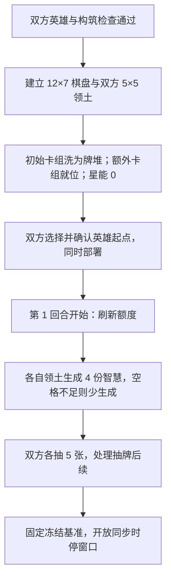

本章是标准对战的审阅草案。构筑数量、费用和稀有度限制取自两版旧规则书；领土按用户试玩反馈改为每方 5×5，棋盘尺寸与坐标随之调整，见[来源记录](../maintenance/sources.md#标准对战三章起草)。

## 10.1 英雄选择与构筑限制

**STD-004 每名玩家恰好选择一名英雄。** 英雄决定本方构筑职业，独立于初始卡组和额外卡组，不计入两者的张数，也不计入初始卡组总费用。

初始卡组与额外卡组只能加入所选英雄职业的可收集卡牌，以及中立职业的可收集卡牌。收集属性按[2.3.1](../common/elements.md#收集属性)区分：衍生卡、不可收集卡不能主动加入这两类构筑，英雄单独选择。

这些限制用于检查开局构筑；对局中因效果生成、取得或转交卡牌，不因此重新检查整副卡组是否合法。具体取得方式依卡牌效果执行。

### 10.1.1 同名卡上限

**STD-005 同名卡上限合并计算两类卡组。** 不是初始卡组和额外卡组各享有一份上限。

| 稀有度 | 初始卡组与额外卡组中的同名卡总数上限 |
| --- | --- |
| 普通 | 5 张 |
| 稀有 | 3 张 |
| 史诗 | 2 张 |
| 传说 | 1 张 |

例如，一种普通卡已经在初始卡组加入 3 张，额外卡组至多再加入 2 张。不同卡名分别计算；由效果在对局中产生的卡牌不占用开局构筑名额。

当前试玩另外遵守[本轮测试排除名单](../maintenance/neutral-card-audit.md#本轮测试排除)。这是本轮内容准入限制，不是永久删除这些卡牌的设计或身份。

## 10.2 初始卡组与额外卡组

**STD-006 两类卡组各有独立用途。**

| 项目 | 初始卡组 | 额外卡组 |
| --- | --- | --- |
| 开局张数 | 恰好 10 张非英雄牌 | 20–30 张非英雄牌，含边界 |
| 总费用限制 | 卡面星能费用之和不超过 5 | 不另设总费用上限 |
| 开局去向 | 洗牌后成为本方牌堆 | 进入本方额外卡组区域 |
| 主要用途 | 提供抽牌和主卡组循环 | 提供商店商品 |

初始卡组费用按构筑时的卡面费用计算，不使用对局中可能获得的折扣。卡牌数量、总费用、职业、收集属性、同名卡和英雄选择必须全部合法，否则不能开始标准对战。

额外卡组与商店是两个区域，具体定义见[2.6 游戏区域](../common/elements.md#游戏区域)。开局把牌放入额外卡组，不等于已经陈列到商店。购买、补位、主动刷新与卡组循环统一采用[第五章](../common/economy.md)，不会因回合推进自动向额外卡组添加新的卡牌。

## 10.3 地图与英雄部署

### 10.3.1 棋盘与领土

**STD-007 标准双人棋盘为纵向 12 行、横向 7 列。** 本章以固定俯视方向从上到下编号第 1–12 行、从左到右编号第 1–7 列；编号不随玩家视角翻转。卡文中的前方、上方和箭头朝向仍按[空间关系](../common/elements.md#棋盘与空间关系)解释。

**每名玩家拥有一块 5×5 领土（已确认）。** 领土后方直接到棋盘边界，不另留空行；左右各保留一列，中央保留两行无归属区域。A 玩家从下方向上，B 玩家从上方向下。布局按[本次确认](../maintenance/sources.md#标准地图去除领地后方空行)调整。

| 区域 | 固定棋盘坐标 |
| --- | --- |
| A 玩家领土 | 第 8–12 行，第 2–6 列 |
| B 玩家领土 | 第 1–5 行，第 2–6 列 |
| 无玩家领土归属的区域 | 左右第 1、7 列，以及中央第 6–7 行 |

领土属于格子，不因随从移动经过或占据它就自动改变。本章所称领土与卡牌当前归属分别判断；领土影响普通放置与资源生成，具体行动合法性仍见[第四章](../common/actions.md)。

### 10.3.2 英雄部署

**STD-008 玩家在己方领土最后一排的合法空格中选择英雄起点。** 按上述地图，A 可选择第 12 行第 2–6 列，B 可选择第 1 行第 2–6 列。

部署作为开局配置完成，不消耗手牌、星能或箭头，也不计入任何回合的普通放置次数。英雄按卡面建立当前生命与行动额度，其生效范围内的持续效果随开局配置生效；开局部署不额外发动一次入场效果。

本稿采用双方同时秘密选择、双方确认后一起公开并完成部署。英雄初始部署完成前，不开放时停或时动操作窗口。部署选择与初始化沿用本轮开局默认值。

## 10.4 初始状态与开局步骤

### 10.4.1 初始区域与数值

**STD-009 初始化不额外发手牌或提前上货。**

| 对象 | 完成开局配置、尚未进入第一回合时 |
| --- | --- |
| 玩家星能 | 0 |
| 战场 | 双方已部署的英雄；本版不预置自动野怪或其他地图物件 |
| 牌堆 | 本方初始卡组的 10 张牌，已随机洗牌 |
| 额外卡组 | 本方构筑的 20–30 张牌 |
| 手牌、弃牌堆、商店商品、虚空 | 均为空 |

商店使用[5.2 商店规则](../common/economy.md#额外卡组与商店候选)的基础容量；首次进入购买阶段时才上货。本章不额外给予初始星能、一次起手调换或额外一轮抽牌。模式未指定的实例记录按其通用定义初始化。

### 10.4.2 开局顺序

1. 确定双方席位、所选英雄与两类构筑，检查全部构筑限制及本轮内容准入。
2. 建立本局棋盘和双方 5×5 领土；本版不预置自动野怪，遗失的智慧在回合开始时生成。
3. 双方初始卡组分别洗为牌堆，额外卡组进入对应区域；星能为 0，其余区域依 10.4.1 初始化。
4. 双方选择英雄部署格，确认后同时完成英雄部署与起始属性建立。
5. 进入第 1 回合的[回合开始流程](../common/rounds.md#回合开始)：刷新额度，执行第十一章资源生成，再由双方各抽 5 张并处理后续。
6. 回合开始结算全部完成后，建立冻结基准，开放双方的首次时停窗口。

图 10-A 只展示开局衔接，不重画之后的完整回合。首次购买阶段才发生首次上货；资源生成数量见[11.1](automatic.md#资源生成)。

## 10.5 关联章节

- [模式概览与胜负](overview.md)
- [对局自动逻辑](automatic.md)
- [本轮模式审阅记录](../maintenance/pending.md#第二部分待裁定)
